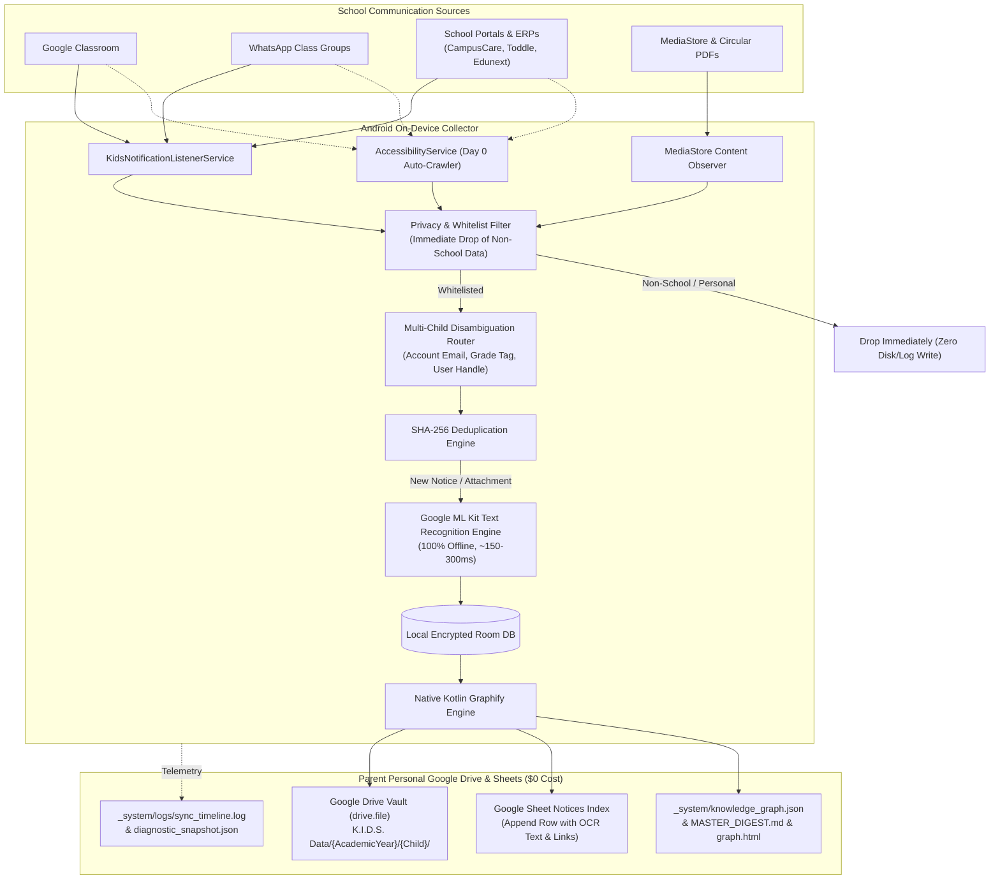

# K.I.D.S. Android Collector

<p align="center">
  
  
  
  
  
  
</p>

---

## 🎯 Executive Overview

The **Kids Intelligent Dashboard System (K.I.D.S.) Android Collector** is an ambient, privacy-first mobile companion application that continuously captures, deduplicates, and organizes school communications (notices, circulars, homework assignments, exam schedules, and PDF attachments) across school apps (Google Classroom, WhatsApp, School ERPs, Gmail) and syncs them directly into the parent's personal **Google Drive Vault** and **Google Sheets**.

By moving ingestion to an Android background service on the parent's mobile device, K.I.D.S.:
1. **Eliminates desktop tab dependencies**: No need to keep browser windows open or run background desktop scrapers.
2. **Eliminates school-domain OAuth lockouts**: Bypasses `access_not_configured` school restrictions by operating on push notifications and device-level accessibility trees.
3. **Runs at \$0.00 cloud infrastructure cost**: Uses direct Google Sign-In with scoped permissions (`drive.file` + `spreadsheets`) and 100% on-device Google ML Kit OCR.
4. **Maintains complete privacy**: Zero student data is ever sent to or stored on third-party servers.

---

## 🎨 Brand Design & UI System

The application is crafted using Jetpack Compose with the official K.I.D.S. design tokens:

### Color System & WCAG 2.1 Contrast Ratios
| Token | Hex Value | Contrast Ratio | Role & Application |
| :--- | :--- | :--- | :--- |
| **Deep Navy (Primary)** | `#1A365D` | **11.4:1 (AAA)** | Brand primary, App bar, primary buttons, headers |
| **Amber Orange (Accent)** | `#ED8936` | **3.0:1 (UI / Badges)** | Active sync badges, highlight borders, action buttons |
| **Light Slate (Border)** | `#E2E8F0` | **1.3:1 (Structural)** | Card strokes, dividing lines, inactive chips |
| **Off-White (Canvas)** | `#F7FAFC` | Background Canvas | Main app background, scaffold canvas |
| **Surface White** | `#FFFFFF` | Surface Container | Card surfaces, modal sheets, elevated containers |
| **Text Primary** | `#0F172A` | **15.8:1 (AAA)** | High-contrast titles, reading body |
| **Text Secondary** | `#475569` | **5.5:1 (AA)** | Timestamps, metadata labels, subtext |

### Typography System
- **Display & Headings: `Kanit`** (SemiBold 600, Bold 700, ExtraBold 800) — Confident, structured, modern.
- **Body & Controls: `Poppins`** (Regular 400, Medium 500, SemiBold 600) — Clean geometric clarity and legibility.

---

## 🏗️ System Architecture



---

## ⚡ Workflows

### 1. Day 0: Historical Ingestion Workflow (One-Time Backfill)
When onboarding, the parent can configure one or more school communication channels. For enabled channels, the crawler indexes assignments, notices, and PDF circulars back to the beginning of the academic year (e.g., June):
- **Classroom**: Auto-scrolls Stream and Classwork tabs.
- **School ERPs**: Scans notice boards and circular lists.
- **WhatsApp**: Auto-scrolls whitelisted group messages or imports native `.txt` chat export.

### 2. Day 1+: Continuous Passive Ingestion (24/7 Background)
- Intercepts push notifications the millisecond an announcement is broadcast.
- Drops personal chats and non-whitelisted sources at the memory boundary.
- Generates SHA-256 hash to prevent duplicate entries across retries.
- Performs on-device ML Kit OCR on timetable images and PDF circulars.
- Appends parsed records into Google Sheets and saves attachments into `K.I.D.S. Data/`.
- Recompiles `knowledge_graph.json` and `MASTER_DIGEST.md`.

---

## 📂 Google Drive Vault Hierarchy

Data is organized neatly into the parent's Google Drive under standard scoped permissions:

```
G:\My Drive\K.I.D.S. Data\
└── 2026-2027\
    ├── Anvesha\
    │   ├── _system\
    │   │   ├── logs\
    │   │   │   ├── sync_timeline.log          # Chronological audit log
    │   │   │   └── diagnostic_snapshot.json   # Real-time health metrics
    │   │   └── knowledge_graph.json           # Machine-readable GraphRAG index
    │   ├── MASTER_DIGEST.md                   # Formatted AI markdown digest
    │   ├── graph.html                         # Interactive visual graph viewer
    │   ├── K.I.D.S. School Notices - Anvesha  # Google Sheet tracking rows
    │   ├── notices_index.json
    │   └── attachments\
    │       ├── Circular_Exam_Timetable_Sep2026.pdf
    │       └── Worksheet_Mathematics_Ch4.pdf
    ├── Atharva\
    │   └── ...
    └── FAMILY_DIGEST.md                       # Consolidated multi-child rollup
```

---

## ♿ Accessibility & Governance (WCAG 2.1 AA)

- **TalkBack Ready**: Explicit content descriptions, semantic headings, and non-cluttered decorative elements.
- **Touch Targets**: Guaranteed >= 48dp × 48dp on all clickable controls.
- **Dynamic Type Scaling**: Tested up to 200% system font scaling without text clipping.
- **AccessibilityService Policy Compliance**: The accessibility crawler is **100% optional**. Core real-time sync operates fully via `NotificationListenerService` even if Accessibility permissions are declined.

---

## 🛠️ Tech Stack & Specifications

- **OS / Target**: Android 14+ (API 34/35), Min SDK 26 (Android 8.0)
- **Language**: Kotlin 2.0+ (K2 compiler)
- **UI**: Jetpack Compose, Material 3, Google Fonts (Kanit & Poppins)
- **Storage**: Jetpack Room 2.6.1 + SQLite FTS4, DataStore
- **Sync**: AndroidX WorkManager 2.9.0 (Expedited + Periodic Work)
- **OCR Engine**: Google ML Kit Text Recognition (`play-services-mlkit-text-recognition:19.0.0`)
- **Cloud APIs**: Google Drive REST API v3, Google Sheets REST API v4
- **Auth**: Google Sign-In SDK (`play-services-auth:21.0.0`)
- **Testing**: JUnit 5, MockK, Robolectric, Truth, Compose Test Rule

---

## 🚀 Quickstart & Development

### Clone & Open
```bash
git clone https://github.com/daarshnicsanjeev/K.I.D.S.git
cd K.I.D.S
```

### Build & Run Tests
```bash
# Execute static analysis & unit tests
./gradlew testDebugUnitTest

# Assemble debug APK
./gradlew assembleDebug
```

---

## 🤝 Contributing

Contributions are welcome! Please review our [Contributing Guidelines](CONTRIBUTING.md) and [Antigravity Workspace Rules](GEMINI.md) prior to submitting pull requests.

## 📄 License

Licensed under the [Apache License, Version 2.0](LICENSE).
