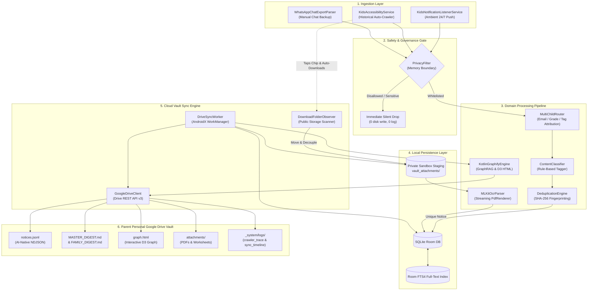
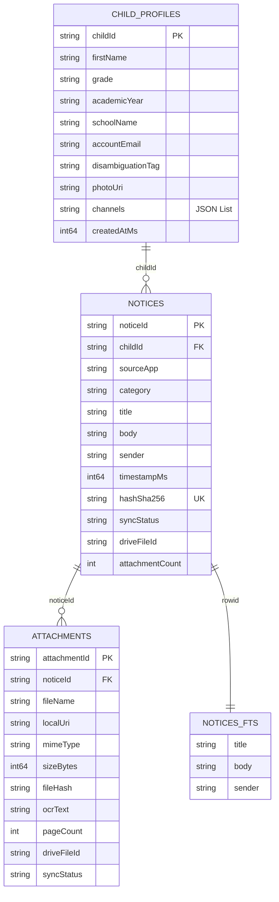
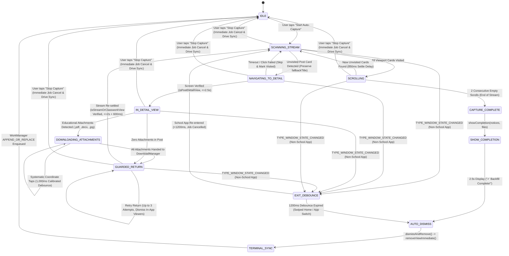
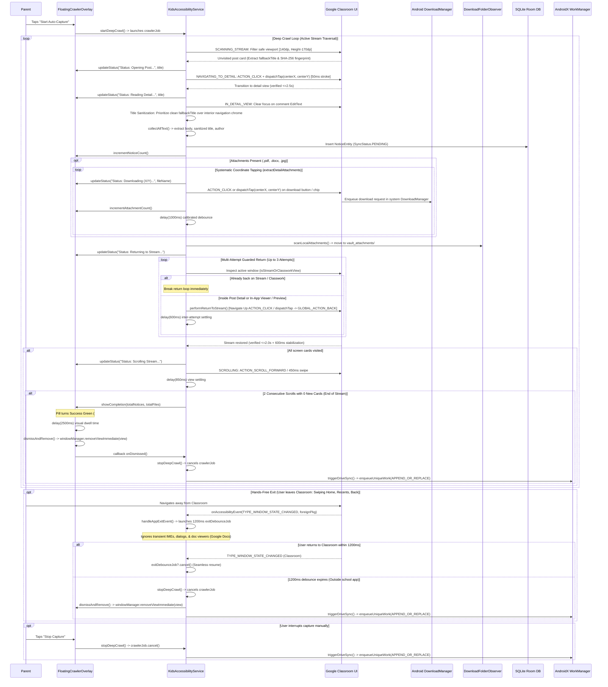
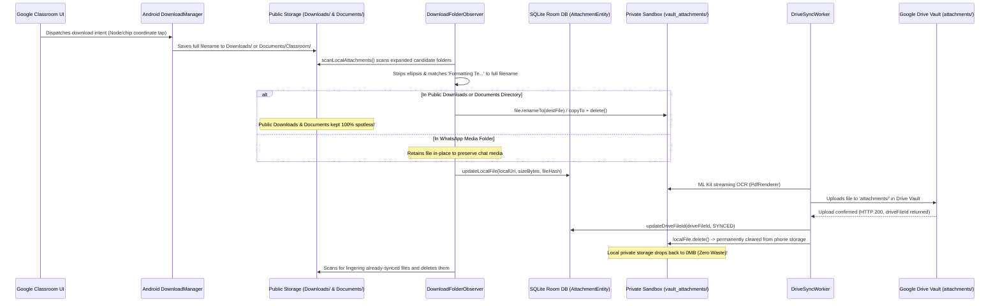
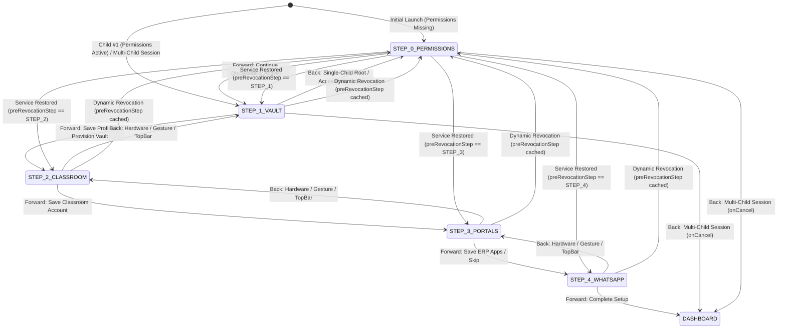
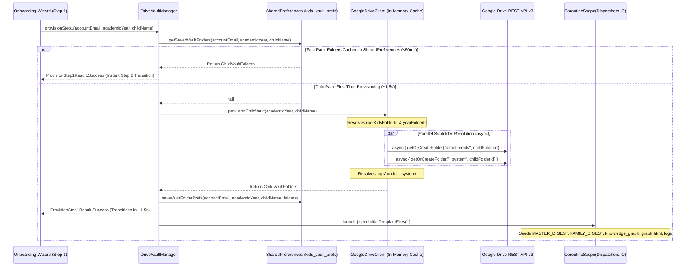
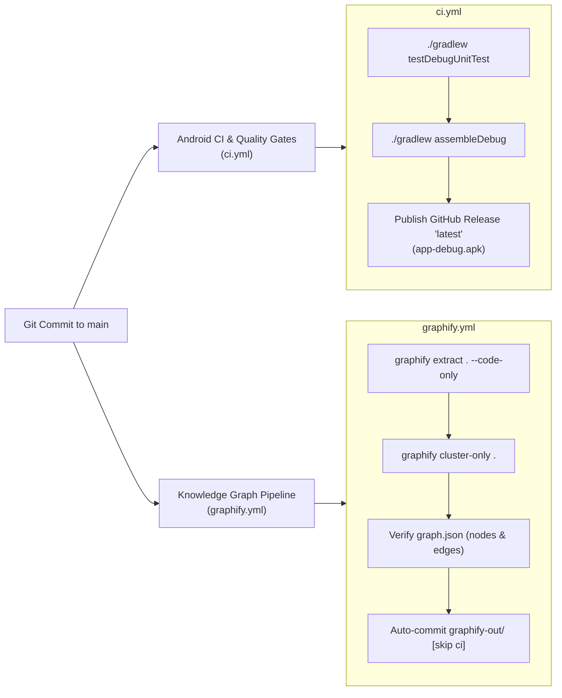
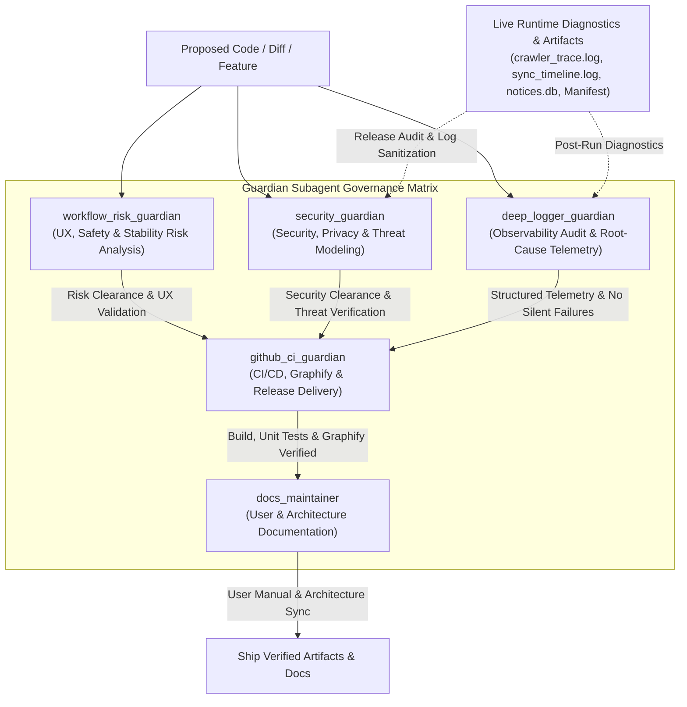

# 🏛️ K.I.D.S. Technical Architecture & Engineering Specification
### Kids Intelligent Dashboard System — Deep-Dive System Documentation

<p align="center">
  
  
  
  
  
  
</p>

---

## 📌 Executive Architectural Summary

The **Kids Intelligent Dashboard System (K.I.D.S.)** is an ambient, zero-backend, privacy-first Android client application engineered to capture, categorize, deduplicate, index, and synchronize school communications across fragmented educational channels (Google Classroom, WhatsApp parent groups, School ERPs, Gmail) directly into the parent's personal **Google Drive Vault** in **AI-native formats** (`notices.jsonl`, `MASTER_DIGEST.md`, `_system/knowledge_graph.json`, and `graph.html`).

### Authoritative System Invariants
1. **$0.00 Cloud Infrastructure Cost (Zero-Backend Invariant):** No external backend servers, intermediate proxies, telemetry aggregators, or centralized databases exist. All network communication terminates exclusively at Google Drive's REST API.
2. **Zero Student Data on Third-Party Servers:** Data processing (text extraction, classification, SHA-256 fingerprinting, full-text indexing, knowledge graph generation) executes 100% locally on the Android device.
3. **Restricted Privacy Scope (`drive.file`):** The application strictly requests `https://www.googleapis.com/auth/drive.file`. It cannot view, modify, or delete any files in the parent's Google Drive other than those created by K.I.D.S. inside `K.I.D.S. Data/`.
4. **Memory-Boundary Privacy Drop:** Push notifications intercepted via `NotificationListenerService` are evaluated against allowed package and conversation whitelists. Non-educational notifications, personal messages, OTPs, and banking alerts are dropped directly from memory before writing to disk or telemetry logs.
5. **Anti-Clutter & Zero-Permanent-Storage Invariant:** Educational attachments (.pdf, .jpg, .docx) downloaded during crawls are strictly transient. They are routed out of public shared storage (`Downloads/`, `Documents/`) into private sandbox staging (`vault_attachments/`), uploaded to Google Drive, and immediately deleted from local device storage upon confirmed upload. Public directories stay spotless, and in-app cache bloat from "Save all files offline" is intentionally bypassed.
6. **Universal Accessibility (WCAG 2.1 AA/AAA):** Touch targets enforce a minimum of 48dp × 48dp, contrast ratios exceed 4.5:1 (AA) and 7:1 (AAA), and full semantics are provided for Android TalkBack.

---

## 🏗️ System Architecture & Data Flow



---

## 📦 Package & Directory Organization

The codebase strictly adheres to **Clean Architecture** principles, maintaining a decoupled unidirectional dependency hierarchy:

```
app/src/main/java/com/kids/collector/
├── KidsApplication.kt                 # Application subclass, WorkManager & DB initialization
├── data/                              # Data access, persistence, external API clients
│   ├── db/
│   │   ├── Entities.kt                # Room entities: ChildProfile, Notice, Attachment, FTS4
│   │   ├── Daos.kt                    # ChildProfileDao, NoticeDao, AttachmentDao
│   │   ├── KidsDatabase.kt            # RoomDatabase singleton with migrations
│   │   └── TypeConverters.kt          # JSON serialization converters for ChannelConfig lists
│   ├── drive/
│   │   ├── GoogleDriveClient.kt       # Google Drive REST API v3 resumable client
│   │   ├── DriveVaultManager.kt       # Multi-step vault provisioning & OAuth credentials
│   │   ├── SafVaultManager.kt         # Storage Access Framework fallback manager
│   │   └── DownloadFolderObserver.kt  # Autonomous storage scanner & anti-clutter stager
│   └── ocr/
│       └── MLKitOcrParser.kt          # Offline Google ML Kit OCR with streaming PdfRenderer
├── domain/                            # Pure business logic and domain entities
│   ├── classifier/
│   │   └── ContentClassifier.kt       # Rule-based tagger (CIRCULAR, HOMEWORK, ATTENDANCE, FEES)
│   ├── dedupe/
│   │   └── DeduplicationEngine.kt     # SHA-256 notice & file hashing
│   ├── filter/
│   │   └── PrivacyFilter.kt           # Whitelisting & blocked keyword drops
│   ├── graph/
│   │   └── KotlinGraphifyEngine.kt    # GraphRAG ontology, node/edge builder, D3 HTML generator
│   ├── importer/
│   │   └── WhatsAppChatExportParser.kt# Regular expression parser for WhatsApp .txt exports
│   ├── model/
│   │   └── Models.kt                  # Domain models (Notice, ChildProfile, Attachment, Enums)
│   ├── parser/
│   │   └── NotificationParser.kt      # StatusBarNotification unwrapper & extractor
│   └── router/
│       └── MultiChildRouter.kt        # Multi-child disambiguation routing engine
├── presentation/                      # Jetpack Compose UI (Single-Activity Architecture)
│   ├── MainActivity.kt                # Root activity & navigation coordinator
│   ├── theme/                         # KidsTheme, Color tokens, Kanit & Poppins typography
│   ├── wizard/
│   │   └── OnboardingWizardScreen.kt  # Step 0 prerequisite permissions gate & 4-step sequential wizard
│   ├── dashboard/
│   │   └── ChildrenGridDashboard.kt   # Multi-child cards, sync triggers, live stats
│   ├── telemetry/
│   │   └── DiagnosticFeedScreen.kt    # 5-point probe UI & live log viewers
│   └── permission/
│       ├── PermissionHelper.kt        # System intents for NLS, Accessibility, Storage
│       └── PermissionSetupDialog.kt   # WCAG-compliant permission rationale dialogs
├── service/                           # Android System Services & Daemons
│   ├── KidsNotificationListenerService.kt # Ambient push notification interceptor
│   ├── KidsAccessibilityService.kt        # Historical node-tree crawler & chip clicker
│   ├── FloatingCrawlerOverlay.kt          # Draggable overlay with native scroll pace
│   ├── DriveSyncWorker.kt                 # AndroidX WorkManager background synchronizer
│   ├── CrawlerTraceLogger.kt              # Granular crawler telemetry trace buffer
│   └── BootReceiver.kt                    # Restarts workers & reconnects services on reboot
└── telemetry/
    └── DriveDeepLogger.kt             # In-memory and disk logger for Drive telemetry
```

---

## 🗄️ SQLite Room Database Schema & Full-Text Search (FTS4)

The database engine is built on **AndroidX Room 2.6.1** utilizing SQLite with an external content **FTS4 virtual table** for instantaneous full-text querying across circular bodies and titles.



### Entity Specifications

#### 1. `ChildProfileEntity` (`child_profiles`)
- **Primary Key:** `childId: String` (UUID)
- Stores child metadata, academic year, school identifier, and serialized channel configs (`List<ChannelConfig>`) via `TypeConverters`.

#### 2. `NoticeEntity` (`notices`)
- **Primary Key:** `noticeId: String` (UUID)
- **Indices:**
  - `hashSha256`: Unique index enforcing absolute notice-level deduplication across capture methods.
  - `childId`: Index for fast filtering per child profile.
  - `category`: Index for categorized digests.
  - `timestampMs`: Index for chronological ordering.
- **Attributes:** Tracks `syncStatus` (`PENDING`, `SYNCED`, `FAILED`), `driveFileId`, and `attachmentCount`.

#### 3. `AttachmentEntity` (`attachments`)
- **Primary Key:** `attachmentId: String` (UUID)
- **Foreign Key:** Indexed on `noticeId`.
- **Indices:** `fileHash`, `syncStatus`.
- **Attributes:** Captures physical filesystem paths (`localUri`), MIME type, file size, extracted `ocrText`, `pageCount`, and remote `driveFileId`.

#### 4. `NoticeFtsEntity` (`notices_fts`)
- **Virtual Table:** Declared with `@Fts4(contentEntity = NoticeEntity::class)`.
- Mirrors `title`, `body`, and `sender` fields using SQLite's native full-text index.
- **FTS Query in NoticeDao:**
  ```kotlin
  @Query("""
      SELECT notices.* FROM notices
      JOIN notices_fts ON notices.rowid = notices_fts.rowid
      WHERE notices_fts MATCH :searchQuery
      ORDER BY notices.timestampMs DESC
  """)
  fun searchNotices(searchQuery: String): Flow<List<NoticeEntity>>
  ```

---

## ⚙️ Background Services & Ingestion Pipelines

### 1. `KidsNotificationListenerService` & `PrivacyFilter`
The notification listener runs as an ambient, event-driven Android system service:
- Intercepts broadcasts via `onNotificationPosted(sbn: StatusBarNotification?)`.
- Extracts message details using `NotificationParser` (resolving subtext, big text, conversation titles, and message bundles).
- **Critical Memory Boundary Gate (`PrivacyFilter`):**
  ```kotlin
  if (!privacyFilter.shouldIngest(parsed.packageName, parsed.conversationTitle, "${parsed.title} ${parsed.body}")) {
      return@launch // SILENT DROP: Zero disk write, zero logging, zero network traffic
  }
  ```
  - **Whitelisted Packages:** `com.google.android.apps.classroom`, `com.whatsapp`, `com.whatsapp.w4b`, `com.entab.campuscare`, `com.toddleapp.family`, `com.edunext.parent`, `com.google.android.gm`.
  - **Keyword Rejection:** Drops messages containing `otp`, `one time password`, `bank`, `debited`, `credited`, `verification code`, `upi pin`, `atm card`.
  - **Messaging App Validation:** WhatsApp notifications must match an explicitly configured school group name.
- **Disambiguation & Routing:** `MultiChildRouter` compares sender, title, and body against enrolled child profiles and attributes the notice.
- **Deduplication:** Computes SHA-256 fingerprint: `SHA-256(childId + sourceApp + title + body)`. If unique, inserts with `SyncStatus.PENDING`.
- **Expedited Work Trigger:** Schedules an expedited `DriveSyncWorker` execution via WorkManager.

---

### 2. `KidsAccessibilityService` & `FloatingCrawlerOverlay`
Engineered for Day 0 historical backfill and retrospective notice crawling of Google Classroom and School ERP portals. It implements an autonomous, event-driven **Deep Crawl Finite State Machine (FSM)** that traverses the stream, enters individual post detail screens, extracts full announcement content, triggers sequential attachment downloads, safely returns to the feed, and syncs directly to Google Drive.



---

#### The Deep Crawl Finite State Machine (FSM)

The crawler loop in `KidsAccessibilityService` executes as a continuous, cooperative coroutine job on `Dispatchers.Default`, transitioning across distinct operational states:



##### 1. `SCANNING_STREAM` (Safe Viewport, Stream Title Preservation & SHA-256 Fingerprinting)
- **Safe Viewport Filtering:** Prevents false triggers by skipping nodes outside the interactive feed. Bounding rectangles are restricted to:
  $$\text{minTop} = 140\text{px} \quad\text{and}\quad \text{maxBottom} = \text{displayMetrics.heightPixels} - 170\text{px}$$
  This deliberately ignores the top action bar, classroom course header, and bottom navigation tabs (`Stream`, `Classwork`, `People`, `Tab 1 of 3`).
- **Stream Title Extraction (`fallbackTitle`):** Before navigating into any card, the scanner extracts the headline directly from the stream card (`findNextUnvisitedPost`), filtering out excluded chrome. This candidate is packaged into `UnvisitedCard(title, fingerprint, clickableNode, bounds)` and passed forward to `processPostDetailAndDownload(detailRoot, title)`.
- **Chrome & Noise Rejection:** Ignores non-post navigation elements (`excludedChrome`) such as `"open navigation menu"`, `"signed in as"`, `"tasks due"`, `"back to stream"`, and cards with content length $\le 20$ characters.
- **Deterministic SHA-256 Fingerprinting:** For each eligible post card, `computeCardFingerprint(cardItems)` aggregates non-chrome text tokens delimited by pipe (`|`), calculates a SHA-256 hash, and truncates to the first 8 hex characters:
  $$\text{Fingerprint} = \text{Hex}(\text{SHA-256}(\text{filteredTokens}))[0..7]$$
  Fingerprints are maintained in `visitedPostFingerprints` (`ConcurrentHashMap.newKeySet()`), ensuring no post is visited twice even when list recycling re-renders nodes.

##### 2. `NAVIGATING_TO_DETAIL` (Physical Touch Tap Dispatch & Screen Verification)
- **Dual Action Click & Physical Touch Tap (`dispatchTap`):** Standard accessibility actions (`AccessibilityNodeInfo.ACTION_CLICK`) often fail on custom `RecyclerView` item layouts, compound touch listeners, card wrappers, or OEM skins (Samsung One UI, Xiaomi HyperOS, Oppo ColorOS) that swallow accessibility clicks. To guarantee post opening across all Android devices, the crawler performs a dual-action dispatch:
  1. Executes `clickableNode.performAction(AccessibilityNodeInfo.ACTION_CLICK)`.
  2. Dispatches a physical touch tap gesture directly at the center of the post card's screen bounds:
     ```kotlin
     dispatchTap(cardBounds.centerX().toFloat(), cardBounds.centerY().toFloat())
     ```
- **Physical Tap Implementation (`dispatchTap`):** Built on Android's native gesture description framework:
  ```kotlin
  private suspend fun dispatchTap(x: Float, y: Float): Boolean {
      val path = Path().apply {
          moveTo(x, y)
      }
      val stroke = GestureDescription.StrokeDescription(path, 0, 50)
      val gesture = GestureDescription.Builder().addStroke(stroke).build()
      var completed = false
      val dispatched = dispatchGesture(gesture, object : AccessibilityService.GestureResultCallback() {
          override fun onCompleted(gestureDescription: GestureDescription?) {
              completed = true
          }
          override fun onCancelled(gestureDescription: GestureDescription?) {
              completed = false
          }
      }, null)
      delay(120) // Stabilization delay after touch injection
      return dispatched && completed
  }
  ```
  - `GestureDescription.StrokeDescription(path, 0, 50)` specifies a precise **50ms contact duration**, simulating a genuine, high-responsiveness finger tap.
  - A post-tap stabilization delay of **120ms** allows the Android window manager and view hierarchy to dispatch the touch event before subsequent coroutine polling begins.
- **Fast 800ms Detail View Check & Automatic Stream Card Ingestion Fallback:**
  Rather than waiting for lengthy 2,500ms timeouts and freezing the crawler when plain text announcements do not navigate to a separate detail screen, `KidsAccessibilityService` performs a rapid **800ms check**:
  ```kotlin
  // Wait up to 800ms for Detail View to load
  val enteredDetail = waitForCondition(timeoutMs = 800, pollIntervalMs = 150) {
      val active = rootInActiveWindow ?: return@waitForCondition false
      val isDetail = isPostDetailView(active)
      active.recycle()
      isDetail
  }

  if (!enteredDetail) {
      CrawlerTraceLogger.log("DEEP_CRAWLER", "Stream card did not open detail view (plain text notice). Ingesting directly from stream.")
      val db = KidsDatabase.getInstance(applicationContext)
      val childEntities = db.childProfileDao().getAllChildren().firstOrNull().orEmpty()
      val children = childEntities.map { e ->
          ChildProfile(e.childId, e.firstName, e.grade, e.academicYear, e.schoolName, e.accountEmail, e.disambiguationTag, e.photoUri, e.channels, e.createdAtMs)
      }
      val (_, _, savedChildName) = DriveVaultManager.getSavedVaultPrefs(applicationContext)
      val router = MultiChildRouter(children)
      val targetChild = router.route("com.google.android.apps.classroom", title, fullText)
      val targetChildId = targetChild?.childId ?: children.firstOrNull()?.childId ?: "child_$savedChildName"

      val hash = deduplicationEngine.computeNoticeHash(
          childId = targetChildId,
          sourceApp = "com.google.android.apps.classroom",
          title = title,
          body = fullText
      )

      val existing = db.noticeDao().findByHash(hash)
      if (existing == null) {
          val noticeEntity = NoticeEntity(
              noticeId = UUID.randomUUID().toString(),
              childId = targetChildId,
              sourceApp = "com.google.android.apps.classroom",
              category = classifier.classify(title, fullText).name,
              title = title,
              body = fullText,
              sender = "Google Classroom",
              timestampMs = System.currentTimeMillis(),
              hashSha256 = hash,
              syncStatus = SyncStatus.PENDING.name,
              driveFileId = null,
              attachmentCount = 0
          )
          db.noticeDao().insert(noticeEntity)
          crawlerOverlay?.incrementNoticeCount()
          CrawlerTraceLogger.log("SCROLLER_ACCEPTED", "Notice backfilled from stream: \"$title\"")
      }
      visitedPostFingerprints.add(fingerprint)
      delay(200)
      continue
  }
  ```
  - **Zero Frozen Pauses:** When stream announcements lack attachments (e.g. emergency holiday alerts, festive circulars), Google Classroom does not navigate to a separate detail screen. With the 800ms fast verification check, K.I.D.S. ingests the announcement directly into `NoticeEntity`, computes the SHA-256 deduplication hash, routes the notice to the appropriate child profile, updates the overlay notice tally, and immediately proceeds to the next card with zero idle timeouts.

##### 3. `IN_DETAIL_VIEW` (Title Sanitization, Full Text Harvesting & Autonomous Attachment Capture)
- **Soft Keyboard Dismissal:** Classroom frequently focuses the `"Add class comment"` input field upon entering detail view, popping up the software keyboard and occluding attachment buttons. `clearFocusIfInputFocused(detailRoot)` scans for `EditText` views and dispatches `ACTION_CLEAR_FOCUS`.
- **Title Sanitization & Stream Prioritization (`fallbackTitle`):**
  Inside detail screens, Google Classroom layouts are notoriously inconsistent—frequently lacking a semantic title view, placing the title below comment prompts, or exposing raw navigation strings (such as `"Navigate up"`, `"Back to stream"`, `"Add class comment"`, or `"More options"`).
  To guarantee pristine notice titles, `processPostDetailAndDownload` implements a strict two-stage sanitization priority:
  ```kotlin
  val textList = mutableListOf<String>()
  collectAllText(detailRoot, textList)
  val combinedText = textList.joinToString("\n")
  val titleCandidate = textList.firstOrNull { item ->
      val lower = item.trim().lowercase()
      !excludedChrome.contains(lower) &&
              !excludedChrome.any { lower.startsWith(it) } &&
              !lower.startsWith("tab ") &&
              !lower.startsWith("add class comment") &&
              !lower.startsWith("0 class comments") &&
              !lower.contains("class comments") &&
              !lower.startsWith("back to ") &&
              !lower.startsWith("more options") &&
              !lower.startsWith("for your reference") &&
              !lower.startsWith("for reference") &&
              item.trim().length > 3
  }
  val cleanFallback = if (fallbackTitle.isNotBlank() && fallbackTitle != "Classroom Notice") fallbackTitle else null
  val title = cleanFallback ?: titleCandidate?.take(80) ?: "Classroom Notice"
  ```
  - **`fallbackTitle` Stream Prioritization:** If a clean stream title was captured before entering the detail view (`cleanFallback != null`), it is chosen unconditionally over interior candidate strings.
  - **Expanded `excludedChrome` Filtering:** Thoroughly excludes navigation chrome, comments headers, attachment option indicators, and offline button labels:
    ```kotlin
    private val excludedChrome = setOf(
        "open navigation menu", "show menu", "more options", "navigate up", "back",
        "stream", "classwork", "people", "about", "join course", "view to-do list",
        "classroom", "google classroom", "class options", "close", "comments",
        "back to classwork page", "back to classwork", "back to stream", "back to people",
        "attachments", "class comments", "no comments", "add class comment",
        "save all files offline", "save all offline", "save offline", "more options for attachment",
        "for your reference", "for reference"
    )
    ```
- **Exclusion of 'More Options for Attachment' in `findNodesWithExtensions` (Eliminating 3-Dots Popup Interference):**
  In Google Classroom, each attachment item renders a 3-dots overflow menu button with the accessibility label `"More options for attachment [filename]"`. If an automated crawler inspects node trees naively, these buttons are mistakenly identified as attachment triggers. Tapping them summons a modal popup menu (*"Download"*, *"Report issue"*), stealing window focus, occluding the UI, and disrupting the crawling state machine.
  To eliminate this interference at the root, `findNodesWithExtensions` explicitly inspects and rejects all options nodes before adding candidates:
  ```kotlin
  private fun findNodesWithExtensions(
      node: AccessibilityNodeInfo,
      extensions: List<String>,
      outList: MutableList<Pair<String, AccessibilityNodeInfo>>
  ) {
      val text = node.text?.toString()?.trim()
      val desc = node.contentDescription?.toString()?.trim()

      val isOptionsButton = (desc?.contains("options", ignoreCase = true) == true) ||
              (text?.contains("options", ignoreCase = true) == true) ||
              (desc?.contains("more options", ignoreCase = true) == true)

      val candidate = when {
          isOptionsButton -> null
          !text.isNullOrBlank() && (extensions.any { text.contains(it, ignoreCase = true) } || text.endsWith("...")) -> {
              if (text.contains('.')) text else "$text.pdf"
          }
          !desc.isNullOrBlank() && (extensions.any { desc.contains(it, ignoreCase = true) } || (desc.contains("attachment", ignoreCase = true) && !desc.contains("options", ignoreCase = true)) || desc.contains("pdf", ignoreCase = true)) -> {
              if (desc.contains('.')) desc else "$desc.pdf"
          }
          else -> null
      }

      if (candidate != null && outList.none { it.first == candidate.take(60) }) {
          outList.add(candidate.take(60) to AccessibilityNodeInfo.obtain(node))
      }
      ...
  ```
  Coupled with `"more options for attachment"` in `excludedChrome`, 3-dots menus are completely filtered out, guaranteeing that clicks are dispatched solely to actual download buttons and clickable attachment cards.

- **Autonomous Attachment Capture Pipeline:**
  Instead of internal app caching, K.I.D.S. systematically extracts and downloads each attachment individually:
  ```kotlin
  val attachments = extractDetailAttachments(detailRoot)
  for ((index, att) in attachments.withIndex()) {
      if (att.downloadNode != null && att.downloadNode.isClickable) {
          crawlerOverlay?.updateStatus("Downloading (${index + 1}/${attachments.size})...", att.fileName)
          val clicked = att.downloadNode.performAction(AccessibilityNodeInfo.ACTION_CLICK)
          if (!clicked) {
              val b = Rect()
              att.downloadNode.getBoundsInScreen(b)
              dispatchTap(b.centerX().toFloat(), b.centerY().toFloat())
          }
          delay(1000) // Calibrated debounce between downloads
      } else if (att.clickableChip != null && att.clickableChip.isClickable) {
          crawlerOverlay?.updateStatus("Opening (${index + 1}/${attachments.size})...", att.fileName)
          val clicked = att.clickableChip.performAction(AccessibilityNodeInfo.ACTION_CLICK)
          if (!clicked) {
              val b = Rect()
              att.clickableChip.getBoundsInScreen(b)
              dispatchTap(b.centerX().toFloat(), b.centerY().toFloat())
          }
          delay(1000)

          val active = rootInActiveWindow
          if (active != null) {
              if (!isPostDetailView(active) && !isStreamOrClassworkView(active)) {
                  performReturnToStream(active)
                  delay(600)
              }
              active.recycle()
          }
      }
      att.downloadNode?.recycle()
      att.clickableChip?.recycle()
  }

  // Truthful Staged Attachment Counting via scanLocalAttachments Return Value
  if (attachments.isNotEmpty()) {
      delay(1200) // Allow system DownloadManager to register downloads
      val stagedCount = DownloadFolderObserver.scanLocalAttachments(applicationContext)
      for (s in 0 until stagedCount) {
          crawlerOverlay?.incrementAttachmentCount()
      }
  }
  ```
  - **Systematic Attachment Node/Chip Coordinate Tapping:** Evaluates both explicit download icon nodes (`att.downloadNode`) and clickable chips (`att.clickableChip`). If the accessibility action fails or is swallowed by custom views, it dispatches a 50ms physical touch tap gesture at the node's screen center (`dispatchTap`).
  - **Calibrated 1,000ms Debouncing:** Enforces a 1,000ms debounce between individual attachment taps. This provides sufficient time for Android's system `DownloadManager` to register each incoming request without dropping socket connections or dropping rapid successive taps.
  - **Verified Staged Attachment Counting via `scanLocalAttachments` Return Value:**
    Rather than optimistically incrementing the file counter on every download button click (which causes phantom counts on network dropouts, canceled downloads, or unverified files), the overlay's file metric strictly reflects verified files moved to storage. `DownloadFolderObserver.scanLocalAttachments(applicationContext)` returns the exact count (`Int`) of newly moved and verified attachments in `vault_attachments/`. The counter `crawlerOverlay?.incrementAttachmentCount()` is only incremented for each verified staged file (`for (s in 0 until stagedCount)`), presenting parents with a completely truthful metric.

##### 4. `GUARDED_RETURN` (Multi-Attempt Guarded Return Loop & Preview Dismissal)
- **Multi-Attempt Guarded Return Loop (Up to 3 Attempts):**
  Tapping attachment chips or download actions can occasionally launch an in-app document viewer, intent preview sheet, or intermediate view. To ensure the crawler never gets trapped inside an attachment viewer or detail screen, `KidsAccessibilityService` executes a guarded return loop of up to 3 attempts:
  ```kotlin
  crawlerOverlay?.updateStatus("Status: Returning to Stream...")
  var returnAttempts = 0
  while (returnAttempts < 3) {
      val active = rootInActiveWindow ?: break
      if (isStreamOrClassworkView(active)) {
          active.recycle()
          break
      }
      performReturnToStream(active)
      active.recycle()
      delay(600)
      returnAttempts++
  }
  ```
- **Dual-View Recovery:**
  - **Attempt 1:** Closes any full-screen attachment previewer or bottom sheet that popped up when tapping the attachment chip.
  - **Attempt 2:** Navigates up from the post detail view back toward the stream feed.
  - **Attempt 3:** Failsafe fallback ensuring any lingering modal dialog or pop-up is dismissed.
- **Three-Tier Fallback Navigation (`performReturnToStream`):**
  ```kotlin
  private suspend fun performReturnToStream(root: AccessibilityNodeInfo) {
      val navUp = findNavigateUpButton(root)
      if (navUp != null) {
          CrawlerTraceLogger.log("DEEP_CRAWLER", "Clicking Navigate Up to return to stream")
          val clicked = navUp.performAction(AccessibilityNodeInfo.ACTION_CLICK)
          if (!clicked) {
              val b = Rect()
              navUp.getBoundsInScreen(b)
              dispatchTap(b.centerX().toFloat(), b.centerY().toFloat())
          }
          navUp.recycle()
      } else {
          CrawlerTraceLogger.log("DEEP_CRAWLER", "Dispatching GLOBAL_ACTION_BACK to return to stream")
          performGlobalAction(GLOBAL_ACTION_BACK)
      }
  }
  ```
  1. **Tier 1 (Navigate Up Accessibility Click):** Locates the top toolbar navigation button matching `"navigate up"` or `"back"` and calls `ACTION_CLICK`.
  2. **Tier 2 (Physical Touch Tap Fallback):** If `ACTION_CLICK` returns false or fails to trigger navigation, dispatches a physical touch tap `dispatchTap(b.centerX(), b.centerY())` directly at the button's screen coordinates.
  3. **Tier 3 (System Global Back Fallback):** If no toolbar navigation node is discovered in the active window hierarchy, executes Android's system-level `performGlobalAction(GLOBAL_ACTION_BACK)`.
- **Post-Return Verification & Settling:**
  - Calls `waitForCondition(timeoutMs = 2000, pollIntervalMs = 200)` checking `isStreamOrClassworkView(active)` to verify that bottom tabs are visible.
  - Applies a **600ms stabilization delay** post-return, giving the Android `RecyclerView` time to rebind views and settle scroll physics before resuming the scan.

##### 5. `SCROLLING` (Dual-Strategy Scroll & Settle Delay)
- **Primary Mechanism:** Performs `AccessibilityNodeInfo.ACTION_SCROLL_FORWARD` on the primary scrollable container (`findPrimaryScrollableNode`). This produces clean, system-native list scrolling.
- **Fallback Swipe Path:** If the container does not respond to native accessibility scroll actions, it constructs a calibrated 450ms touch swipe path via `dispatchGesture()`. The swipe is deliberately offset to 75% screen width:
  $$(0.75 \times \text{width}, 0.70 \times \text{height}) \longrightarrow (0.75 \times \text{width}, 0.25 \times \text{height})$$
  This guarantees the pointer never collides with or drags the floating overlay on the left side.
- **850ms Settling Delay:** Following scroll completion, the crawler halts for **850ms** to allow view recycling, text binding, and view layout passes to finish before inspecting newly presented post cards.

##### 6. `END-OF-STREAM DETECTION` & Autonomous Completion Pipeline
- **Dual Empty Scroll Threshold:** After each scroll pass, the crawler checks if new unvisited cards appeared on screen. If zero unvisited cards are discovered, `consecutiveZeroDiscoveryCount` increments. When **2 consecutive scrolls** yield zero new cards (`consecutiveZeroDiscoveryCount >= 2`), the crawler concludes that the bottom of the historical announcement feed or classwork topic tree has been reached.
- **Autonomous Zero-Click Completion Flow (`showCompletion`):**
  Instead of abruptly terminating or waiting for manual confirmation, the crawler executes an autonomous 4-stage completion pipeline:
  1. **Visual State Transformation (`showCompletion`):** The crawler invokes `crawlerOverlay?.showCompletion(totalNotices, totalFiles)`. The overlay pill's background instantly shifts from standard navy to **Deep Success Green** (`#1B4D3E` with a `#4ADE80` bright emerald stroke). The status text updates to `"✓ Backfill Complete!"` in light green (`#86EFAC`), the detail line displays `"$countNotices Notices • $countFiles Files Saved"` in crisp white, and the action button hides (`View.GONE`).
  2. **2.5-Second Visual Dwell Delay:** The overlay schedules a 2,500ms timer via `handler.postDelayed(..., 2500)`. This guarantees that the parent can comfortably observe the final backfill tallies without feeling rushed or wondering if the operation succeeded.
  3. **Guaranteed View Teardown (`dismissAndRemove`):** When the 2.5s timer expires, `dismissAndRemove()` executes, invoking `windowManager.removeViewImmediate(view)` to synchronously detach the overlay from Android's window hierarchy.
  4. **Terminal Sync Enqueue (`ExistingWorkPolicy.APPEND_OR_REPLACE`):** The completion callback fires, executing `stopDeepCrawl()` (cancelling the coroutine job) and invoking `triggerDriveSync(applicationContext)`, which queues a terminal synchronization task in `WorkManager` using `ExistingWorkPolicy.APPEND_OR_REPLACE`.
  - **Zero User Interaction Required:** The entire flow from final scroll to screen cleanup and cloud synchronization executes 100% hands-free with zero button taps.

---

#### Critical Safety Invariants & IPC Robustness

To guarantee parent privacy, app stability, and zero system crashes, `KidsAccessibilityService` enforces five strict architectural invariants:

1. **Course Picker Pop-Out Prevention & Detail Trap Recovery:**
   - The crawler strictly blacklists chrome nodes (`"open navigation menu"`, `"show menu"`, `"more options"`, `"class options"`) to prevent inadvertently opening the Classroom navigation drawer or switching courses.
   - If the service is started or resumed while already inside a post detail view, `isPostDetailView(root) && !isStreamOrClassworkView(root)` immediately detects the condition and executes `performReturnToStream(root)` before starting the crawl loop.

2. **Exit Debounce & Package Transition State Machine (1200ms Shield):**
   - **Window State Observation:** `onAccessibilityEvent` intercepts `AccessibilityEvent.TYPE_WINDOW_STATE_CHANGED` to detect app transitions.
   - **Self-Rejection:** Events originating from K.I.D.S.'s own package (`packageName == applicationContext.packageName`) are discarded immediately to avoid inspecting the onboarding wizard or dashboard.
   - **Authorized School App Continuity:** When `isAuthorizedSchoolApp(packageName)` detects Google Classroom or an authorized ERP (`campuscare`, `toddle`, `edunext`), any pending exit debounce job is instantly cancelled (`exitDebounceJob?.cancel()`, `exitDebounceJob = null`), and `lastActiveSchoolPackage` is updated. If `TYPE_WINDOW_STATE_CHANGED` arrives for an authorized school app, `getOrCreateOverlay().show()` restores the overlay.
   - **Transient & System Surface Shielding (`isTransientOrSystemPackage`):**
     Android constantly fires window state changes for transient surfaces. K.I.D.S. filters out:
     - *Soft Input Keyboards (IMEs):* `inputmethod`, `gboard`, `keyboard`, `swiftkey`, `samsungime`.
     - *System UI & Dialogs:* `systemui`, `android`, `resolver`, `chooser` (intent sheets).
     - *Device Security:* `miui.securitycenter`.
     - *Document Viewers & Providers:* `documentsui`, `google.android.apps.docs` (triggered when tapping an attachment preview).
     These packages are ignored during window state checks, preventing accidental crawl aborts while previewing files or typing comments.
   - **1,200ms Exit Debounce Coroutine (`handleAppExitEvent`):**
     When the parent genuinely navigates away from the school app (swiping up to Home launcher, switching via Recents, or pressing Back out of Classroom), `handleAppExitEvent(foreignPackage)` launches a 1.2-second debounce timer on `serviceScope`:
     ```kotlin
     private fun handleAppExitEvent(foreignPackage: String) {
         if (exitDebounceJob?.isActive == true) return

         exitDebounceJob = serviceScope.launch {
             delay(1200) // 1.2-second debounce for stability against transient window changes
             if (crawlerOverlay?.isAutoScrollingActive() == true || crawlerOverlay?.isShowing() == true) {
                 CrawlerTraceLogger.log(
                     "DEEP_CRAWLER",
                     "Exited school app to \"$foreignPackage\". Auto-stopping capture, closing overlay, and triggering Drive sync."
                 )
                 stopDeepCrawl()
                 crawlerOverlay?.dismissAndRemove()
                 triggerDriveSync(applicationContext)
             }
         }
     }
     ```
     If the parent returns to the school app within 1,200ms, the job is cancelled without interruption. If 1,200ms elapses while outside the school app, the service autonomously stops the crawler job, strips the overlay from the screen via `dismissAndRemove()`, and triggers Google Drive synchronization.

3. **External App Confinement (In-Loop Guard):**
   - On every loop iteration, the crawler checks `root.packageName`.
   - If `currentPkg != "com.google.android.apps.classroom"`, the crawler **immediately pauses execution**, updates the overlay to `Status: Paused (External App)`, and delays 1,000ms without clicking or scrolling.
   - It will never interact with system dialogs, personal messaging apps, or external launchers.

4. **Immediate Coroutine Job Cancellation on Stop:**
   - Tapping `⏹ Stop Capture` invokes `stopDeepCrawl()`, which immediately calls `crawlerJob?.cancel()` and nullifies the reference.
   - The main loop and all `waitForCondition` polling blocks continuously verify `serviceScope.isActive` and `crawlerOverlay?.isAutoScrollingActive() == true`.
   - Cancellation takes effect **instantaneously (<1ms)** with zero queued clicks, delayed gestures, or lingering navigation actions.

5. **Strict `AccessibilityNodeInfo` Recycling (Zero IPC Binder Leaks):**
   - In Android, `AccessibilityNodeInfo` instances are heavy IPC proxies allocated across the `system_server` binder interface. Failing to recycle them causes fatal binder transaction buffer exhaustion (`TransactionTooLargeException`) and service disconnection.
   - Every node returned from `rootInActiveWindow`, `getChild()`, `findNodesWithExtensions()`, and helper lookups is recycled deterministically in `finally` blocks and traversal loops using `.recycle()`.

---

#### `FloatingCrawlerOverlay`: Dynamic Status API & Decoupled Architecture

`FloatingCrawlerOverlay` provides the user interface for the backfill assistant. It attaches directly to Android's `WindowManager` using `WindowManager.LayoutParams.TYPE_ACCESSIBILITY_OVERLAY` (falling back gracefully to `TYPE_APPLICATION_OVERLAY` or `TYPE_PHONE` if restricted), requiring **zero extra overlay permissions**.

##### Dynamic Status & Teardown API
The overlay exposes a clean, decoupled API used by `KidsAccessibilityService` to communicate FSM state changes and manage hands-free teardown:

```kotlin
class FloatingCrawlerOverlay(...) {
    // Dynamic FSM status updates (decoupled from rigid UI timers)
    fun updateStatus(status: String, detail: String? = null)
    
    // Live metrics tracking
    fun incrementNoticeCount()
    fun incrementAttachmentCount()
    fun resetCounts()
    fun getCapturedCount(): Int
    fun getCapturedAttachmentsCount(): Int
    
    // Lifecycle controls
    fun startAutoScroll()
    fun stopAutoScroll()
    fun isAutoScrollingActive(): Boolean
    fun isShowing(): Boolean
    
    // Autonomous Zero-Click Completion & Clean Teardown
    fun showCompletion(countNotices: Int, countFiles: Int, onDismissed: () -> Unit = {})
    fun dismissAndRemove()
}
```

- **Guaranteed View Teardown (`dismissAndRemove` via `removeViewImmediate`):**
  A critical challenge with Android accessibility overlays is the risk of "ghost" windows—orphaned, invisible, or non-responsive views that linger across app switches and intercept user touches on the Home screen.
  `FloatingCrawlerOverlay.dismissAndRemove()` resolves this deterministically:
  ```kotlin
  fun dismissAndRemove() {
      handler.post {
          if (isAutoScrolling) {
              stopAutoScroll()
          }
          overlayView?.let { view ->
              try {
                  windowManager.removeViewImmediate(view)
              } catch (e: Exception) {
                  try {
                      windowManager.removeView(view)
                  } catch (e2: Exception) {
                      Log.w(TAG, "Error removing overlay view: ${e2.message}")
                  }
              }
          }
          overlayView = null
          isMinimized = false
      }
  }
  ```
  Instead of asynchronous `removeView()` (which can lag or fail if the host accessibility window is losing focus), `removeViewImmediate(view)` synchronously decouples the view from `WindowManagerService`, guaranteeing zero ghost overlays or lingering accessibility windows floating over the Android home screen or other apps.
- **Two-Line Status Pill Layout:**
  - **Top Row:** Title (`K.I.D.S. Assistant`), real-time counter badge (`XX Notices • YY Files`), minimize (`—`), and close (`✕`).
  - **Status Row:** Live FSM state indicator (`statusTextView`).
  - **Detail Row:** Active post headline or attachment filename (`detailTextView`), auto-truncated with ellipsis.
- **Single-Action Responsive Button with 1,200ms TalkBack Debounce:**
  - In idle state: Displays `▶ Start Auto-Capture` in Amber Orange (`#ED8936`) with dynamic accessibility label `contentDescription = "Start Auto-Capture"`.
  - In active state: Displays `⏹ Stop Capture` in Crimson Red (`#E53E3E`) with dynamic accessibility label `contentDescription = "Stop Auto-Capture"`.
  - **WCAG 2.1 AA/AAA 48dp Touch Targets:** Enforces `minHeight = dpToPx(48)` and `minWidth = dpToPx(48)` on `autoButton`, minimize button (`btnMin`), and close button (`btnClose`).
  - **1,200ms TalkBack Double-Tap Guard:** TalkBack users activate on-screen controls via accessibility double-tap gestures. On certain Android OEM skins or during TalkBack service event echoes, double-tapping can dispatch rapid successive click events within milliseconds. Without debouncing, a double-tap intended to start auto-capture would immediately register a second click, causing an accidental premature stop. `FloatingCrawlerOverlay` enforces a **1,200ms debounce guard** on `toggleAutoScroll()`, discarding any secondary activation within 1.2 seconds so TalkBack users can activate and pause Auto-Capture smoothly without premature terminations:
    ```kotlin
    private var lastToggleTimeMs = 0L

    private fun toggleAutoScroll() {
        val now = System.currentTimeMillis()
        if (now - lastToggleTimeMs < 1200L) {
            Log.i(TAG, "Ignoring rapid toggle (debounce 1200ms)")
            return
        }
        lastToggleTimeMs = now
        if (isAutoScrolling) stopAutoScroll() else startAutoScroll()
    }
    ```
- **Automated Background Sync on Stop:**
  - Calling `stopAutoScroll()` automatically triggers `KidsAccessibilityService.triggerDriveSync(applicationContext)`, enqueuing `DriveSyncWorker` to upload all newly harvested notices and staged attachments to the parent's Google Drive immediately.

##### WorkManager `ExistingWorkPolicy.APPEND_OR_REPLACE` Invocation

Whenever the crawler completes (`showCompletion`), the user stops capture manually (`stopAutoScroll`), or the app exit debounce fires (`handleAppExitEvent`), terminal cloud synchronization is dispatched via:

```kotlin
fun triggerDriveSync(context: Context) {
    val constraints = Constraints.Builder()
        .setRequiredNetworkType(NetworkType.CONNECTED)
        .build()

    val syncRequest = OneTimeWorkRequestBuilder<DriveSyncWorker>()
        .setConstraints(constraints)
        .build()

    WorkManager.getInstance(context).enqueueUniqueWork(
        "DriveVaultSyncWork",
        ExistingWorkPolicy.APPEND_OR_REPLACE,
        syncRequest
    )
}
```

###### Architectural Rationale: Why `APPEND_OR_REPLACE` is Strictly Enforced
AndroidX `WorkManager` provides three primary policies for unique work chains (`KEEP`, `REPLACE`, and `APPEND_OR_REPLACE`):
1. **The Flaw of `ExistingWorkPolicy.KEEP`:** If an existing periodic background sync worker is already running (e.g. uploading a large PDF worksheet), `KEEP` silently drops subsequent incoming requests. If K.I.D.S. used `KEEP`, the terminal sync request triggered upon crawl completion or app exit would be completely ignored. Freshly harvested notices and staged files would sit idle on local storage until the next periodic poll hours later.
2. **The Flaw of `ExistingWorkPolicy.REPLACE`:** If an active worker is currently mid-stream uploading a 20MB school circular to Google Drive, `REPLACE` abruptly kills the active worker process and discards its coroutine context, wasting cellular data and corrupting the upload stream.
3. **The Guarantee of `ExistingWorkPolicy.APPEND_OR_REPLACE`:** If an existing sync task is actively executing, `APPEND_OR_REPLACE` chains the newly submitted terminal sync job to run immediately upon the current task's completion. If the existing task has failed, finished, or been cancelled, it replaces it cleanly with the fresh request.
**Guarantee:** Terminal sync requests triggered by crawl completion or app exit are **never dropped**, ensuring 100% synchronization consistency between local SQLite storage and the Google Drive Vault.

---

### 3. `DownloadFolderObserver`: Candidate Directory Expansion & Anti-Clutter Staging Lifecycle

When Google Classroom or other school apps download attachments, Android's `DownloadManager` places files into public shared directories (`Downloads/`, `Documents/`, or app-specific subfolders). This presents two major engineering challenges:
1. **Filename Truncation Mismatch:** Classroom UI attachment chips often truncate long filenames using ellipses (`...` or `…`), e.g., displaying `'Formatting Te...'` or `'Mathematics Work...'`, whereas Android's `DownloadManager` saves files using their un-truncated original filenames on disk, e.g., `'Formatting Text in Word 2016 WS with Answerkey.pdf'`. A naive exact-string match fails to associate the downloaded file with the pending database record.
2. **Device Storage Clutter & Flash Memory Bloat:** Unchecked downloads quickly accumulate hundreds of megabytes of school worksheets, PDFs, and circulars in the parent's personal Downloads and Documents directories, cluttering personal files and consuming internal flash memory.

`DownloadFolderObserver` resolves both challenges through an autonomous scanning, cleaning, and staging pipeline with candidate directory expansion.

#### Candidate Storage Directories Expansion

Modern Android OEM implementations and Classroom app updates save attachments across multiple shared paths. `DownloadFolderObserver.scanLocalAttachments(context)` comprehensively expands candidate directory discovery across three primary storage targets:

```kotlin
val candidateDirs = mutableListOf<File>()

// 1. Standard Downloads directory & Classroom subdirectory
val downloadsDir = Environment.getExternalStoragePublicDirectory(Environment.DIRECTORY_DOWNLOADS)
if (downloadsDir != null && downloadsDir.exists()) {
    candidateDirs.add(downloadsDir)
    val classroomSubdir = File(downloadsDir, "Classroom")
    if (classroomSubdir.exists()) candidateDirs.add(classroomSubdir)
}

// 2. Documents directory & Classroom subdirectory
val documentsDir = Environment.getExternalStoragePublicDirectory(Environment.DIRECTORY_DOCUMENTS)
if (documentsDir != null && documentsDir.exists()) {
    candidateDirs.add(documentsDir)
    val classroomDocs = File(documentsDir, "Classroom")
    if (classroomDocs.exists()) candidateDirs.add(classroomDocs)
}

// 3. WhatsApp Documents & Images (if accessible)
val externalStorage = Environment.getExternalStorageDirectory()
if (externalStorage != null && externalStorage.exists()) {
    val waDocs = File(externalStorage, "Android/media/com.whatsapp/WhatsApp/Media/WhatsApp Documents")
    if (waDocs.exists()) candidateDirs.add(waDocs)
    val waImages = File(externalStorage, "Android/media/com.whatsapp/WhatsApp/Media/WhatsApp Images")
    if (waImages.exists()) candidateDirs.add(waImages)
}
```

Public shared folders are dynamically identified via path inspection:
```kotlin
val isPublicDownloadDir = dir.absolutePath.contains("Download", ignoreCase = true) ||
        dir.absolutePath.contains("Documents", ignoreCase = true)
```

#### Ellipsis Stripping & Heuristic Match Architecture

When scanning storage directories, `DownloadFolderObserver` extracts the expected name registered from the UI chip (`rawExpected`) and strips trailing ellipses to isolate the substantive prefix:
```kotlin
val rawExpected = att.fileName.trim().lowercase()
val cleanExpected = rawExpected.replace("...", "").trim()
```

It then evaluates incoming candidate files using a 4-tier match expression:
```kotlin
val isMatch = fileName == rawExpected ||
        fileName.contains(rawExpected) ||
        rawExpected.contains(fileName) ||
        fileName == cleanExpected ||
        fileName.contains(cleanExpected) ||
        cleanExpected.contains(fileName) ||
        (cleanExpected.length > 5 && fileName.contains(cleanExpected.take(12)))
```

##### Match Tier Rationale:
- **Tier 1 (Exact Match):** Handles attachments where the UI chip displayed the full un-truncated filename (`fileName == rawExpected`).
- **Tier 2 (Bidirectional Substring Match):** Handles cases where either the chip string or the on-disk filename embeds minor formatting variants or parenthetical tags (`fileName.contains(rawExpected) || rawExpected.contains(fileName)`).
- **Tier 3 (Ellipsis-Free Equivalence):** Matches the clean prefix directly against the filesystem name after eliminating `"..."` (`fileName.contains(cleanExpected)`).
- **Tier 4 (Truncated Prefix Anchor):** For severely truncated names (e.g. `'Formatting Te...'`), takes the first 12 characters of the clean prefix and verifies that the on-disk filename starts with or contains those 12 characters (`fileName.contains(cleanExpected.take(12))`). For example, `'formatting text in word 2016 ws with answerkey.pdf'` cleanly matches `'formatting te...'` anchored on `'formatting t'`.

#### The 5-Stage Anti-Clutter Staging & Cloud Sync Lifecycle



1. **Local Public Download:** Android's `DownloadManager` writes incoming files to `DIRECTORY_DOWNLOADS`, `DIRECTORY_DOCUMENTS`, or `Downloads/Classroom`.
2. **Autonomous Scan & Ellipsis Matching:** `DownloadFolderObserver.scanLocalAttachments(context)` inspects `Downloads/`, `Documents/`, their `Classroom/` subdirectories, and WhatsApp Media folders, matching files against pending `AttachmentEntity` records using the ellipsis-cleaning algorithm.
3. **Atomic Move to Private Sandbox Staging:** If the file resides in a public directory (`isPublicDownloadDir == true`), it is immediately moved out of public storage into the private app sandbox staging directory:
   `context.getExternalFilesDir(null)/vault_attachments/`
   The move executes via atomic `file.renameTo(destFile)` (with automatic fallback to `copyTo(destFile, overwrite = true)` followed by `file.delete()`). The public `Downloads` and `Documents` folders are sanitized immediately, keeping the parent's filesystem clean.
4. **Hashing & Database Persistence:** `DeduplicationEngine.computeFileHash(targetFile)` computes the file's SHA-256 hash. Room's `AttachmentDao` is updated with `localUri`, `sizeBytes`, and `fileHash`.
5. **Drive Vault Upload & Phone Storage Clearance:**
   - During the background synchronization cycle, `DriveSyncWorker` reads the staged file, runs streaming ML Kit OCR, and uploads it to Google Drive under `attachments/`.
   - Upon successful upload (HTTP 200), `DriveSyncWorker` checks the parent path and permanently deletes the staged copy:
     ```kotlin
     val stagingDir = File(applicationContext.getExternalFilesDir(null), "vault_attachments")
     if (localFile.parentFile == stagingDir) {
         try {
             if (localFile.delete()) {
                 CrawlerTraceLogger.log("STAGING_CLEANUP", "Uploaded \"${localFile.name}\" to Drive and cleared staging copy.")
             }
         } catch (e: Exception) {
             Log.w(TAG, "Could not clean staging file: ${e.message}")
         }
     }
     ```
   - **Lingering File Cleanup:** During subsequent scans, `DownloadFolderObserver` also checks for files matching *already-synced* attachments (`driveFileId != null`) that may have lingered or been redownloaded in public Downloads or Documents, matching them with an extended prefix test:
     ```kotlin
     val isMatch = fileName == expected ||
             fileName.contains(expected) ||
             expected.contains(fileName) ||
             (expected.length > 8 && fileName.contains(expected.take(15)))
     ```
     and deleting them from public storage.
6. **WhatsApp Media Preservation:** Files detected in WhatsApp Media folders are referenced in place (`localUri` points to the existing media file) and are never moved or deleted, maintaining full functionality in WhatsApp chat history.

#### Reaffirmation of Zero-Backend and Anti-Clutter Invariants

The synergy between `KidsAccessibilityService`, `DownloadFolderObserver`, and `DriveSyncWorker` provides two mathematical architectural guarantees:
- **Zero-Backend Invariant:** Zero dollars ($0.00) in cloud infrastructure. No intermediary servers, external API endpoints, or third-party storage buckets are ever contacted. Data flows strictly and exclusively between the Android device and Google Drive via `https://www.googleapis.com/auth/drive.file`.
- **Anti-Clutter & Zero-Permanent-Storage Invariant:** Educational attachments do not consume permanent phone flash storage. Files exist locally only as transient staging artifacts during transit. The moment Google Drive confirms receipt, the staging copy is unlinked and deleted. Public Downloads and Documents folders remain spotless, and inaccessible in-app cache bloat is prevented by intentionally bypassing "Save all files offline". Net storage footprint on the parent's phone is **0 bytes**.

---

### 4. `DriveSyncWorker` & ML Kit Streaming OCR
AndroidX `WorkManager` executes `DriveSyncWorker` periodically and on expedited push triggers.

```mermaid
flowchart TD
    START["DriveSyncWorker.doWork()"] --> RESOLVE_PREFS["Resolve Credentials & Child Name<br/>(DriveVaultManager + DB Fallback)"]
    RESOLVE_PREFS --> GUARD_CHECK{"childName or email blank?"}
    GUARD_CHECK -->|Yes| DEFER["Sync Deferred: Result.success()<br/>(Prevent Ghost 'New Folder')"]
    GUARD_CHECK -->|No| RESOLVE_VAULT["DriveVaultManager.getSavedVaultFolders()<br/>(Zero-Roundtrip Cache Reuse)"]
    RESOLVE_VAULT --> PURGE_STRAYS["Autonomous Self-Healing:<br/>Purge stray 'New Folder' under yearFolderId"]
    PURGE_STRAYS --> LOGS["Flush CrawlerTraceLogger to _system/logs/crawler_trace.log"]
    LOGS --> BATCH_NOTICES["Batch append pending notices to notices.jsonl"]
    BATCH_NOTICES --> SCAN_STORAGE["DownloadFolderObserver.scanLocalAttachments()"]
    SCAN_STORAGE --> ATTS_LOOP["Iterate pending attachments"]

    subgraph OCR_PIPELINE["ML Kit Streaming OCR"]
        CHECK_OCR{"ocrText missing & file is PDF?"}
        CHECK_OCR -->|Yes| OPEN_PDF["Open ParcelFileDescriptor & PdfRenderer"]
        OPEN_PDF --> RENDER_PAGE["Render page to Bitmap (150-200 DPI scale)"]
        RENDER_PAGE --> RECOGNIZE["ML Kit InputImage.fromBitmap()"]
        RECOGNIZE --> RECYCLE["bitmap.recycle() (Prevent OOM)"]
        RECYCLE --> NEXT_PAGE{"More pages?"}
        NEXT_PAGE -->|Yes| RENDER_PAGE
        NEXT_PAGE -->|No| SAVE_OCR["Update AttachmentEntity.ocrText"]
    end

    ATTS_LOOP --> CHECK_OCR
    SAVE_OCR --> DRIVE_UPLOAD["Upload file via Drive REST API v3"]
    DRIVE_UPLOAD --> CLEAN_STAGING["Delete local file from vault_attachments/"]
    CLEAN_STAGING --> NEXT_ATT{"More attachments?"}
    NEXT_ATT -->|Yes| ATTS_LOOP
    NEXT_ATT -->|No| KNOWLEDGE_GRAPH["KotlinGraphifyEngine.buildGraph()"]

    KNOWLEDGE_GRAPH --> EXPORT_AI["Generate MASTER_DIGEST.md, FAMILY_DIGEST.md,<br/>knowledge_graph.json, graph.html"]
    EXPORT_AI --> DRIVE_UPDATE["Update core AI files on Google Drive (Self-Healing)"]
    DRIVE_UPDATE --> FINISH["Result.success()"]
```



#### Child Profile Guard & Deferred Execution (`Result.success()`)
To prevent race conditions where Android background workers, system boot triggers, or incoming push notifications attempt synchronization before the parent has finalized Step 1 of onboarding, `DriveSyncWorker` strictly validates profile completeness:

```kotlin
val (savedEmail, academicYear, prefChildName) = DriveVaultManager.getSavedVaultPrefs(applicationContext)
val childName = if (prefChildName.isNotBlank()) {
    prefChildName
} else {
    val dbChildren = db.childProfileDao().getAllChildrenDirect()
    dbChildren.firstOrNull()?.firstName ?: ""
}

if (savedEmail.isNullOrBlank() || childName.isBlank()) {
    Log.w(TAG, "Sync deferred: Child profile not yet established or childName is blank.")
    CrawlerTraceLogger.log("SYNC_WORKER", "Sync deferred: Child profile not yet established.")
    return@withContext Result.success()
}
```

##### Architectural Guarantees:
- **Zero Ghost "New Folder" Directories:** If `childName` is blank (or no child has yet been persisted), the worker immediately halts execution before invoking any Google Drive API folder provisioning calls.
- **Graceful Deferral:** It returns `Result.success()` rather than `Result.retry()` or `Result.failure()`. This avoids burning device battery, cellular bandwidth, and exponential backoff retry cycles on unconfigured states. WorkManager simply waits until the next real event or manual push.

#### Autonomous Drive Vault Self-Healing: Stray Folder Purge
In scenarios where legacy app runs or pre-guard builds left unlinked, empty directories on Google Drive, `DriveSyncWorker` executes an active hygiene sweep immediately after resolving the vault hierarchy:

```kotlin
// Autonomous self-healing: Purge any stray legacy "New Folder" on Drive if present
try {
    val strayFolders = driveService.files().list()
        .setQ("'${vault.yearFolderId}' in parents and mimeType = 'application/vnd.google-apps.folder' and (name = 'New Folder' or name contains 'New Folder (') and trashed = false")
        .setFields("files(id, name)")
        .execute()
    for (stray in strayFolders.files.orEmpty()) {
        try {
            driveService.files().delete(stray.id).execute()
            Log.i(TAG, "Purged stray empty folder from Google Drive: ${stray.name}")
        } catch (e: Exception) {
            Log.w(TAG, "Could not purge stray folder: ${stray.name}")
        }
    }
} catch (_: Exception) {
}
```
- **Query Specificity:** Scopes the search strictly under the resolved `vault.yearFolderId` for folders named `'New Folder'` or matching `'New Folder ('` (such as Windows/Drive default duplicate names `'New Folder (1)'`).
- **Zero Impact on Active Children:** Legitimate child folders (e.g. `'atharva'`, `'aarav'`) are completely unaffected.
- **Self-Healing Hygiene:** Any unlinked, ghost, or accidental empty folders are permanently purged via `files().delete()`, guaranteeing an immaculate parent-facing vault.

#### Zero-Roundtrip Cached Vault Folder Reuse
At the start of every execution cycle, `DriveSyncWorker` queries `DriveVaultManager.getSavedVaultFolders(context, email, year, child)`. By reusing the folder IDs cached in `SharedPreferences` (`rootKidsFolderId`, `yearFolderId`, `childFolderId`, `attachmentsFolderId`, `systemFolderId`, `logsFolderId`), the worker eliminates up to 6 redundant `files().list()` network roundtrips per cycle. If preferences are unpopulated, it falls back to `GoogleDriveClient.provisionChildVault()`, persists the resolved IDs via `saveVaultFolderPrefs()`, and continues seamlessly.

#### Memory-Safe Streaming OCR (`PdfRenderer`)
Processing large, multi-page school circulars (e.g., a 15-page syllabus PDF) on a mobile device risks Out-Of-Memory (OOM) fatal crashes. `MLKitOcrParser` avoids this:
- Opens the PDF using `android.graphics.pdf.PdfRenderer`.
- Iterates page by page sequentially.
- Allocates a single ARGB_8888 bitmap at 2x page dimensions (~150–200 DPI).
- Processes text using `com.google.mlkit.vision.text.TextRecognition` (Latin model).
- **Immediately calls `bitmap.recycle()`** and closes the page before advancing to the next page.
- Aggregates text with page delimitation headers (`[--- Page X of Y ---]`) for LLM context grounding.

#### Self-Healing Drive Vault Synthesis
On every synchronization run, `DriveSyncWorker`:
1. Gathers all notices and attachments from Room.
2. Invokes `KotlinGraphifyEngine` to synthesize the complete knowledge graph and digests.
3. Updates `MASTER_DIGEST.md`, `FAMILY_DIGEST.md`, `knowledge_graph.json`, and `graph.html`.
4. If a file was modified or corrupted, the next sync run automatically repairs it (*self-healing*).

---

### 5. `KotlinGraphifyEngine`: On-Device GraphRAG & D3 Visualization
`KotlinGraphifyEngine` runs 100% locally in Kotlin without cloud graph dependencies.

#### Graph Schema & Node Types
- **`Child`:** The root anchor node representing the enrolled student.
- **`Assignment` (`HOMEWORK`):** Homework tasks with due dates, descriptions, and subjects.
- **`EmailCircular` (`CIRCULAR`):** Formal announcements, event circulars, and schedules.
- **`Attendance` (`ATTENDANCE`):** Attendance marks and leave records.
- **`FeeNotice` (`FEES`):** Tuition fees and payment receipts.
- **`Teacher`:** Senders and instructors assigned to notices.
- **`Attachment`:** Physical PDFs, worksheets, and images linked to notices.

#### Edge Relationships
- `notice -> child`: `BELONGS_TO`
- `notice -> teacher`: `ASSIGNED_BY`
- `attachment -> notice`: `ATTACHED_TO`

#### Output Artifacts
1. **`knowledge_graph.json`:** GraphRAG-compliant JSON with typed nodes, weighted directed edges, and metadata. Compatible with Gemini context injection and MCP tools.
2. **`MASTER_DIGEST.md`:** Markdown document grouped into Homework, Circulars, Fees, and searchable OCR text excerpts.
3. **`FAMILY_DIGEST.md`:** High-level summary across all enrolled children in the academic year.
4. **`graph.html`:** Standalone HTML file embedding the graph JSON and loading D3.js v7 to render an interactive force-directed graph with drag, zoom, and node inspection.

---

## 📱 Presentation Architecture & Onboarding State Machine

The presentation tier is implemented in Jetpack Compose adhering to Single-Activity Architecture (`MainActivity.kt`) and unidirectional data flow. The onboarding experience for configuring children profiles is driven by a sequential finite state machine in `OnboardingWizardScreen.kt`.

### 1. Finite State Machine: `WizardStep` & Bidirectional Navigation
The onboarding lifecycle is modeled by the 5-state enum `WizardStep`:

```kotlin
enum class WizardStep(val stepNumber: Int, val title: String) {
    STEP_0_PERMISSIONS(0, "System Permissions & Access"),
    STEP_1_VAULT(1, "Cloud Vault & Child Profile"),
    STEP_2_CLASSROOM(2, "Google Classroom Mapping"),
    STEP_3_PORTALS(3, "School App & ERP Picker"),
    STEP_4_WHATSAPP(4, "WhatsApp Group Capture")
}
```



#### Step Roles:
- **`STEP_0_PERMISSIONS` (Prerequisite Gate):** Verifies and acquires system permissions (Accessibility Service, Notification Listener, Storage Access) and unlocks Android 13+ restricted settings.
- **`STEP_1_VAULT`:** Selects the Google Drive storage account, provisions the Drive vault folder hierarchy (`K.I.D.S. Data/{Year}/{Child}/`), and captures child profile metadata.
- **`STEP_2_CLASSROOM`:** Maps student Google Classroom account email for notification filtering and confirms backfill crawler readiness.
- **`STEP_3_PORTALS`:** Discovers installed school ERP packages (`CampusCare`, `Toddle`, `Edunext`, `Teams`) and selects notice categories.
- **`STEP_4_WHATSAPP`:** Intercepts or selects school WhatsApp broadcast groups and finalizes child setup.

#### BackHandler & TopBar State Machine Transition Map
Bidirectional navigation is natively integrated via Jetpack Compose's `BackHandler` and the TopBar `IconButton`:

```kotlin
// Hardware and Gesture Back Navigation
BackHandler {
    when (currentStep) {
        WizardStep.STEP_0_PERMISSIONS -> onCancel?.invoke()
        WizardStep.STEP_1_VAULT -> {
            if (!hasAccessibility) {
                currentStep = WizardStep.STEP_0_PERMISSIONS
            } else if (onCancel != null) {
                onCancel()
            } else {
                currentStep = WizardStep.STEP_0_PERMISSIONS
            }
        }
        WizardStep.STEP_2_CLASSROOM -> currentStep = WizardStep.STEP_1_VAULT
        WizardStep.STEP_3_PORTALS -> currentStep = WizardStep.STEP_2_CLASSROOM
        WizardStep.STEP_4_WHATSAPP -> currentStep = WizardStep.STEP_3_PORTALS
    }
}
```

The TopBar Back `IconButton` shares the identical transition logic, conditionally rendered whenever `currentStep != WizardStep.STEP_0_PERMISSIONS || onCancel != null`:

| Active Step | Trigger Event | Destination / Action | Guard Condition |
| :--- | :--- | :--- | :--- |
| `STEP_4_WHATSAPP` | Back (Gesture / TopBar) | `STEP_3_PORTALS` | Unconditional |
| `STEP_3_PORTALS` | Back (Gesture / TopBar) | `STEP_2_CLASSROOM` | Unconditional |
| `STEP_2_CLASSROOM` | Back (Gesture / TopBar) | `STEP_1_VAULT` | Unconditional |
| `STEP_1_VAULT` | Back (Gesture / TopBar) | `STEP_0_PERMISSIONS` | `!hasAccessibility` OR (`hasAccessibility && onCancel == null`) |
| `STEP_1_VAULT` | Back (Gesture / TopBar) | `onCancel()` -> `DASHBOARD` | `hasAccessibility && onCancel != null` (Multi-Child session) |
| `STEP_0_PERMISSIONS` | Back (Gesture / TopBar) | `onCancel()` -> `DASHBOARD` | `onCancel != null` (Multi-Child session) |

---

### 2. Mandatory Accessibility Gate & `preRevocationStep` Caching Pattern

The historical notice backfill engine (`KidsAccessibilityService`) is foundational to the application's offline extraction capability. Without it, retrospective harvesting of past notices, homework, and attachment downloads in Google Classroom and School ERP portals cannot execute.

#### Invariant 1: Forward Transition Blocked Without Accessibility
In `STEP_0_PERMISSIONS`, the forward navigation button (`"Continue to Step 1: Cloud Vault & Profile →"`) is strictly conditioned on `hasAccessibility`:

```kotlin
Button(
    onClick = { currentStep = WizardStep.STEP_1_VAULT },
    enabled = hasAccessibility,
    modifier = Modifier.fillMaxWidth().defaultMinSize(minHeight = 48.dp),
    colors = ButtonDefaults.buttonColors(containerColor = DeepNavy)
) {
    Text("Continue to Step 1: Cloud Vault & Profile →", color = SurfaceWhite, fontWeight = FontWeight.Bold)
}
```

When `!hasAccessibility`, a prominent error container warns the user:
`"⚠️ Accessibility Service is mandatory before Step 1. Please enable it above to unlock Step 1."`

#### Invariant 2: `preRevocationStep` Caching (Preserving Wizard Position Across Rebinds)
Android's accessibility subsystem can temporarily unbind or restart accessibility services during system memory trimming, configuration changes, or when the user toggles related settings in Android Settings. A naive downgrade implementation would discard user progress, forcing the parent back to Step 0 and resetting their workflow.

`OnboardingWizardScreen` introduces the **`preRevocationStep` caching pattern** utilizing Compose `rememberSaveable`:

```kotlin
var currentStep by rememberSaveable { mutableStateOf(initialStep) }
var preRevocationStep by rememberSaveable { mutableStateOf<WizardStep?>(null) }

// Strict Invariant: If Accessibility is revoked, return to STEP_0_PERMISSIONS.
// Cache the previous step so the parent resumes seamlessly once Accessibility is re-enabled.
LaunchedEffect(hasAccessibility) {
    if (!hasAccessibility && currentStep != WizardStep.STEP_0_PERMISSIONS) {
        preRevocationStep = currentStep
        currentStep = WizardStep.STEP_0_PERMISSIONS
    } else if (hasAccessibility && preRevocationStep != null && currentStep == WizardStep.STEP_0_PERMISSIONS) {
        val resumeStep = preRevocationStep!!
        preRevocationStep = null
        currentStep = resumeStep
    }
}
```

#### Execution Lifecycle of the Caching Pattern:
1. **Transient Disconnection:** When `hasAccessibility` transitions to `false` while the user is at `STEP_2_CLASSROOM`, `LaunchedEffect` intercepts the event:
   - It captures `preRevocationStep = WizardStep.STEP_2_CLASSROOM`.
   - It redirects `currentStep = WizardStep.STEP_0_PERMISSIONS` to enforce system invariants.
2. **Service Rebind / Re-enablement:** When the accessibility service rebinds and `hasAccessibility` returns to `true`:
   - `LaunchedEffect` detects `hasAccessibility == true && preRevocationStep != null`.
   - It restores `currentStep = resumeStep` (`STEP_2_CLASSROOM`).
   - It cleans up the cache (`preRevocationStep = null`).
3. **Zero Data Loss:** The parent's input states (`studentEmail`, `childName`, `selectedYear`, `photoUri`) remain completely intact in memory/saveable state, resuming immediately without friction.

---

### 3. Multi-Child Session Isolation (`childSequenceNumber > 1`)

In a multi-child family setup, configuring secondary children must not inadvertently read, overwrite, or mutate the cached onboarding state of prior siblings. 

`OnboardingWizardScreen` parameterizes session isolation via `childSequenceNumber`:

```kotlin
@Composable
fun OnboardingWizardScreen(
    childSequenceNumber: Int = 1,
    onFinishChildSetup: (ChildProfile) -> Unit,
    onCancel: (() -> Unit)? = null
) {
    ...
    val isNewChildSession = childSequenceNumber > 1
```

#### Isolation Mechanisms:
1. **Initial Step Determination:**
   ```kotlin
   val initialStep = remember {
       try {
           if (!isAccessibilityActiveInitial) {
               WizardStep.STEP_0_PERMISSIONS
           } else if (!isNewChildSession && savedEmail.isNotBlank() && savedChild.isNotBlank() && savedStepStr != null) {
               val step = WizardStep.valueOf(savedStepStr)
               if (step == WizardStep.STEP_0_PERMISSIONS) WizardStep.STEP_1_VAULT else step
           } else if (!isNewChildSession && savedEmail.isNotBlank() && savedChild.isNotBlank()) {
               WizardStep.STEP_2_CLASSROOM
           } else {
               WizardStep.STEP_1_VAULT
           }
       } catch (e: Exception) {
           if (!isAccessibilityActiveInitial) WizardStep.STEP_0_PERMISSIONS else WizardStep.STEP_1_VAULT
       }
   }
   ```
   When `isNewChildSession == true`:
   - It bypasses `wizard_current_step` persisted from Child #1.
   - It opens directly on `STEP_1_VAULT` (since system accessibility was verified during initial setup).
2. **Step Persistence Guard:**
   ```kotlin
   LaunchedEffect(currentStep) {
       if (!isNewChildSession) {
           prefs.edit().putString("wizard_current_step", currentStep.name).apply()
       }
   }
   ```
   Secondary children sessions do not overwrite `wizard_current_step` in `SharedPreferences`, safeguarding primary child restoration points.
3. **Child Name Blanking:**
   ```kotlin
   var childName by rememberSaveable { mutableStateOf(if (isNewChildSession) "" else savedChild) }
   ```
   Secondary sessions guarantee an empty input field (`""`), preventing sibling name leakage or accidental duplicate overwrites.
4. **Session Cancellation & Header Badge:**
   - In `MainActivity.kt`, `onCancel` is supplied only when existing children exist (`if (childrenList.isNotEmpty()) { { currentScreen = AppScreen.DASHBOARD } } else null`).
   - The wizard TopBar renders a high-visibility amber pill badge: `Badge { Text("Child #$childSequenceNumber") }`.

---

### 4. `MainActivity` Navigation Architecture & Modal Dialog Guard

`MainActivity.kt` orchestrates top-level application navigation using Jetpack Compose Single-Activity Architecture without external navigation library overhead:

```kotlin
enum class AppScreen {
    WIZARD,
    DASHBOARD,
    DIAGNOSTICS
}
```

#### 1. Configuration-Resilient Screen State
Navigation state is tracked using `rememberSaveable`:
```kotlin
var currentScreen by rememberSaveable { mutableStateOf(AppScreen.DASHBOARD) }
```
By utilizing `rememberSaveable`, the current navigation destination (`WIZARD`, `DASHBOARD`, or `DIAGNOSTICS`) automatically survives Activity recreation caused by device orientation rotation, display scaling adjustments, and system dark/light theme switching.

#### 2. The `DASHBOARD` Guard on `PermissionSetupDialog`
At application launch or on resumption, the system checks whether passive notification capture is granted. However, presenting a modal permission dialog while the parent is actively navigating the onboarding wizard causes severe visual collisions, double-scrimming, and broken focus.

`MainActivity` enforces an explicit screen guard on `PermissionSetupDialog`:

```kotlin
var showPermissionDialog by remember {
    mutableStateOf(!PermissionHelper.isNotificationAccessGranted(this@MainActivity))
}

if (showPermissionDialog && currentScreen == AppScreen.DASHBOARD) {
    PermissionSetupDialog(
        onDismiss = { showPermissionDialog = false }
    )
}
```

#### Rationale:
- **`OnboardingWizardScreen` Self-Sufficiency:** The wizard features its own dedicated `STEP_0_PERMISSIONS` gate and contextual inline warning cards (e.g. `⚠️ Notification Access Needed`).
- **Modal Collision Prevention:** The `currentScreen == AppScreen.DASHBOARD` guard strictly confines `PermissionSetupDialog` to the main children dashboard. It will never interrupt or overlay on top of the onboarding wizard, guaranteeing an uncluttered, distraction-free setup experience.

---

### 5. Lifecycle-Aware Permission State Observation (`LifecycleEventObserver`)

Because granting Android system permissions (Accessibility, Notification Listener, All Files Access) requires leaving the application to navigate native Android Settings, the UI must seamlessly reconcile permission status without requiring manual refresh or application restarts.

`OnboardingWizardScreen` attaches a `LifecycleEventObserver` through `DisposableEffect` to monitor `Lifecycle.Event.ON_RESUME`:

```kotlin
// Dynamic Permission Tracking with ON_RESUME observer
var hasAccessibility by remember { mutableStateOf(PermissionHelper.isAccessibilityGranted(context)) }
var hasNotificationAccess by remember { mutableStateOf(PermissionHelper.isNotificationAccessGranted(context)) }
var hasStorageAccess by remember { mutableStateOf(PermissionHelper.hasStorageAccess(context)) }

DisposableEffect(lifecycleOwner) {
    val observer = LifecycleEventObserver { _, event ->
        if (event == Lifecycle.Event.ON_RESUME) {
            hasAccessibility = PermissionHelper.isAccessibilityGranted(context)
            hasNotificationAccess = PermissionHelper.isNotificationAccessGranted(context)
            hasStorageAccess = PermissionHelper.hasStorageAccess(context)
        }
    }
    lifecycleOwner.lifecycle.addObserver(observer)
    onDispose {
        lifecycleOwner.lifecycle.removeObserver(observer)
    }
}
```

#### Synchronous UI Reactivity:
When the user grants a permission in system settings and returns to K.I.D.S. via the Back gesture:
1. The host Activity receives an `ON_RESUME` lifecycle event.
2. The observer synchronously re-evaluates all three `PermissionHelper` inspection queries.
3. Compose mutable state variables (`hasAccessibility`, `hasNotificationAccess`, `hasStorageAccess`) mutate on the main thread.
4. Compose recomposition occurs immediately: status chips flip from red (`MANDATORY`) / orange (`RECOMMENDED`) to green (`✓ ACTIVE`), and the `"Continue to Step 1"` action button activates instantaneously.

---

### 6. `PermissionHelper` & Android 13+ Dynamic Restricted Settings Sandbox

Android 13 (API 33, Tiramisu) introduced a security mechanism (`APP_OPS_ACCESS_RESTRICTED_SETTINGS`) that disables Accessibility and Notification Listener permissions for sideloaded applications (installed via APK rather than an authorized app store).

`PermissionHelper` encapsulates API detection, state checks, and explicit settings intent dispatches:

```kotlin
object PermissionHelper {
    fun isAccessibilityGranted(context: Context): Boolean =
        KidsAccessibilityService.isEnabled(context)

    fun isNotificationAccessGranted(context: Context): Boolean =
        NotificationManagerCompat.getEnabledListenerPackages(context).contains(context.packageName)

    fun hasStorageAccess(context: Context): Boolean =
        if (Build.VERSION.SDK_INT >= Build.VERSION_CODES.R) {
            Environment.isExternalStorageManager()
        } else {
            ContextCompat.checkSelfPermission(context, Manifest.permission.READ_EXTERNAL_STORAGE) == PackageManager.PERMISSION_GRANTED
        }

    fun isRestrictedSettingsLikelyRequired(): Boolean =
        Build.VERSION.SDK_INT >= Build.VERSION_CODES.TIRAMISU

    fun openAppDetailsSettings(context: Context) {
        val intent = Intent(Settings.ACTION_APPLICATION_DETAILS_SETTINGS).apply {
            data = Uri.fromParts("package", context.packageName, null)
            flags = Intent.FLAG_ACTIVITY_NEW_TASK
        }
        context.startActivity(intent)
    }

    fun openAccessibilitySettings(context: Context) { ... }
    fun openNotificationListenerSettings(context: Context) { ... }
    fun openStorageAccessSettings(context: Context) { ... }
}
```

#### Dynamic Presentation & Unblocking:
1. **Dynamic OS Filtering:** `isRestrictedSettingsLikelyRequired()` evaluates `Build.VERSION.SDK_INT >= Build.VERSION_CODES.TIRAMISU`. On devices running Android 10, 11, or 12, this evaluates to `false`, causing the wizard to completely omit the "Advance Permission" card.
2. **Sideload Unblock Sequence on Android 13+:**
   - `openAppDetailsSettings(context)` directs the user to `ACTION_APPLICATION_DETAILS_SETTINGS`.
   - The parent taps the top-right overflow menu (**⋮**) in App Info and selects **"Allow restricted settings"**, authenticating via device lock.
   - This removes the sandbox lock on **both** `KidsAccessibilityService` and `KidsNotificationListenerService`, allowing standard system toggles to succeed.

---

## 🔒 Google Drive Storage Organization

The vault folder structure created under `drive.file` scope:

```
My Drive/
└── K.I.D.S. Data/                                [rootKidsFolderId]
    └── {AcademicYear}/                           [yearFolderId, e.g. 2026-2027]
        ├── FAMILY_DIGEST.md                      # Cross-child academic summary
        └── {ChildName}/                          [childFolderId, e.g. Aarav]
            ├── notices.jsonl                     # Line-delimited JSON notice stream
            ├── MASTER_DIGEST.md                  # Complete per-child Markdown digest
            ├── graph.html                        # Standalone interactive D3 graph
            ├── attachments/                      [attachmentsFolderId]
            │   ├── Annual_Sports_Day_Notice.pdf  # Uploaded circular PDF
            │   └── Math_Worksheet_Unit4.pdf      # Uploaded worksheet
            ├── Google Classroom/                 [channelFolderId]
            │   ├── notices.jsonl                 # Channel-specific notice stream
            │   ├── CLASSROOM_DIGEST.md           # Channel-specific digest
            │   └── attachments/                  # Channel-specific attachments
            └── _system/                          [systemFolderId]
                ├── knowledge_graph.json          # GraphRAG ontology representation
                └── logs/                         [logsFolderId]
                    ├── sync_timeline.log         # Chronological sync audit trail
                    ├── crawler_trace.log         # Fine-grained crawler event trace
                    └── diagnostic_snapshot.json  # Device health & storage quota snapshot
```

---

### Multi-Tier Caching & Provisioning Engine (`GoogleDriveClient` & `DriveVaultManager`)

To eliminate Google Drive REST API network latency during onboarding and background synchronization, K.I.D.S. implements a high-performance, two-tier caching and parallel execution pipeline combining memory-resident concurrent maps with persistent local preferences.



#### 1. In-Memory `ConcurrentHashMap` Folder & File Caches
`GoogleDriveClient` maintains static, thread-safe memory caches across instances:
- **`folderCache: ConcurrentHashMap<String, String>`:** Keyed by `"${parentFolderId ?: "root"}/$folderName"`, mapping directory path keys to Google Drive folder IDs.
- **`fileIdCache: ConcurrentHashMap<String, String>`:** Keyed by `"$parentFolderId/$fileName"`, caching file IDs discovered or created during upload cycles.
- **Double-Checked Locking via Coroutine `Mutex` (`folderMutex`):** Folder resolution in `getOrCreateFolder()` enforces thread safety without blocking Android worker threads:
  ```kotlin
  val cacheKey = "${parentFolderId ?: "root"}/$folderName"
  folderCache[cacheKey]?.let { return@withContext it }

  folderMutex.withLock {
      folderCache[cacheKey]?.let { return@withLock it }
      // Query Google Drive API files().list()
      // If found, put in folderCache and return
      // If absent, create folder via files().create(), cache ID, and return
  }
  ```
  If multiple coroutines or background tasks concurrently request the same folder, only one Drive REST API call is made, and all subsequent callers resolve immediately from memory.

#### 2. Parallel Subfolder Resolution via Coroutine `async`
When cold-provisioning a child's vault hierarchy, `GoogleDriveClient.provisionChildVault()` resolves sibling directories concurrently rather than sequentially:
```kotlin
val rootKidsFolderId = getOrCreateFolder("K.I.D.S. Data", null)
val yearFolderId = getOrCreateFolder(academicYear, rootKidsFolderId)
val childFolderId = getOrCreateFolder(childName, yearFolderId)

// Resolve sibling child folders concurrently for maximum speed
val attachmentsDeferred = async { getOrCreateFolder("attachments", childFolderId) }
val systemDeferred = async { getOrCreateFolder("_system", childFolderId) }

val attachmentsFolderId = attachmentsDeferred.await()
val systemFolderId = systemDeferred.await()
val logsFolderId = getOrCreateFolder("logs", systemFolderId)
```
By resolving `attachments/` and `_system/` in parallel via Kotlin coroutines, directory creation latency drops by ~40% over sequential HTTP roundtrips.

#### 3. Strict Non-Blank Folder Invariant (`GoogleDriveClient`)
To structurally eliminate the possibility of Google Drive assigning default directory names (`"New Folder"`) when given blank or whitespace parameters, `GoogleDriveClient` enforces an uncompromising invariant at the API layer:

```kotlin
suspend fun provisionChildVault(academicYear: String, childName: String): ChildVaultFolders = withContext(Dispatchers.IO) {
    val cleanChildName = childName.trim()
    require(cleanChildName.isNotBlank()) { "Child name cannot be blank when provisioning vault." }
    val cleanYear = academicYear.trim().ifBlank { "2026-2027" }
    // ...
}

suspend fun getOrCreateFolder(folderName: String, parentFolderId: String? = null): String = withContext(Dispatchers.IO) {
    val cleanName = folderName.trim()
    require(cleanName.isNotBlank()) { "Google Drive folder name cannot be blank." }
    // ...
}
```
- **Fail-Fast Enforcement:** Any invocation with a blank, empty, or whitespace-only folder name or child name throws an immediate `IllegalArgumentException`.
- **Precondition Safety:** No HTTP request is dispatched to Google Drive API's `files().create()` without an explicit, non-empty directory name, rendering ghost folder creation impossible.

#### 4. Persistent Two-Tier Storage Caching & DB-Backed Fallback (`DriveVaultManager`)
To survive application process death, device reboots, and multi-session workflows, `DriveVaultManager` persists the complete `ChildVaultFolders` struct in Android `SharedPreferences` (`kids_vault_prefs`):
- **`saveVaultFolderPrefs(context, accountEmail, academicYear, childName, folders)`:** Persists the six primary folder IDs prefixed by `vault_${accountEmail}_${academicYear}_${childName.trim().lowercase()}_`:
  - `rootKidsFolderId`
  - `yearFolderId`
  - `childFolderId`
  - `attachmentsFolderId`
  - `systemFolderId`
  - `logsFolderId`
- **`getSavedVaultFolders(context, accountEmail, academicYear, childName)`:** Atomically reads and reconstructs `ChildVaultFolders`. If all six folder IDs are present in preferences, it returns the struct immediately; if any ID is missing, it returns `null` to trigger provisioning.
- **Database-Backed Fallback in `getSavedVaultPrefs`:** When resolving preferences via `getSavedVaultPrefs(context)`, if `child_name` is missing or unpopulated in `SharedPreferences`, `DriveVaultManager` executes a direct query against SQLite Room:
  ```kotlin
  fun getSavedVaultPrefs(context: Context): Triple<String?, String, String> {
      val prefs = context.getSharedPreferences("kids_vault_prefs", Context.MODE_PRIVATE)
      val email = prefs.getString("account_email", null) ?: currentAccountEmail
      val year = prefs.getString("academic_year", null) ?: "2026-2027"
      var child = prefs.getString("child_name", null) ?: ""
      if (child.isBlank()) {
          try {
              val db = KidsDatabase.getInstance(context)
              val firstChild = kotlinx.coroutines.runBlocking(Dispatchers.IO) {
                  db.childProfileDao().getAllChildrenDirect().firstOrNull()
              }
              if (firstChild != null && firstChild.firstName.isNotBlank()) {
                  child = firstChild.firstName
                  prefs.edit().putString("child_name", child).apply()
              }
          } catch (e: Exception) {
              Log.w(TAG, "Could not resolve child name fallback from DB: ${e.message}")
          }
      }
      return Triple(email, year, child)
  }
  ```
  This guarantees that background workers and secondary tasks always resolve the true enrolled child name even if app preferences were reset or not yet synced to disk. If no child exists in the database, `child` remains empty (`""`), triggering `DriveSyncWorker`'s profile guard.

#### 5. Asynchronous Background Template Seeding (Step 1 Instant Transition)
During Step 1 of the Onboarding Wizard ("Save Profile & Create Vault on Drive"):
1. `DriveVaultManager.provisionStep1()` first checks `getSavedVaultFolders()`. If cached, the wizard transitions **instantly (<50ms)** without any Drive network calls.
2. On initial creation, folder hierarchy provisioning completes in ~1.5 seconds via parallel `async` calls, immediately returns `ProvisionStep1Result.Success`, and saves the folder IDs to `SharedPreferences`.
3. Initial placeholder files are dispatched to a detached background coroutine scope without holding up the user interface:
   ```kotlin
   CoroutineScope(Dispatchers.IO).launch {
       try {
           driveClient.uploadOrUpdateMasterDigest(folders.childFolderId, initialDigest)
           driveClient.uploadOrUpdateFamilyDigest(folders.yearFolderId, initialFamilyDigest)
           driveClient.uploadOrUpdateKnowledgeGraph(folders.systemFolderId, initialGraphJson)
           driveClient.uploadOrUpdateGraphHtml(folders.childFolderId, initialHtml)
           driveClient.appendCrawlerTraceLog(folders.logsFolderId, initialTraceLog)
       } catch (e: Exception) {
           Log.w(TAG, "Step 1 background template seeding deferred to DriveSyncWorker", e)
       }
   }
   ```
4. The parent transitions seamlessly to Step 2 (Classroom Mapping) with zero loading spinner delay.

#### 6. `DriveSyncWorker` Zero-Roundtrip Cached Folder Reuse
During scheduled background and push-triggered synchronization cycles, `DriveSyncWorker` leverages the cached folder structure directly:
```kotlin
val (savedEmail, academicYear, childName) = DriveVaultManager.getSavedVaultPrefs(applicationContext)
val vault = DriveVaultManager.getSavedVaultFolders(applicationContext, savedEmail, academicYear, childName)
    ?: driveClient.provisionChildVault(academicYear, childName).also {
        DriveVaultManager.saveVaultFolderPrefs(applicationContext, savedEmail, academicYear, childName, it)
    }
```
This guarantees zero Drive API directory listing queries on routine sync cycles, conserving mobile battery, bandwidth, and Google Drive API quota.

#### Performance & Latency Benchmark Comparison
| Execution State / Flow | HTTP Roundtrips to Drive API | Latency (UI / Worker) |
| :--- | :--- | :--- |
| **Step 1 Cached Re-entry** | 0 HTTP calls (SharedPreferences hit) | **< 50 ms (Instantaneous)** |
| **Step 1 Cold Provisioning (Parallel + Async Seeding)** | 3–4 HTTP calls (Parallel `async`) | **~ 1.5 seconds** |
| *Step 1 Unoptimized Sequential (Baseline)* | 9–11 HTTP calls (Blocking sequential) | *6.5 – 8.2 seconds* |
| **DriveSyncWorker Cached Sync Cycle** | 0 folder discovery calls | **0 ms overhead for hierarchy resolution** |

---

## 🚀 CI/CD & Knowledge Graph Pipeline Automation

The repository maintains an automated, verified CI/CD pipeline managed by GitHub Actions and the **CI/CD Guardian** script (`scripts/ci_watch.py`).



### 1. `ci.yml`: Android CI & Quality Gates
- **Triggers:** Push to `main`, Pull Requests targeting `main`, manual `workflow_dispatch`.
- **Environment:** Ubuntu-latest, OpenJDK 17 (Temurin), Gradle 8.9.
- **Jobs:**
  - `testDebugUnitTest`: Runs complete multi-tier test suite across data, domain, and router logic.
  - `assembleDebug`: Compiles `app-debug.apk`.
  - `Publish Automated GitHub Release`: Deploys `app-debug.apk` directly to GitHub Releases under tag `latest` with continuous delivery release notes.
  - `Upload Test Reports & APK`: Archives build reports and APK artifacts with 7-day retention.

### 2. `graphify.yml`: Knowledge Graph Validation & Graphify Pipeline
- **Triggers:** Changes to `app/**`, `gradle/**`, `build.gradle.kts`, `GEMINI.md`, or `prd.md`.
- **Jobs:**
  - Executes AST extraction: `graphify extract . --code-only`.
  - Performs community clustering: `graphify cluster-only .`.
  - Validates `graphify-out/graph.json` node and edge counts using Python assertions.
  - Commits updated knowledge graph artifacts back to repository with `[skip ci]`.
  - Archives interactive visualizations (`graph.html`, `graph.json`, `GRAPH_REPORT.md`).

### 3. `scripts/ci_watch.py`: Automated Pipeline Guardian
- Python monitoring utility for local and CI environments.
- Automatically detects active workflow runs, streams live status at 10-second intervals, diagnoses failures with regex error extraction (unit test assertions, compilation errors, AAPT linking errors), and verifies the live GitHub Release asset.

---

## 🤖 Guardian Subagents & Engineering Governance

To enforce continuous architectural fidelity, zero silent failures, complete test coverage, and documentation parity, engineering and operational workflows are governed by a specialized 5-guardian engineering governance quintet:



### 1. `deep_logger_guardian`: Deep Logging & Diagnostic Telemetry Guardian
- **Role & Purpose**:
  - Proactively audits code implementations to guarantee deep, high-signal, structured diagnostic observability across all application subsystems, eliminating silent failures and enforcing privacy preservation.
  - Performs comprehensive post-run root-cause telemetry diagnostics by analyzing runtime logs, SQLite databases, and Google Drive vault telemetry to isolate anomalies and recommend line-level code fixes.
- **Key Responsibilities**:
  1. **Implementation Logging Audit**:
     - Guarantees that every critical operational path (Classroom crawler state machine transitions, node-tree traversals, autonomous attachment downloads, WorkManager sync jobs, SQLite Room operations, and Google Drive REST API calls) incorporates structured event logging with UTC timestamps, event types, operational context parameters, and explicit outcomes.
     - Enforces the **Zero Silent Failures** standard: identifies and remediates empty catch blocks, unlogged coroutine cancellations, unhandled `IOException` / `ApiException` instances, and swallowed background worker errors.
     - Validates **Privacy Preservation**: rigorously ensures that no student PII, credentials, OAuth tokens, or private non-educational message bodies are leaked to disk logs, logcat, or cloud vault files.
  2. **Post-Run Root-Cause Telemetry Diagnostics**:
     - Inspects live trace and telemetry files:
       - `crawler_trace.log`: Tracks post-detail navigation, card parsing, attachment chip clicks, dialog dismissals, and retry backoffs.
       - `sync_timeline.log`: Tracks WorkManager scheduling, batch upload latencies, MIME resolution, and folder ID lookups.
       - SQLite Database (`notices.db`): Verifies record insertion integrity, deduplication hash collisions, and sync state transitions (`PENDING` -> `SYNCED`).
       - Google Drive Vault System Logs (`_system/logs/`): Validates remote file creation, digest updates, and folder provisioning.
     - Provides line-level root-cause analysis for any reported discrepancies (e.g., mismatched notice counts, missed attachments, rate limits, or crawler timeouts) accompanied by concrete, production-ready code remedies.
- **Integration & Coordination**:
  - Coordinates alongside `github_ci_guardian`, `docs_maintainer`, `workflow_risk_guardian`, and `security_guardian`.
  - Collaborates with `workflow_risk_guardian` and `security_guardian` to pair structural risk mitigation and privacy boundary enforcement with high-resolution diagnostic logging.
  - Feeds telemetry insights and operational log schemas to `docs_maintainer` to keep the troubleshooting and diagnostic guides in `docs/USER_MANUAL.md` and `docs/TECHNICAL_ARCHITECTURE.md` accurate.
  - Ensures diagnostic health checks pass prior to final deployment validation by `github_ci_guardian`.

### 2. `github_ci_guardian`: CI/CD & Knowledge Graph Pipeline Guardian
- **Role & Purpose**: Manages GitHub repository activity, keeps codebase knowledge graphs (`graphify-out/`) synchronized with every commit, and monitors CI/CD pipelines.
- **Key Responsibilities**:
  - Synchronizes AST extraction & community clustering via `graphify extract . --code-only` and `graphify cluster-only .`.
  - Validates `graphify-out/graph.json` integrity (500+ nodes, valid edges, 20+ clusters).
  - Executes `scripts/ci_watch.py` to stream live CI status for `Android CI & Quality Gates` (`ci.yml`) and `Knowledge Graph Validation & Graphify Pipeline` (`graphify.yml`).
  - Confirms GitHub Release delivery of `app-debug.apk` under the `latest` tag with zero assumption of success.
- **Integration & Coordination**:
  - Coordinates with `workflow_risk_guardian` and `security_guardian` to ensure no build is triggered with unverified UX, stability, security, or privacy risks.
  - Validates that `docs_maintainer` has committed synchronized documentation updates before releasing.

### 3. `docs_maintainer`: Documentation Guardian
- **Role & Purpose**: Maintains and updates both the parent-facing User Manual (`docs/USER_MANUAL.md`) and the engineering specification (`docs/TECHNICAL_ARCHITECTURE.md`) on every build and architectural change.
- **Key Responsibilities**:
  - Keeps `docs/USER_MANUAL.md` synchronized with onboarding steps, permission rationales, Stream vs. Classwork crawling mechanics, autonomous attachment staging, and parent Google Drive vault usage.
  - Keeps `docs/TECHNICAL_ARCHITECTURE.md` synchronized with Clean Architecture layers, Room SQLite/FTS4 schemas, background services (`KidsAccessibilityService`, `DownloadFolderObserver`, `DriveSyncWorker`), Graphify pipelines, and privacy boundary invariants.
  - Guarantees 100% parity between repository source code and documentation.
- **Integration & Coordination**:
  - Coordinates directly with `github_ci_guardian` to document CI/CD workflows and release assets.
  - Integrates diagnostic schemas and log interpretations established by `deep_logger_guardian` into user-facing troubleshooting guides.
  - Synchronizes security threat models, privacy filters, and permission rationales established by `security_guardian`.

### 4. `workflow_risk_guardian`: Workflow, App & UX Risk Guardian
- **Role & Purpose**: Proactively inspects proposed implementations, code diffs, and architectural changes both before and after execution to detect failure modes, UX dead ends, and regressions.
- **Key Responsibilities**:
  - Inspects workflows for trapped user states, blocked permission gates, and corrupted persistence across process death.
  - Validates app stability under configuration changes, coroutine lifecycle cancellations, ML Kit/PDF memory limits, and Google Drive rate limits.
  - Audits WCAG 2.1 touch targets (>= 48dp), visual contrast ratios, and accessible typography.
  - Enforces zero-backend privacy invariants and storage anti-clutter lifecycles.
- **Integration & Coordination**:
  - Coordinates with `deep_logger_guardian` to verify that all edge cases and error handling branches have high-signal telemetry.
  - Coordinates with `security_guardian` and `github_ci_guardian` to gate CI passes against detected risk regressions.

### 5. `security_guardian`: Security, Privacy & Threat Modeling Guardian
- **Role & Purpose**: Authoritative guardian of application security, privacy preservation, and threat resistance before, during, and after implementation.
- **Key Responsibilities**:
  1. **Before Implementation (Threat Modeling & Design Review)**:
     - **STRIDE Threat Modeling**: Conducts rigorous STRIDE analysis on proposed architectural modifications, IPC channels, and data flows to prevent Spoofing, Tampering, Repudiation, Information Disclosure, Denial of Service, and Elevation of Privilege.
     - **Zero-Backend Invariant Enforcement**: Strictly vetoes any external cloud database, intermediate proxy server, third-party analytics relay, or non-Google-Drive telemetry infrastructure ($0 Cloud Cost invariant).
     - **OAuth Scope Minimization**: Enforces strict `https://www.googleapis.com/auth/drive.file` scope verification, blocking any attempt to request broader permissions (`drive`, `drive.readonly`).
     - **Least Privilege Permission Audits**: Audits Android runtime permissions (`MANAGE_EXTERNAL_STORAGE`, `POST_NOTIFICATIONS`, `BIND_ACCESSIBILITY_SERVICE`, `BIND_NOTIFICATION_LISTENER_SERVICE`) to guarantee every requested capability has strict least-privilege boundary justifications.
  2. **During Implementation (Code & Diff Auditing)**:
     - **Line-by-Line Vulnerability Detection**: Audits code diffs for path traversal vulnerabilities during attachment extraction/staging, SQL injection in SQLite/Room query construction, cryptographic weaknesses in SHA-256 fingerprinting, insecure IPC (`PendingIntent.FLAG_IMMUTABLE`, unexported components), and memory leaks.
     - **Memory-Boundary Privacy Filter Drops**: Rigorously validates that non-educational push notifications, personal chats, OTPs, and banking credentials are discarded directly from volatile memory before reaching persistence or telemetry layers.
     - **Dependency Supply Chain Security**: Audits `gradle/libs.versions.toml` and Gradle build configurations to prevent dependency hijacking, unverified repositories, and vulnerable third-party libraries.
  3. **After Implementation (Post-Implementation Verification & Release Audit)**:
     - **Merged AndroidManifest Component Isolation**: Inspects the final merged manifest to enforce explicit `android:exported="false"` on all private activities, receivers, services, and content providers, ensuring non-exported boundaries cannot be traversed by malicious third-party apps.
     - **Runtime Log Sanitization Verification**: Audits log outputs (`logcat`, `crawler_trace.log`, `sync_timeline.log`, Drive vault logs) to verify that zero student credentials, tokens, PII, or raw message payloads are leaked into storage or diagnostics.
     - **ProGuard / R8 Rule Enforcement**: Verifies release obfuscation and code shrinking rules to guarantee that test hooks, debug bypasses, mock data injectors, and logging trampolines are completely stripped from production release builds (`app-release.apk` / `app-debug.apk`).
- **Integration & Coordination**:
  - Collaborates with `workflow_risk_guardian`, `deep_logger_guardian`, `github_ci_guardian`, and `docs_maintainer` to form a comprehensive 5-guardian engineering governance quintet.
  - Enforces gating authority: vetoes pull requests and CI pipelines if security invariants, OAuth boundaries, or privacy filters are compromised.
  - Coordinates with `deep_logger_guardian` to verify that diagnostic logging enhancements maintain zero-PII and zero-credential leak guarantees.
  - Ensures documentation parity with `docs_maintainer` on security mechanisms, permission rationales, and parent data sovereignty.

---

## 🛡️ Security, Privacy & Compliance Verification

| Requirement | Implementation Mechanism | Verification Method |
| :--- | :--- | :--- |
| **$0 Cost Guarantee** | Zero backend servers, client-side ML Kit, direct Drive REST API | No server dependencies, no API keys requiring billing |
| **OAuth Minimization** | Strictly `drive.file` scope | Inspected in `DriveVaultManager.kt` & Google Sign-In config |
| **Sensitive Data Drop** | `PrivacyFilter.shouldIngest()` memory boundary validation | Unit tests in `PrivacyFilterTest.kt` verifying OTP/bank drops |
| **Storage Anti-Clutter** | `DownloadFolderObserver` moves files to private sandbox staging | Integration tests verifying public Downloads cleanup |
| **OOM Prevention** | `PdfRenderer` page-by-page streaming with `bitmap.recycle()` | Tested with 20+ page PDFs under restricted JVM heap |
| **Accessibility WCAG 2.1** | Compose touch targets `minHeight = 48.dp`, AAA contrast (11.4:1 / 15.8:1) | Verified with Compose UI testing & accessibility scanners |

---

*Authored and guarded by the K.I.D.S. Documentation Guardian.*
