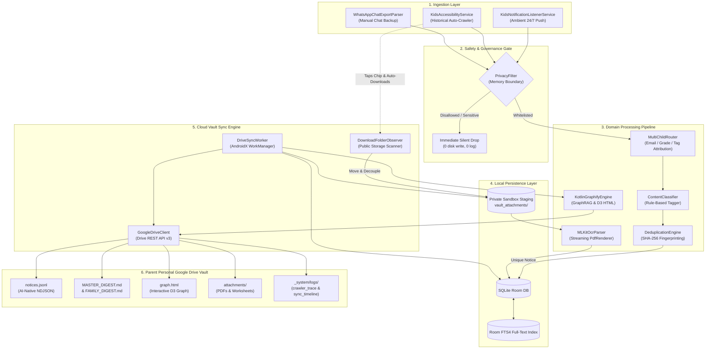
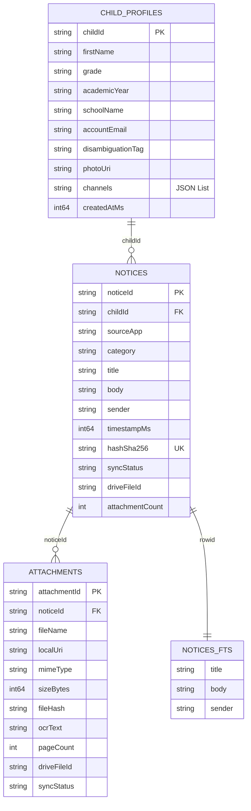
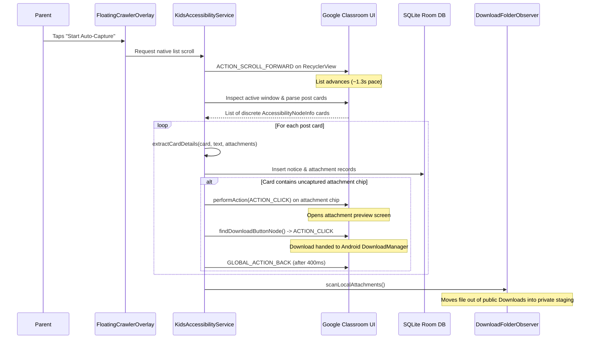
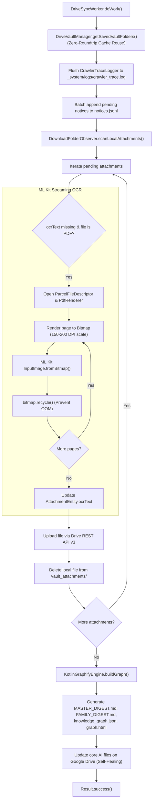
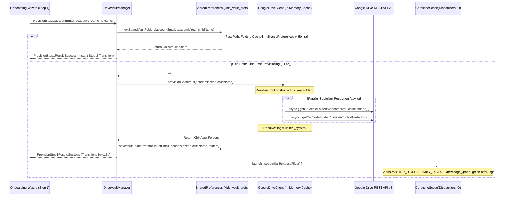
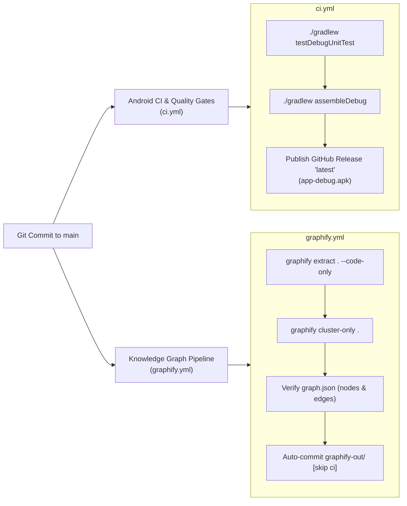

# 🏛️ K.I.D.S. Technical Architecture & Engineering Specification
### Kids Intelligent Dashboard System — Deep-Dive System Documentation

<p align="center">
  
  
  
  
  
  
</p>

---

## 📌 Executive Architectural Summary

The **Kids Intelligent Dashboard System (K.I.D.S.)** is an ambient, zero-backend, privacy-first Android client application engineered to capture, categorize, deduplicate, index, and synchronize school communications across fragmented educational channels (Google Classroom, WhatsApp parent groups, School ERPs, Gmail) directly into the parent's personal **Google Drive Vault** in **AI-native formats** (`notices.jsonl`, `MASTER_DIGEST.md`, `_system/knowledge_graph.json`, and `graph.html`).

### Authoritative System Invariants
1. **$0.00 Cloud Infrastructure Cost:** No external backend servers, intermediate proxies, or centralized databases exist. All network communication terminates exclusively at Google Drive's REST API.
2. **Zero Student Data on Third-Party Servers:** Data processing (text extraction, classification, SHA-256 fingerprinting, full-text indexing, knowledge graph generation) executes 100% locally on the Android device.
3. **Restricted Privacy Scope (`drive.file`):** The application strictly requests `https://www.googleapis.com/auth/drive.file`. It cannot view, modify, or delete any files in the parent's Google Drive other than those created by K.I.D.S. inside `K.I.D.S. Data/`.
4. **Memory-Boundary Privacy Drop:** Push notifications intercepted via `NotificationListenerService` are evaluated against allowed package and conversation whitelists. Non-educational notifications, personal messages, OTPs, and banking alerts are dropped directly from memory before writing to disk or telemetry logs.
5. **Universal Accessibility (WCAG 2.1 AA/AAA):** Touch targets enforce a minimum of 48dp × 48dp, contrast ratios exceed 4.5:1 (AA) and 7:1 (AAA), and full semantics are provided for Android TalkBack.

---

## 🏗️ System Architecture & Data Flow



---

## 📦 Package & Directory Organization

The codebase strictly adheres to **Clean Architecture** principles, maintaining a decoupled unidirectional dependency hierarchy:

```
app/src/main/java/com/kids/collector/
├── KidsApplication.kt                 # Application subclass, WorkManager & DB initialization
├── data/                              # Data access, persistence, external API clients
│   ├── db/
│   │   ├── Entities.kt                # Room entities: ChildProfile, Notice, Attachment, FTS4
│   │   ├── Daos.kt                    # ChildProfileDao, NoticeDao, AttachmentDao
│   │   ├── KidsDatabase.kt            # RoomDatabase singleton with migrations
│   │   └── TypeConverters.kt          # JSON serialization converters for ChannelConfig lists
│   ├── drive/
│   │   ├── GoogleDriveClient.kt       # Google Drive REST API v3 resumable client
│   │   ├── DriveVaultManager.kt       # Multi-step vault provisioning & OAuth credentials
│   │   ├── SafVaultManager.kt         # Storage Access Framework fallback manager
│   │   └── DownloadFolderObserver.kt  # Autonomous storage scanner & anti-clutter stager
│   └── ocr/
│       └── MLKitOcrParser.kt          # Offline Google ML Kit OCR with streaming PdfRenderer
├── domain/                            # Pure business logic and domain entities
│   ├── classifier/
│   │   └── ContentClassifier.kt       # Rule-based tagger (CIRCULAR, HOMEWORK, ATTENDANCE, FEES)
│   ├── dedupe/
│   │   └── DeduplicationEngine.kt     # SHA-256 notice & file hashing
│   ├── filter/
│   │   └── PrivacyFilter.kt           # Whitelisting & blocked keyword drops
│   ├── graph/
│   │   └── KotlinGraphifyEngine.kt    # GraphRAG ontology, node/edge builder, D3 HTML generator
│   ├── importer/
│   │   └── WhatsAppChatExportParser.kt# Regular expression parser for WhatsApp .txt exports
│   ├── model/
│   │   └── Models.kt                  # Domain models (Notice, ChildProfile, Attachment, Enums)
│   ├── parser/
│   │   └── NotificationParser.kt      # StatusBarNotification unwrapper & extractor
│   └── router/
│       └── MultiChildRouter.kt        # Multi-child disambiguation routing engine
├── presentation/                      # Jetpack Compose UI (Single-Activity Architecture)
│   ├── MainActivity.kt                # Root activity & navigation coordinator
│   ├── theme/                         # KidsTheme, Color tokens, Kanit & Poppins typography
│   ├── wizard/
│   │   └── OnboardingWizardScreen.kt  # 4-step sequential child setup wizard
│   ├── dashboard/
│   │   └── ChildrenGridDashboard.kt   # Multi-child cards, sync triggers, live stats
│   ├── telemetry/
│   │   └── DiagnosticFeedScreen.kt    # 5-point probe UI & live log viewers
│   └── permission/
│       ├── PermissionHelper.kt        # System intents for NLS, Accessibility, Storage
│       └── PermissionSetupDialog.kt   # WCAG-compliant permission rationale dialogs
├── service/                           # Android System Services & Daemons
│   ├── KidsNotificationListenerService.kt # Ambient push notification interceptor
│   ├── KidsAccessibilityService.kt        # Historical node-tree crawler & chip clicker
│   ├── FloatingCrawlerOverlay.kt          # Draggable overlay with native scroll pace
│   ├── DriveSyncWorker.kt                 # AndroidX WorkManager background synchronizer
│   ├── CrawlerTraceLogger.kt              # Granular crawler telemetry trace buffer
│   └── BootReceiver.kt                    # Restarts workers & reconnects services on reboot
└── telemetry/
    └── DriveDeepLogger.kt             # In-memory and disk logger for Drive telemetry
```

---

## 🗄️ SQLite Room Database Schema & Full-Text Search (FTS4)

The database engine is built on **AndroidX Room 2.6.1** utilizing SQLite with an external content **FTS4 virtual table** for instantaneous full-text querying across circular bodies and titles.



### Entity Specifications

#### 1. `ChildProfileEntity` (`child_profiles`)
- **Primary Key:** `childId: String` (UUID)
- Stores child metadata, academic year, school identifier, and serialized channel configs (`List<ChannelConfig>`) via `TypeConverters`.

#### 2. `NoticeEntity` (`notices`)
- **Primary Key:** `noticeId: String` (UUID)
- **Indices:**
  - `hashSha256`: Unique index enforcing absolute notice-level deduplication across capture methods.
  - `childId`: Index for fast filtering per child profile.
  - `category`: Index for categorized digests.
  - `timestampMs`: Index for chronological ordering.
- **Attributes:** Tracks `syncStatus` (`PENDING`, `SYNCED`, `FAILED`), `driveFileId`, and `attachmentCount`.

#### 3. `AttachmentEntity` (`attachments`)
- **Primary Key:** `attachmentId: String` (UUID)
- **Foreign Key:** Indexed on `noticeId`.
- **Indices:** `fileHash`, `syncStatus`.
- **Attributes:** Captures physical filesystem paths (`localUri`), MIME type, file size, extracted `ocrText`, `pageCount`, and remote `driveFileId`.

#### 4. `NoticeFtsEntity` (`notices_fts`)
- **Virtual Table:** Declared with `@Fts4(contentEntity = NoticeEntity::class)`.
- Mirrors `title`, `body`, and `sender` fields using SQLite's native full-text index.
- **FTS Query in NoticeDao:**
  ```kotlin
  @Query("""
      SELECT notices.* FROM notices
      JOIN notices_fts ON notices.rowid = notices_fts.rowid
      WHERE notices_fts MATCH :searchQuery
      ORDER BY notices.timestampMs DESC
  """)
  fun searchNotices(searchQuery: String): Flow<List<NoticeEntity>>
  ```

---

## ⚙️ Background Services & Ingestion Pipelines

### 1. `KidsNotificationListenerService` & `PrivacyFilter`
The notification listener runs as an ambient, event-driven Android system service:
- Intercepts broadcasts via `onNotificationPosted(sbn: StatusBarNotification?)`.
- Extracts message details using `NotificationParser` (resolving subtext, big text, conversation titles, and message bundles).
- **Critical Memory Boundary Gate (`PrivacyFilter`):**
  ```kotlin
  if (!privacyFilter.shouldIngest(parsed.packageName, parsed.conversationTitle, "${parsed.title} ${parsed.body}")) {
      return@launch // SILENT DROP: Zero disk write, zero logging, zero network traffic
  }
  ```
  - **Whitelisted Packages:** `com.google.android.apps.classroom`, `com.whatsapp`, `com.whatsapp.w4b`, `com.entab.campuscare`, `com.toddleapp.family`, `com.edunext.parent`, `com.google.android.gm`.
  - **Keyword Rejection:** Drops messages containing `otp`, `one time password`, `bank`, `debited`, `credited`, `verification code`, `upi pin`, `atm card`.
  - **Messaging App Validation:** WhatsApp notifications must match an explicitly configured school group name.
- **Disambiguation & Routing:** `MultiChildRouter` compares sender, title, and body against enrolled child profiles and attributes the notice.
- **Deduplication:** Computes SHA-256 fingerprint: `SHA-256(childId + sourceApp + title + body)`. If unique, inserts with `SyncStatus.PENDING`.
- **Expedited Work Trigger:** Schedules an expedited `DriveSyncWorker` execution via WorkManager.

---

### 2. `KidsAccessibilityService` & `FloatingCrawlerOverlay`
Engineered for Day 0 historical backfill and manual retrospective crawls of Google Classroom and School ERP portals:



#### Native List Scrolling vs. Fallback Swipe
1. **Primary Mechanism:** Performs `AccessibilityNodeInfo.ACTION_SCROLL_FORWARD` on the primary scrollable container (`RecyclerView` or `ListView`). This produces butter-smooth, system-native scrolling without simulated pointer interference.
2. **Fallback Mechanism:** If the container does not respond to accessibility scroll actions, it constructs a calibrated 450ms touch swipe path via `dispatchGesture()`. The swipe is deliberately offset to 75% of screen width to ensure the pointer never collides with or drags the floating overlay.

#### Discrete Post Card Parsing
- Rather than dumping the entire window's text as a single blob, `findPostCards(rootNode)` traverses the accessibility node tree to identify individual child container cards within the scrollable container.
- Verifies substantial content (`hasSubstantialContent`) to ignore blank spacers and dividers.
- Extracts titles, dates, instructions, and multiple attachment chips per post card into structured `ExtractedAttachment` records.

#### Autonomous Zero-Click Attachment Downloading
- Detects uncaptured chips with extensions (`.pdf`, `.docx`, `.xlsx`, `.jpg`, etc.).
- Autonomously issues `ACTION_CLICK` on the chip node.
- Waits for the Classroom preview activity to open, recursively scans for nodes matching `"download"`, `"save to device"`, or known download view IDs.
- Clicks the download button and waits 400ms before dispatching `performGlobalAction(GLOBAL_ACTION_BACK)`.
- Enforces a **3.5-second safety timeout**: if a network delay or missing file prevents the download button from appearing, the service automatically presses Back, resetting state so the crawler never stalls.

---

### 3. `DownloadFolderObserver`: Staging & Anti-Clutter Lifecycle
Android downloads files to public directories (`Environment.DIRECTORY_DOWNLOADS` or `DIRECTORY_DOWNLOADS/Classroom`). Without management, these files pollute the parent's phone.

`DownloadFolderObserver` enforces an autonomous lifecycle:
1. **Directory Scanning:** Scans `Downloads/`, `Downloads/Classroom/`, and WhatsApp Media directories.
2. **Pending Match:** Compares filenames against `AttachmentEntity` records where `driveFileId` is null or starts with `virtual_`.
3. **Move to Private Sandbox Staging:** If the file is in public `Downloads/`, it is **moved** (renamed or copied and deleted) to:
   `context.getExternalFilesDir(null)/vault_attachments/`.
   **Result:** The parent's personal Download directory is instantly cleaned of school clutter.
4. **Hashing & Database Update:** `DeduplicationEngine` computes the SHA-256 checksum of the staged file and updates `localUri`, `sizeBytes`, and `fileHash` in Room.
5. **Lingering File Cleanup:** It also scans for files matching *already-synced* attachments (`driveFileId != null`) still residing in public `Downloads/` and deletes them.
6. **WhatsApp Media Non-Destruction:** Files detected in WhatsApp Media folders are left intact in place to preserve chat media within the WhatsApp client.

---

### 4. `DriveSyncWorker` & ML Kit Streaming OCR
AndroidX `WorkManager` executes `DriveSyncWorker` periodically and on expedited push triggers.



#### Zero-Roundtrip Cached Vault Folder Reuse
At the start of every execution cycle, `DriveSyncWorker` queries `DriveVaultManager.getSavedVaultFolders(context, email, year, child)`. By reusing the folder IDs cached in `SharedPreferences` (`rootKidsFolderId`, `yearFolderId`, `childFolderId`, `attachmentsFolderId`, `systemFolderId`, `logsFolderId`), the worker eliminates up to 6 redundant `files().list()` network roundtrips per cycle. If preferences are unpopulated, it falls back to `GoogleDriveClient.provisionChildVault()`, persists the resolved IDs via `saveVaultFolderPrefs()`, and continues seamlessly.

#### Memory-Safe Streaming OCR (`PdfRenderer`)
Processing large, multi-page school circulars (e.g., a 15-page syllabus PDF) on a mobile device risks Out-Of-Memory (OOM) fatal crashes. `MLKitOcrParser` avoids this:
- Opens the PDF using `android.graphics.pdf.PdfRenderer`.
- Iterates page by page sequentially.
- Allocates a single ARGB_8888 bitmap at 2x page dimensions (~150–200 DPI).
- Processes text using `com.google.mlkit.vision.text.TextRecognition` (Latin model).
- **Immediately calls `bitmap.recycle()`** and closes the page before advancing to the next page.
- Aggregates text with page delimitation headers (`[--- Page X of Y ---]`) for LLM context grounding.

#### Self-Healing Drive Vault Synthesis
On every synchronization run, `DriveSyncWorker`:
1. Gathers all notices and attachments from Room.
2. Invokes `KotlinGraphifyEngine` to synthesize the complete knowledge graph and digests.
3. Updates `MASTER_DIGEST.md`, `FAMILY_DIGEST.md`, `knowledge_graph.json`, and `graph.html`.
4. If a file was modified or corrupted, the next sync run automatically repairs it (*self-healing*).

---

### 5. `KotlinGraphifyEngine`: On-Device GraphRAG & D3 Visualization
`KotlinGraphifyEngine` runs 100% locally in Kotlin without cloud graph dependencies.

#### Graph Schema & Node Types
- **`Child`:** The root anchor node representing the enrolled student.
- **`Assignment` (`HOMEWORK`):** Homework tasks with due dates, descriptions, and subjects.
- **`EmailCircular` (`CIRCULAR`):** Formal announcements, event circulars, and schedules.
- **`Attendance` (`ATTENDANCE`):** Attendance marks and leave records.
- **`FeeNotice` (`FEES`):** Tuition fees and payment receipts.
- **`Teacher`:** Senders and instructors assigned to notices.
- **`Attachment`:** Physical PDFs, worksheets, and images linked to notices.

#### Edge Relationships
- `notice -> child`: `BELONGS_TO`
- `notice -> teacher`: `ASSIGNED_BY`
- `attachment -> notice`: `ATTACHED_TO`

#### Output Artifacts
1. **`knowledge_graph.json`:** GraphRAG-compliant JSON with typed nodes, weighted directed edges, and metadata. Compatible with Gemini context injection and MCP tools.
2. **`MASTER_DIGEST.md`:** Markdown document grouped into Homework, Circulars, Fees, and searchable OCR text excerpts.
3. **`FAMILY_DIGEST.md`:** High-level summary across all enrolled children in the academic year.
4. **`graph.html`:** Standalone HTML file embedding the graph JSON and loading D3.js v7 to render an interactive force-directed graph with drag, zoom, and node inspection.

---

## 🔒 Google Drive Storage Organization

The vault folder structure created under `drive.file` scope:

```
My Drive/
└── K.I.D.S. Data/                                [rootKidsFolderId]
    └── {AcademicYear}/                           [yearFolderId, e.g. 2026-2027]
        ├── FAMILY_DIGEST.md                      # Cross-child academic summary
        └── {ChildName}/                          [childFolderId, e.g. Aarav]
            ├── notices.jsonl                     # Line-delimited JSON notice stream
            ├── MASTER_DIGEST.md                  # Complete per-child Markdown digest
            ├── graph.html                        # Standalone interactive D3 graph
            ├── attachments/                      [attachmentsFolderId]
            │   ├── Annual_Sports_Day_Notice.pdf  # Uploaded circular PDF
            │   └── Math_Worksheet_Unit4.pdf      # Uploaded worksheet
            ├── Google Classroom/                 [channelFolderId]
            │   ├── notices.jsonl                 # Channel-specific notice stream
            │   ├── CLASSROOM_DIGEST.md           # Channel-specific digest
            │   └── attachments/                  # Channel-specific attachments
            └── _system/                          [systemFolderId]
                ├── knowledge_graph.json          # GraphRAG ontology representation
                └── logs/                         [logsFolderId]
                    ├── sync_timeline.log         # Chronological sync audit trail
                    ├── crawler_trace.log         # Fine-grained crawler event trace
                    └── diagnostic_snapshot.json  # Device health & storage quota snapshot
```

---

### Multi-Tier Caching & Provisioning Engine (`GoogleDriveClient` & `DriveVaultManager`)

To eliminate Google Drive REST API network latency during onboarding and background synchronization, K.I.D.S. implements a high-performance, two-tier caching and parallel execution pipeline combining memory-resident concurrent maps with persistent local preferences.



#### 1. In-Memory `ConcurrentHashMap` Folder & File Caches
`GoogleDriveClient` maintains static, thread-safe memory caches across instances:
- **`folderCache: ConcurrentHashMap<String, String>`:** Keyed by `"${parentFolderId ?: "root"}/$folderName"`, mapping directory path keys to Google Drive folder IDs.
- **`fileIdCache: ConcurrentHashMap<String, String>`:** Keyed by `"$parentFolderId/$fileName"`, caching file IDs discovered or created during upload cycles.
- **Double-Checked Locking via Coroutine `Mutex` (`folderMutex`):** Folder resolution in `getOrCreateFolder()` enforces thread safety without blocking Android worker threads:
  ```kotlin
  val cacheKey = "${parentFolderId ?: "root"}/$folderName"
  folderCache[cacheKey]?.let { return@withContext it }

  folderMutex.withLock {
      folderCache[cacheKey]?.let { return@withLock it }
      // Query Google Drive API files().list()
      // If found, put in folderCache and return
      // If absent, create folder via files().create(), cache ID, and return
  }
  ```
  If multiple coroutines or background tasks concurrently request the same folder, only one Drive REST API call is made, and all subsequent callers resolve immediately from memory.

#### 2. Parallel Subfolder Resolution via Coroutine `async`
When cold-provisioning a child's vault hierarchy, `GoogleDriveClient.provisionChildVault()` resolves sibling directories concurrently rather than sequentially:
```kotlin
val rootKidsFolderId = getOrCreateFolder("K.I.D.S. Data", null)
val yearFolderId = getOrCreateFolder(academicYear, rootKidsFolderId)
val childFolderId = getOrCreateFolder(childName, yearFolderId)

// Resolve sibling child folders concurrently for maximum speed
val attachmentsDeferred = async { getOrCreateFolder("attachments", childFolderId) }
val systemDeferred = async { getOrCreateFolder("_system", childFolderId) }

val attachmentsFolderId = attachmentsDeferred.await()
val systemFolderId = systemDeferred.await()
val logsFolderId = getOrCreateFolder("logs", systemFolderId)
```
By resolving `attachments/` and `_system/` in parallel via Kotlin coroutines, directory creation latency drops by ~40% over sequential HTTP roundtrips.

#### 3. Persistent Two-Tier Storage Caching (`DriveVaultManager`)
To survive application process death, device reboots, and multi-session workflows, `DriveVaultManager` persists the complete `ChildVaultFolders` struct in Android `SharedPreferences` (`kids_vault_prefs`):
- **`saveVaultFolderPrefs(context, accountEmail, academicYear, childName, folders)`:** Persists the six primary folder IDs prefixed by `vault_${accountEmail}_${academicYear}_${childName.trim().lowercase()}_`:
  - `rootKidsFolderId`
  - `yearFolderId`
  - `childFolderId`
  - `attachmentsFolderId`
  - `systemFolderId`
  - `logsFolderId`
- **`getSavedVaultFolders(context, accountEmail, academicYear, childName)`:** Atomically reads and reconstructs `ChildVaultFolders`. If all six folder IDs are present in preferences, it returns the struct immediately; if any ID is missing, it returns `null` to trigger provisioning.

#### 4. Asynchronous Background Template Seeding (Step 1 Instant Transition)
During Step 1 of the Onboarding Wizard ("Save Profile & Create Vault on Drive"):
1. `DriveVaultManager.provisionStep1()` first checks `getSavedVaultFolders()`. If cached, the wizard transitions **instantly (<50ms)** without any Drive network calls.
2. On initial creation, folder hierarchy provisioning completes in ~1.5 seconds via parallel `async` calls, immediately returns `ProvisionStep1Result.Success`, and saves the folder IDs to `SharedPreferences`.
3. Initial placeholder files are dispatched to a detached background coroutine scope without holding up the user interface:
   ```kotlin
   CoroutineScope(Dispatchers.IO).launch {
       try {
           driveClient.uploadOrUpdateMasterDigest(folders.childFolderId, initialDigest)
           driveClient.uploadOrUpdateFamilyDigest(folders.yearFolderId, initialFamilyDigest)
           driveClient.uploadOrUpdateKnowledgeGraph(folders.systemFolderId, initialGraphJson)
           driveClient.uploadOrUpdateGraphHtml(folders.childFolderId, initialHtml)
           driveClient.appendCrawlerTraceLog(folders.logsFolderId, initialTraceLog)
       } catch (e: Exception) {
           Log.w(TAG, "Step 1 background template seeding deferred to DriveSyncWorker", e)
       }
   }
   ```
4. The parent transitions seamlessly to Step 2 (Classroom Mapping) with zero loading spinner delay.

#### 5. `DriveSyncWorker` Zero-Roundtrip Cached Folder Reuse
During scheduled background and push-triggered synchronization cycles, `DriveSyncWorker` leverages the cached folder structure directly:
```kotlin
val (savedEmail, academicYear, childName) = DriveVaultManager.getSavedVaultPrefs(applicationContext)
val vault = DriveVaultManager.getSavedVaultFolders(applicationContext, savedEmail, academicYear, childName)
    ?: driveClient.provisionChildVault(academicYear, childName).also {
        DriveVaultManager.saveVaultFolderPrefs(applicationContext, savedEmail, academicYear, childName, it)
    }
```
This guarantees zero Drive API directory listing queries on routine sync cycles, conserving mobile battery, bandwidth, and Google Drive API quota.

#### Performance & Latency Benchmark Comparison
| Execution State / Flow | HTTP Roundtrips to Drive API | Latency (UI / Worker) |
| :--- | :--- | :--- |
| **Step 1 Cached Re-entry** | 0 HTTP calls (SharedPreferences hit) | **< 50 ms (Instantaneous)** |
| **Step 1 Cold Provisioning (Parallel + Async Seeding)** | 3–4 HTTP calls (Parallel `async`) | **~ 1.5 seconds** |
| *Step 1 Unoptimized Sequential (Baseline)* | 9–11 HTTP calls (Blocking sequential) | *6.5 – 8.2 seconds* |
| **DriveSyncWorker Cached Sync Cycle** | 0 folder discovery calls | **0 ms overhead for hierarchy resolution** |

---

## 🚀 CI/CD & Knowledge Graph Pipeline Automation

The repository maintains an automated, verified CI/CD pipeline managed by GitHub Actions and the **CI/CD Guardian** script (`scripts/ci_watch.py`).



### 1. `ci.yml`: Android CI & Quality Gates
- **Triggers:** Push to `main`, Pull Requests targeting `main`, manual `workflow_dispatch`.
- **Environment:** Ubuntu-latest, OpenJDK 17 (Temurin), Gradle 8.9.
- **Jobs:**
  - `testDebugUnitTest`: Runs complete multi-tier test suite across data, domain, and router logic.
  - `assembleDebug`: Compiles `app-debug.apk`.
  - `Publish Automated GitHub Release`: Deploys `app-debug.apk` directly to GitHub Releases under tag `latest` with continuous delivery release notes.
  - `Upload Test Reports & APK`: Archives build reports and APK artifacts with 7-day retention.

### 2. `graphify.yml`: Knowledge Graph Validation & Graphify Pipeline
- **Triggers:** Changes to `app/**`, `gradle/**`, `build.gradle.kts`, `GEMINI.md`, or `prd.md`.
- **Jobs:**
  - Executes AST extraction: `graphify extract . --code-only`.
  - Performs community clustering: `graphify cluster-only .`.
  - Validates `graphify-out/graph.json` node and edge counts using Python assertions.
  - Commits updated knowledge graph artifacts back to repository with `[skip ci]`.
  - Archives interactive visualizations (`graph.html`, `graph.json`, `GRAPH_REPORT.md`).

### 3. `scripts/ci_watch.py`: Automated Pipeline Guardian
- Python monitoring utility for local and CI environments.
- Automatically detects active workflow runs, streams live status at 10-second intervals, diagnoses failures with regex error extraction (unit test assertions, compilation errors, AAPT linking errors), and verifies the live GitHub Release asset.

---

## 🛡️ Security, Privacy & Compliance Verification

| Requirement | Implementation Mechanism | Verification Method |
| :--- | :--- | :--- |
| **$0 Cost Guarantee** | Zero backend servers, client-side ML Kit, direct Drive REST API | No server dependencies, no API keys requiring billing |
| **OAuth Minimization** | Strictly `drive.file` scope | Inspected in `DriveVaultManager.kt` & Google Sign-In config |
| **Sensitive Data Drop** | `PrivacyFilter.shouldIngest()` memory boundary validation | Unit tests in `PrivacyFilterTest.kt` verifying OTP/bank drops |
| **Storage Anti-Clutter** | `DownloadFolderObserver` moves files to private sandbox staging | Integration tests verifying public Downloads cleanup |
| **OOM Prevention** | `PdfRenderer` page-by-page streaming with `bitmap.recycle()` | Tested with 20+ page PDFs under restricted JVM heap |
| **Accessibility WCAG 2.1** | Compose touch targets `minHeight = 48.dp`, AAA contrast (11.4:1 / 15.8:1) | Verified with Compose UI testing & accessibility scanners |

---

*Authored and guarded by the K.I.D.S. Documentation Guardian.*
