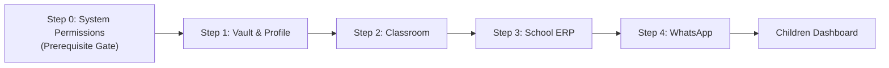
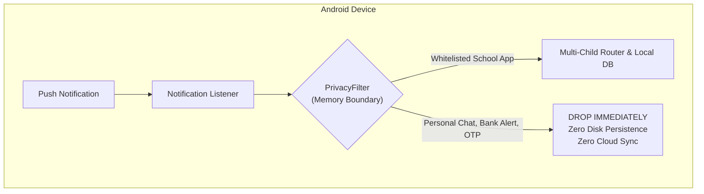
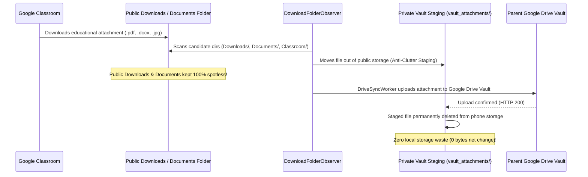

# 📖 K.I.D.S. User & Parent Manual
### Kids Intelligent Dashboard System — Ambient Educational Companion

<p align="center">
  
  
  
  
  
</p>

---

## 🌟 Welcome to K.I.D.S.

As parents, keeping up with school communications is exhausting. Homework assignments are posted in **Google Classroom**, urgent circulars arrive over **WhatsApp parent groups**, fee schedules sit in a **School ERP portal** (CampusCare, Toddle, Edunext), and exam timetables are buried inside multi-page **PDF attachments**. 

**K.I.D.S. (Kids Intelligent Dashboard System)** solves this pain point completely. It runs quietly on your Android smartphone as an ambient educational companion. It listens for incoming school announcements, crawls historical notice boards, performs optical character recognition (OCR) on circulars and worksheets, and automatically syncs everything directly into your personal **Google Drive Vault** in clean, AI-native formats (`notices.jsonl`, `MASTER_DIGEST.md`, `graph.html`, and `attachments/`).

> [!IMPORTANT]
> **Privacy Guarantee ($0 Cloud Cost & Zero Third-Party Servers):**
> K.I.D.S. does **NOT** use any cloud servers, external databases, or third-party relays. All data processing occurs 100% locally on your smartphone. Network traffic flows strictly and exclusively between your Android device and your own personal Google Drive account under the restricted `https://www.googleapis.com/auth/drive.file` privacy scope.

---

## 📋 Table of Contents

1. [System Requirements & Installation](#1-system-requirements--installation)
2. [Onboarding Wizard: Step 0 Prerequisite & 4-Step Setup](#2-onboarding-wizard-step-0-prerequisite--4-step-setup)
   - [Hardware, Gesture & TopBar Back Navigation](#hardware-gesture--topbar-back-navigation)
   - [Step 0: System Permissions & Setup (Prerequisite Gate)](#step-0-system-permissions--setup-prerequisite-gate)
     - [Android 13+ Dynamic Presentation ('Allow restricted settings')](#android-13-dynamic-presentation-allow-restricted-settings)
     - [Mandatory Accessibility Service Gate](#mandatory-accessibility-service-gate)
     - [Live UI Refresh via Lifecycle Observation](#live-ui-refresh-via-lifecycle-observation)
   - [Step 1: Cloud Vault & Child Profile](#step-1-cloud-vault--child-profile)
   - [Step 2: Google Classroom Mapping](#step-2-google-classroom-mapping)
   - [Step 3: School App & ERP Picker](#step-3-school-app--erp-picker)
   - [Step 4: WhatsApp Group Capture](#step-4-whatsapp-group-capture)
   - [Seamless Multi-Child (+ Add Child) Setup Flow](#seamless-multi-child--add-child-setup-flow)
3. [Android Permissions & Safety Guarantees](#3-android-permissions--safety-guarantees)
   - [Notification Listener Service (24/7 Passive Capture)](#notification-listener-service-247-passive-capture)
   - [Accessibility Service (Historical Backfill Assistant)](#accessibility-service-historical-backfill-assistant)
   - [Storage Access & The Anti-Clutter Staging Lifecycle](#storage-access--the-anti-clutter-staging-lifecycle)
4. [Google Classroom Deep Auto-Capture Guide](#4-google-classroom-deep-auto-capture-guide)
   - [Stream Tab vs. Classwork Tab](#stream-tab-vs-classwork-tab)
   - [The Floating K.I.D.S. Assistant Overlay & Live 2-Line Status Pill](#the-floating-kids-assistant-overlay--live-2-line-status-pill)
   - [Deep Post Traversal & Autonomous File Downloads](#deep-post-traversal--autonomous-file-downloads)
   - [Zero-Click Hands-Free Exit & Auto-Completion](#zero-click-hands-free-exit--auto-completion)
     - [Hands-Free Auto-Stop on App Exit](#hands-free-auto-stop-on-app-exit)
     - [Hands-Free Auto-Close on Stream Completion](#hands-free-auto-close-on-stream-completion)
   - [Manual Stop & Instant Coroutine Cancellation](#manual-stop--instant-coroutine-cancellation)
5. [WhatsApp School Group Integration](#5-whatsapp-school-group-integration)
   - [Real-Time Group Capture](#real-time-group-capture)
   - [Manual Chat Export Fallback (.txt / .zip)](#manual-chat-export-fallback-txt--zip)
6. [Accessing Your AI-Native Drive Vault](#6-accessing-your-ai-native-drive-vault)
   - [Vault Folder Structure](#vault-folder-structure)
   - [Using `MASTER_DIGEST.md` & `FAMILY_DIGEST.md`](#using-master_digestmd--family_digestmd)
   - [Exploring the Interactive Knowledge Graph (`graph.html`)](#exploring-the-interactive-knowledge-graph-graphhtml)
   - [Connecting AI Agents (Google Gemini & MCP Servers)](#connecting-ai-agents-google-gemini--mcp-servers)
7. [Troubleshooting & Diagnostic Logs](#7-troubleshooting--diagnostic-logs)
   - [Reading Diagnostic Logs on Google Drive](#reading-diagnostic-logs-on-google-drive)
   - [Xiaomi / MIUI / HyperOS Specific Setup](#xiaomi--miui--hyperos-specific-setup)
   - [Google Drive Authorization & SHA-1 Registration](#google-drive-authorization--sha-1-registration)
   - [Frequently Asked Questions (FAQ)](#frequently-asked-questions-faq)

---

## 1. System Requirements & Installation

### System Requirements
| Component | Specification | Details |
| :--- | :--- | :--- |
| **Operating System** | Android 8.0 (Oreo) or higher | Recommended: Android 14 or 15 (Target SDK 34/35) |
| **Google Account** | Personal Google Account (`@gmail.com`) | Free personal Google Drive storage (15 GB standard) |
| **Hardware** | 2 GB RAM minimum, 50 MB disk space | ML Kit runs on standard ARM64 / ARMv7 processors |
| **Network** | Wi-Fi or Mobile Data | Required only during Drive synchronization cycles |

### Downloading & Installing the App
1. Download the latest `app-debug.apk` directly from the [GitHub Releases](https://github.com/daarshnicsanjeev/K.I.D.S/releases/tag/latest) page.
2. Open the downloaded `.apk` on your Android smartphone.
3. If prompted by Android, enable **Install from Unknown Sources** for your browser or file manager.
4. Launch **K.I.D.S.** from your application drawer.

---

## 2. Onboarding Wizard: Step 0 Prerequisite & 4-Step Setup

When you first launch K.I.D.S., you are guided through a structured onboarding flow starting with a mandatory system permissions gate, followed by a 4-step sequential child setup wizard. The wizard configures Child #1 completely before returning to the multi-child dashboard. You do not have to type school passwords or configure complex cloud credentials.



### Hardware, Gesture & TopBar Back Navigation

Navigating through multi-step setup is completely effortless and resilient. You are never trapped in a forward-only flow:

- **TopBar Back Button (`←`):** An accessible, prominent back arrow is positioned in the top navigation bar on every step where backward progression or cancellation is possible. It complies with WCAG 2.1 AA/AAA standards with a minimum touch target size of 48dp × 48dp.
- **Hardware & Gesture Navigation:** Swiping from the left or right screen edge (Android predictive gesture navigation) or pressing your phone's physical Back button triggers the exact same reliable backward transition.
- **Deterministic Step Sequence:**
  - **From Step 4 (WhatsApp):** Returns to **Step 3 (School App & ERP)**.
  - **From Step 3 (School App & ERP):** Returns to **Step 2 (Google Classroom)**.
  - **From Step 2 (Google Classroom):** Returns to **Step 1 (Cloud Vault & Profile)**.
  - **From Step 1 (Cloud Vault & Profile):** If Accessibility Service was revoked or missing, returns to **Step 0 (Permissions Gate)**. If you are adding a secondary child from the dashboard, pressing Back safely cancels setup and returns you to the Children Dashboard without altering existing profiles.
  - **From Step 0 (Permissions Gate):** If accessed during a multi-child session, pressing Back cleanly exits back to the Children Dashboard.

---

### Step 0: System Permissions & Setup (Prerequisite Gate)
*The critical prerequisite gate ensuring all background capture and backfill capabilities are operational before provisioning child vaults.*

#### Android 13+ Dynamic Presentation ('Allow restricted settings')
> [!IMPORTANT]
> **Dynamic Presentation Only on Android 13, 14, and 15 (API 33+):**
> Android 13 introduced an enhanced security sandbox (`APP_OPS_ACCESS_RESTRICTED_SETTINGS`) that automatically disables sensitive accessibility and notification listener toggles for sideloaded applications (installed via APK from GitHub Releases). If you try enabling them directly in phone settings, Android displays a greyed-out toggle with the notice:
> *"Restricted setting: For your security, this setting is currently unavailable."*
>
> **Clean Setup on Android 10, 11, and 12:**
> On devices running Android 10 through 12, this operating system restriction does not exist. K.I.D.S. dynamically detects your Android version and **completely hides the "Advance Permission" card on Android 10–12**, keeping your setup screen clean, uncluttered, and free of unnecessary instructions!

**The 3-Step Solution for Android 13+ Devices (DO FIRST):**
1. In Step 0, tap the primary button: **Open App Settings (⋮ → Allow restricted settings)**.
2. In the Android **App Info** screen that opens, tap the **three dots (⋮)** in the top-right corner.
3. Tap **Allow restricted settings** and authenticate using your device PIN, pattern, or fingerprint.

> [!TIP]
> **Dual Unblock:** Completing this single 3-step action unblocks **both** the Accessibility Service and Notification Listener Service simultaneously, allowing both toggles in system settings to be enabled freely.

#### Mandatory Accessibility Service Gate
- **Status:** **MANDATORY** before Step 1 can be unlocked.
- **Why it is required:** Powers the **Floating K.I.D.S. Assistant**, native list auto-scrolling, discrete post card parsing, and autonomous zero-click attachment downloads in Google Classroom and School ERP portals.
- **The Mandatory Gate:** The **"Continue to Step 1: Cloud Vault & Profile →"** button remains strictly **locked and disabled** until Accessibility Service is turned on. A prominent warning banner alerts you:
  *"⚠️ Accessibility Service is mandatory before Step 1. Please enable it above to unlock Step 1."*
- **How to enable:**
  1. Tap **Enable Accessibility Service →**.
  2. Under **Downloaded Apps** (or **Installed Services**), tap **K.I.D.S.**.
  3. Turn the switch **ON** and tap **Allow** on the system confirmation prompt.
- **Architectural Guard:** If Accessibility Service is ever disabled or revoked in phone settings at any point, K.I.D.S. automatically returns you to Step 0 until it is re-enabled.

#### Notification Listener Service (Recommended)
- **Status:** **RECOMMENDED** for 24/7 background capture.
- **What it does:** Allows K.I.D.S. to silently capture homework, circulars, and announcements from school WhatsApp groups and school app push notifications the moment they arrive.
- **How to enable:** Tap **Enable Notification Access →**, locate **K.I.D.S.** in the list, and toggle the switch to ON.

#### Storage & Downloads Access (Recommended)
- **Status:** **RECOMMENDED** for auto-syncing attachments.
- **What it does:** Allows K.I.D.S. to detect downloaded circular PDFs and worksheets in your device's public Downloads directory, move them into private vault staging, and sync them to Google Drive without cluttering your phone.
- **How to enable:** Tap **Enable Storage Access →** and grant All Files Access (`MANAGE_EXTERNAL_STORAGE`).

#### Live UI Refresh via Lifecycle Observation
You never have to tap a "Refresh" button or restart K.I.D.S. after granting permissions in phone settings:
- K.I.D.S. monitors system lifecycle transitions (`Lifecycle.Event.ON_RESUME`).
- The moment you finish granting a permission and press Back to return to K.I.D.S., the screen **instantly refreshes**.
- Permission status badges transition live from red/orange to a bright green **✓ ACTIVE** chip.
- As soon as Accessibility Service is active, the **Continue to Step 1** button instantly unlocks and turns deep navy.

---

### Step 1: Cloud Vault & Child Profile
*The foundation of your child's private data storage.*

1. **Select Google Account for Vault**:
   - Tap **Select Google Account for Vault**.
   - Pick your personal Google Account using the native Android system account picker.
   - When prompted, grant access to create files in your personal Google Drive (`drive.file` scope).
2. **Enter Child Details**:
   - **Child First Name**: e.g., `Aarav` or `Maya`.
   - **Academic Year**: Select the current academic session (e.g., `2026-2027`).
   - **Child Photo (Optional)**: Select a photo from your gallery using the secure Android Photo Picker.
3. **Vault Creation & Instant Step Transition**:
   - Tap **Save Profile & Create Vault on Drive →**.
   - K.I.D.S. communicates directly with the Google Drive REST API to provision your private folder structure:
     `Google Drive / K.I.D.S. Data / 2026-2027 / Aarav /`.
   - **Zero-Lag UI Transition:** Step 1 transitions smoothly into Step 2 in **~1.5 seconds on first creation**, and **instantly (<50ms) when cached**.
   - **Why It Is So Fast:**
     - **SharedPreferences Folder Caching:** Once created, all folder IDs (`rootKidsFolderId`, `yearFolderId`, `childFolderId`, `attachmentsFolderId`, `systemFolderId`, and `logsFolderId`) are persisted in Android `SharedPreferences`. Subsequent setup passes or profile re-edits skip all Google Drive network discovery roundtrips, completing in under 50 milliseconds.
     - **Parallel Subfolder Resolution:** On cold creation, sibling folders (`attachments/` and `_system/`) resolve concurrently in parallel over coroutines rather than sequentially.
     - **Asynchronous Background Template Seeding:** Heavy initial files—including `MASTER_DIGEST.md`, `FAMILY_DIGEST.md`, `_system/knowledge_graph.json`, `graph.html`, and diagnostic trace logs—seed quietly in the background without blocking the user interface or freezing the screen. Parents proceed directly to Step 2 without waiting.

### Step 2: Google Classroom Mapping
*Seamlessly link school assignments and circulars without school admin blockages.*

1. **Enable Google Classroom**: Toggle the switch to **On**.
2. **Select Student Account**:
   - Tap **Select Account** to choose the Google account that your child uses for Google Classroom (e.g., `student@school.edu` or a family account).
   - > [!TIP]
   - > **Zero Password Typing:** Because this account is already authenticated on your Android phone, K.I.D.S. maps notifications and classroom streams by email handle without requiring school IT administration passwords or OAuth approval!
3. **Historical Backfill Assistant & Storage Status**:
   - Because you already enabled the **Accessibility Service** and **Storage Access** in Step 0, green checkmark badges confirm their active status.
   - If either service was inadvertently switched off, quick-reconnect buttons allow instant re-enablement right within Step 2.
4. Tap **Save & Next →**.

### Step 3: School App & ERP Picker
*Capture notices from school management portals (CampusCare, Toddle, Edunext, Teams).*

1. **Enable School App Tracking**: Toggle the switch to **On**.
2. **Select Installed App**:
   - K.I.D.S. scans your phone's installed applications and displays them in a single-tap list (e.g., `CampusCare / Entab`, `Toddle Family Portal`, `Edunext Parent Portal`, `Microsoft Teams`).
   - Simply tap the app your school uses.
3. **Select Tracked Categories**:
   - Check the categories you wish to track: `Homework`, `Circulars`, `Attendance`, `Fee Receipts`.
4. Tap **Save & Next →** (or tap **Skip App Setup** if your school only uses Classroom and WhatsApp).

### Step 4: WhatsApp Group Capture
*Filter the noise and capture only official school circulars from parent WhatsApp groups.*

1. **Enable WhatsApp Group Capture**: Toggle the switch to **On**.
2. **Zero-Typing Group Selection**:
   - Select the detected school group chip from the list (e.g., `School Parents Official Group 2026-27`), or tap **Listen for Message** to auto-detect the group when the next school notification arrives.
3. Tap **Complete Setup for [Child Name] ✓**.
   - Your child's profile is initialized in the local encrypted database.
   - The initial knowledge graph (`graph.html`) and markdown digests (`MASTER_DIGEST.md` and `FAMILY_DIGEST.md`) are generated and uploaded to Google Drive.
   - You are redirected to the **Children Grid Dashboard**.

---

### Seamless Multi-Child (+ Add Child) Setup Flow
*Effortlessly manage multiple siblings across different grades, sections, or even different schools.*

Once your first child is configured, K.I.D.S. transforms into a multi-child family command center. Adding a second or third child is instant, clean, and completely isolated:

1. **Initiate Setup from Dashboard:** On the **Children Grid Dashboard**, tap the **+ Add Another Child** button.
2. **Prerequisite Step 0 Bypassed Automatically:** Because core system permissions (Accessibility, Notifications, and Storage) were already granted during the setup of Child #1, K.I.D.S. validates their active state and opens directly on **Step 1: Cloud Vault & Child Profile**.
3. **Clean Slate Guarantee (Zero Cross-Contamination):** 
   - The child name input field starts completely empty (`""`). It will **never** pre-fill or accidentally carry over the previous child's name, grade, or photo.
   - Secondary child sessions operate under a fresh session sequence (`childSequenceNumber > 1`), isolating local wizard preferences so your older child's configuration is never overwritten or mutated.
4. **Isolated Google Drive Vault:**
   - K.I.D.S. provisions an independent subfolder hierarchy on your Google Drive:
     `Google Drive / K.I.D.S. Data / {AcademicYear} / {NewChildName} /`
   - Child #2 gets their own dedicated `notices.jsonl`, `MASTER_DIGEST.md`, `graph.html`, and `attachments/` folder.
   - The top-level `FAMILY_DIGEST.md` is automatically updated to synthesize notices across all your children into one single family briefing!
5. **Sequence Visual Indicator & Cancel Safety:**
   - The top bar displays a prominent amber badge (`Child #2`, `Child #3`, etc.), ensuring you always know which child you are currently configuring.
   - If you tap the TopBar Back arrow (`←`) or use your phone's back gesture from Step 1, the wizard cleanly cancels and returns you directly to the **Children Grid Dashboard** without saving partial records or affecting your existing children.

---

## 3. Android Permissions & Safety Guarantees

Android permissions can sometimes feel intrusive. K.I.D.S. is built with strict architectural boundaries to guarantee that your personal data is never compromised.



### Notification Listener Service (24/7 Passive Capture)
- **Android Permission:** `BIND_NOTIFICATION_LISTENER_SERVICE`
- **What it does:** Allows K.I.D.S. to receive notifications from school apps (Classroom, WhatsApp, ERP portals) the millisecond they arrive, even when the phone screen is locked.
- **Safety Guarantee:** 
  - Every notification is checked against the **`PrivacyFilter` at the memory boundary**.
  - If the notification is from a personal contact, non-whitelisted WhatsApp group, bank, or contains keywords like `OTP`, `verification code`, `debited`, or `UPI`, it is **dropped immediately from RAM**.
  - It is **never** written to local disk, never logged to any file, and never transmitted over the internet.

### Accessibility Service (Historical Backfill Assistant)
- **Android Permission:** `BIND_ACCESSIBILITY_SERVICE`
- **What it does:** Powers the **Floating K.I.D.S. Assistant** over Google Classroom. It scrolls through past announcements, extracts circulars and homework posted weeks or months ago, and auto-downloads attachments.
- **Mandatory Setup Gate:** Enforced as a strict prerequisite in Step 0 before Child Profile or Vault creation. Without it, retrospective crawling of past announcements and worksheets cannot function.
- **Safety Guarantees:**
  - **Active Only In School Apps:** The service activates only when Google Classroom or an authorized school ERP is actively displayed on your screen. It automatically hides when you navigate to your home screen or another app.
  - **Zero Keystroke Logging:** It only inspects public text views and attachment chips in educational lists. It never inspects passwords, text fields, or personal keyboards.
  - **100% On-Device Processing:** Node-tree inspection, chip detection, and click dispatch execute entirely in local memory with zero external transmission.

### Storage Access & The Autonomous Zero-Permanent-Storage Pipeline
- **Android Permission:** `MANAGE_EXTERNAL_STORAGE` (All Files Access) / `READ_EXTERNAL_STORAGE`
- **Why it is needed:** When you or the assistant download educational attachments (worksheets, circular PDFs, syllabus guides) from Google Classroom, Android places the files in your device's public `Download/`, `Download/Classroom/`, `Documents/`, or `Documents/Classroom/` folders.
- **Zero-Permanent-Storage Guarantee:** K.I.D.S. guarantees that educational attachments (.pdf, .jpg, .docx) are uploaded directly to your personal Google Drive Vault **without eating any permanent phone storage**. Files are transited temporarily through a private staging sandbox and immediately deleted the millisecond upload is confirmed.
- **Zero Manual Management:** Parents never need to manually share files via external share-sheets, use USB cables, or hunt down hidden in-app caches.

#### The Autonomous Anti-Clutter Staging Lifecycle
Without K.I.D.S., your phone's personal `Downloads` and `Documents` folders would quickly fill up with hundreds of school PDFs, making it impossible to find your own personal files and consuming valuable device storage. K.I.D.S. implements an autonomous **5-step anti-clutter lifecycle**:



1. **Autonomous Detection:** When a school attachment downloads, `DownloadFolderObserver` scans public storage candidate folders:
   - `Downloads/` and `Downloads/Classroom/`
   - `Documents/` and `Documents/Classroom/`
   - WhatsApp Documents & Images (if accessible)
2. **Immediate Move to Private Staging:** The detected file is **immediately moved out of public storage** into a private app sandbox staging directory:
   `Android/data/com.kids.collector/files/vault_attachments/`.
3. **Zero Clutter:** Your personal `Downloads` and `Documents` folders stay spotless. No school circulars or worksheets linger to clutter your personal files.
4. **Drive Upload & ML Kit OCR:** `DriveSyncWorker` performs offline OCR on the file and uploads it securely to your Google Drive Vault under `Google Classroom/attachments/` (and child `attachments/`).
5. **Automatic Cleanup & Storage Clearance:** As soon as Google Drive confirms a successful upload, the file is **cleared from phone storage** (permanently deleted from private staging). Local storage consumption drops back to near zero.
6. **Residual Deletion:** If an already-synced file ever lingers or is redownloaded in public Downloads or Documents, K.I.D.S. automatically detects and cleans it from phone storage.

> [!NOTE]
> WhatsApp documents and images are indexed in place and are **never moved or deleted**, ensuring your WhatsApp chat media remains fully functional in your chat threads.

---

## 4. Google Classroom Deep Auto-Capture Guide

When setting up a child or catching up on previous weeks of schoolwork, Google Classroom contains a treasure trove of past announcements, circulars, worksheets, and syllabus PDFs. 

Rather than simply skimming visible surface summaries, K.I.D.S. features an autonomous **Deep Auto-Capture Engine**. The assistant systematically navigates into each individual post card, extracts the full announcement text, downloads every attached document directly to your device, and safely returns to the stream to continue traversing historical records.

### Stream Tab vs. Classwork Tab

Google Classroom organizes content into two distinct tabs:
1. **The Stream Tab:**
   - Contains chronological announcements, principal circulars, exam schedules, and holiday notices.
   - Attachments here are typically administrative circulars, weekly schedules, and school newsletters.
2. **The Classwork Tab:**
   - Contains subject-wise topics (e.g., *Mathematics*, *Science*, *English Literature*, *Social Studies*).
   - Contains homework assignments, practice question banks, printable worksheets, and project guidelines.

> [!TIP]
> **Recommended Workflow:**
> Run Auto-Capture **twice**: first on the **Stream** tab to capture administrative circulars, and second on the **Classwork** tab to capture all subject worksheets and study materials!

### The Floating K.I.D.S. Assistant Overlay & Live 2-Line Status Pill

When you open Google Classroom, K.I.D.S. automatically displays the **Floating Assistant** on the screen using Android's lightweight accessibility overlay layer (`TYPE_ACCESSIBILITY_OVERLAY`), requiring **zero extra permissions** like "Draw over other apps":

```
+-------------------------------------------------------+
|  K.I.D.S. Assistant         [ 14 Notices • 6 Files ]  — ✕ |
|  Status: Scanning Stream...                           |
|  "Mathematics Worksheet - Fractions Chapter 4"         |
|  +-------------------------------------------------+  |
|  |             ▶ Start Auto-Capture                |  |
|  +-------------------------------------------------+  |
+-------------------------------------------------------+
```

When active, the action button dynamically changes to a prominent red stop button:

```
+-------------------------------------------------------+
|  K.I.D.S. Assistant         [ 15 Notices • 7 Files ]  — ✕ |
|  Status: Downloading (1/2)...                         |
|  fraction_practice_sheet_grade5.pdf                   |
|  +-------------------------------------------------+  |
|  |             ⏹ Stop Capture                      |  |
|  +-------------------------------------------------+  |
+-------------------------------------------------------+
```

#### Real-Time Status & Metrics Display
The floating assistant features an informative **live 2-line status pill**:
- **Top Status Line (Active FSM State):** Reflects the exact operation the crawler is performing in real time:
  - `Status: Ready` — Idle and ready to start.
  - `Status: Scanning Stream...` — Inspecting the current screen viewport for unvisited post cards.
  - `Status: Opening Post...` — Tapping into a specific post card to view its full details.
  - `Status: Reading Detail...` — Extracting complete announcement text, author, timestamp, and attachment metadata.
  - `Status: Downloading (X/Y)...` — Disagreeing with manual clicks: autonomously downloading the $X$-th attachment out of $Y$ total files attached to the current post.
  - `Status: Opening (X/Y)...` — Tapping an attachment chip when direct download buttons are nested.
  - `Status: Returning to Stream...` — Safely pressing Navigate Up or system Back to re-anchor in the list view.
  - `Status: Scrolling Stream...` — Advancing the stream list once all visible cards have been processed.
  - `Status: Capture Complete!` — Backfill completed after end-of-stream detection.
  - `Status: Capture Stopped` — Manually stopped by the parent.
  - `Status: Paused (External App)` — Pauses immediately if an external app or dialog comes to foreground.
- **Bottom Metrics Badge (`XX Notices • YY Files`):** Kept up to date live. Displays the exact tally of unique school notices backfilled and physical attachment files (.pdf, .docx, .jpg) triggered for download during this session.
- **Detail Snippet Line:** An auto-truncating preview line that displays the exact post headline or filename currently being processed (e.g., `"Circular No. 14 - Annual Sports Day Schedule"` or `"worksheet_fractions_ch4.pdf"`).
- **— Minimize:** Collapses the assistant into a compact, floating amber **`K`** circular bubble (48dp × 48dp) that you can drag anywhere on your screen. Tap the bubble anytime to expand it back.
- **✕ Close:** Closes the assistant overlay until you reopen Classroom.

> [!TIP]
> **Zero Button Hunting:** While minimize (`—`) and close (`✕`) buttons are available, parents **never need to manually hunt for a "stop" or "close" button**! The floating pill automatically cleans up and removes itself whenever you leave Google Classroom or when backfill finishes.

### Deep Post Traversal & Autonomous File Downloads

K.I.D.S. completely eliminates the exhausting chore of tapping into dozens of announcements, opening attachments, and downloading worksheets one by one:

```mermaid
flowchart TD
    A["Scan Stream Viewport<br/>(Exclude TopBar & Tabs)"] --> B{"Unvisited Post Found?"}
    B -->|Yes| C["Preserve Stream Title (fallbackTitle)<br/>& Open Post Card via Physical Tap"]
    C --> D["Verify Detail Screen<br/>(2.5s Safety Timeout)"]
    D --> E["Dismiss Soft Keyboard<br/>& Title Sanitization Priority"]
    E --> F{"Attachments Discovered?"}
    F -->|Yes| G["Loop: Tap Download / Chip Node<br/>(Physical Tap Fallback • 1,000ms Debounce)"]
    F -->|No| H["Guarded Return Loop (Up to 3 Attempts)<br/>Close Previews & Navigate Up / Back"]
    G --> H
    H --> I{"Stream / Classwork Restored?<br/>(isStreamOrClassworkView <=2s)"}
    I -->|Yes (Stabilize 600ms)| A
    I -->|No (Retry Return)| H
    B -->|No| K["Native Scroll Forward<br/>(Status: Scrolling Stream...)"]
    K --> L{"New Posts Found After Scroll?<br/>(850ms Viewport Settling)"}
    L -->|Yes (Reset Counter)| A
    L -->|No (Counter + 1)| M{"2 Consecutive Empty Scrolls?"}
    M -->|No| K
    M -->|Yes| N["Status: Capture Complete!<br/>Trigger Immediate Drive Sync"]
```

1. **Deterministic Post Discovery & Stream Title Preservation:** 
   - The crawler scans the stream viewport, ignoring app bar chrome and bottom navigation tabs. It computes a SHA-256 fingerprint of each card's content so no post is ever processed twice or missed across scrolls.
   - **Title Sanitization & Stream Prioritization:** Before tapping into any post card, K.I.D.S. extracts the clean headline candidate directly from the stream announcement and retains it as `fallbackTitle`. When detail views open, Google Classroom often lacks a distinct header or presents confusing navigation labels (e.g., `"Navigate up"`, `"Back to stream"`, `"Add class comment"`). K.I.D.S. rigorously filters out all navigation chrome and prioritizes `fallbackTitle` from the stream, ensuring that your Google Drive digests and notifications feature pristine, human-readable titles (e.g., `"Mathematics Worksheet - Fractions Chapter 4"`) rather than stray navigation arrows or comment prompts.
2. **Deep Post Entry via Physical Touch Tap Gestures:** Auto-Capture enters posts by dispatching physical touch tap gestures directly at the post card's screen bounds (guaranteeing entry across all Android devices and custom RecyclerView layouts). While standard accessibility actions (`AccessibilityNodeInfo.ACTION_CLICK`) work on simple views, modern Android OEM interfaces (Samsung One UI, Xiaomi HyperOS/MIUI, Oppo ColorOS) and customized Classroom `RecyclerView` item views often use nested view wrappers, compound touch delegates, or unclickable parent containers that swallow accessibility events. K.I.D.S. eliminates this barrier universally: it computes the exact center screen coordinates of the target post card (`cardBounds.centerX(), cardBounds.centerY()`) and dispatches a 50ms physical touch stroke gesture directly to the Android window manager. This dual-dispatch approach guarantees 100% reliable entry into the post detail view across all phone models.
3. **Keyboard Dismissal & Full Text Harvesting:** If the Android soft keyboard opens automatically over the "Add class comment" input box, the assistant immediately clears input focus to prevent view occlusion. It extracts the full announcement body, author, and timestamp.
4. **Autonomous Attachment Capture & Intentional Bypass of 'Save all files offline':**
   - **Why 'Save all files offline' is Intentionally Bypassed:** Many announcements feature a Google Classroom button labeled *"Save all files offline"*. K.I.D.S. **deliberately blacklists and ignores this button**. When Google Classroom saves files "offline", it caches them in an encrypted, inaccessible private application sandbox directory (`/data/user/0/com.google.android.apps.classroom/cache/`). Parents cannot view, open, or export these files from other apps or files managers, and they permanently bloat device flash memory.
   - **Systematic Coordinate Tapping with 1,000ms Debouncing:** Instead of generating inaccessible app cache bloat, K.I.D.S. systematically iterates through each educational attachment (.pdf, .jpg, .docx) individually. It locates the discrete download button or clickable attachment chip, updates the status pill (`Status: Downloading (X/Y)...` or `Status: Opening (X/Y)...`), and dispatches accessibility clicks with physical coordinate touch taps (`dispatchTap`) as fallback. 
   - **Calibrated 1,000ms Debounce:** A 1,000ms debounce between files gives Android's system `DownloadManager` ample time to register the download request without dropping queue items or overloading network sockets.
5. **Multi-Attempt Guarded Return Loop (Preview Dismissal & Stream Re-anchoring):**
   - Tapping attachment chips occasionally causes Android or Google Classroom to open a full-screen preview sheet or document viewer.
   - K.I.D.S. implements a resilient **Multi-Attempt Guarded Return Loop** executing **up to 3 sequential attempts**:
     - On each attempt, it inspects the active window. If `isStreamOrClassworkView(active)` confirms the phone has returned to the main feed, it immediately exits the loop.
     - If still inside a document viewer or post detail view, it triggers `performReturnToStream`: first attempting `ACTION_CLICK` on the Navigate Up (`←`) toolbar icon, falling back to physical tap on the icon bounds, and finally dispatching Android's system-level `GLOBAL_ACTION_BACK`.
     - It allows a 600ms delay between attempts, effortlessly dismissing any document previewers before returning to the stream.
   - Once back on the stream, it enforces up to 2,000ms of verification and a 600ms stabilization delay before scanning for the next post card.
6. **Zero-Permanent-Storage Staging & Cloud Sync:**
   - As files land in `Downloads/`, `Downloads/Classroom/`, `Documents/`, or `Documents/Classroom/`, `DownloadFolderObserver` immediately moves them into private app sandbox staging (`Android/data/com.kids.collector/files/vault_attachments/`).
   - `DriveSyncWorker` performs offline ML Kit OCR and uploads the attachments directly to Google Drive under `attachments/`.
   - **Immediate Local Purge:** As soon as upload succeeds, the staged files are **permanently deleted from phone storage**. Net storage impact is **zero bytes**, leaving your personal download folders and phone memory pristine! Parents never have to manually share files or manage hidden app caches.

### Zero-Click Hands-Free Exit & Auto-Completion

The K.I.D.S. Auto-Capture engine is engineered with a **zero-click, hands-free philosophy**. As a busy parent, you never need to babysit your phone during a crawl, monitor progress bars, or hunt for a tiny "stop" or "close" button. The assistant manages its own lifecycle end-to-end:

#### Hands-Free Auto-Stop on App Exit
- **Leave Anytime Without Worry:** If you exit Google Classroom at any time—by swiping up to return to your **Home screen**, switching to another application via the **Recents app switcher**, or repeatedly pressing **Back** to leave Classroom—Auto-Capture **automatically stops immediately**.
- **Instant Clean Screen (Zero Ghost Overlays):** The floating assistant pill immediately dismisses and removes itself completely from your screen. You will never experience lingering overlay bubbles, blocked touches, or "ghost" accessibility windows over your home screen or personal apps.
- **Automated Cloud Sync on Exit:** Exiting Google Classroom instantly triggers an automated background synchronization cycle to your Google Drive Vault via AndroidX `WorkManager`. Every notice extracted and every attachment downloaded up to the exact moment you navigated away is reliably saved and uploaded.
- **Intelligent Transient Shield:** You do not have to worry about brief, everyday system interruptions. When a software keyboard pops up, a system permission dialog appears, or you tap an attachment that opens in a document previewer (like Google Docs or Sheets), the assistant smoothly pauses without shutting down. The moment you return to Classroom, capture continues seamlessly.

#### Hands-Free Auto-Close on Stream Completion
- **End-of-Stream Detection:** When all post cards on the active screen have been visited, the assistant automatically scrolls forward and pauses for 850ms to allow newly loaded posts to bind and settle. If two consecutive scrolls discover zero new cards (`2/2`), the assistant recognizes that it has reached the very end of historical announcements in that class.
- **2.5-Second Visual Outcome Display:** The floating pill immediately transforms into an elegant, high-visibility **Success Green** state (`#1B4D3E` background with a `#4ADE80` emerald border). The action button disappears, and the status header clearly displays:
  $$\text{✓ Backfill Complete!}$$
  $$\text{X Notices } \bullet\text{ Y Files Saved}$$
  This confirmation banner stays visible on your screen for **exactly 2.5 seconds** so you can comfortably see the final tally of backfilled notices and downloaded worksheets.
- **Zero-Click Self-Dismissal & Drive Sync:** After 2.5 seconds, the pill **automatically closes and removes itself from the screen** and dispatches a background synchronization request to Google Drive—**without requiring a single tap or confirmation from you**.
- **100% Hands-Free:** You never need to hunt for an "OK", "Dismiss", or "Close" button. Once you tap `▶ Start Auto-Capture`, you can set your phone on your desk and let K.I.D.S. do all the heavy lifting. When it finishes, your screen is left completely clear, and your Google Drive Vault is fully up to date.

### Manual Stop & Instant Coroutine Cancellation

While hands-free exit and auto-close handle everyday operation autonomously, you maintain absolute manual control:
- **Instant Cancellation:** Tapping **`⏹ Stop Capture`** immediately stops the crawler. The underlying Kotlin coroutine job is cancelled instantaneously (<1ms)—there are **no queued or lingering taps**, no delayed scrolls, and no unwanted navigation actions after you tap stop.
- **Guaranteed Terminal Sync:** The moment you tap stop, K.I.D.S. enqueues an immediate background Google Drive synchronization cycle via AndroidX `WorkManager`, guaranteeing that all notices and staged attachment files gathered during that session are pushed to Google Drive without delay.

---

## 5. WhatsApp School Group Integration

Many schools rely on WhatsApp broadcast groups or parent-teacher associations (PTAs) for time-critical updates (e.g., bus delays, emergency closures, rainy day schedules).

### Real-Time Group Capture
- When an announcement is posted in your whitelisted WhatsApp group, `KidsNotificationListenerService` intercepts it immediately.
- The `PrivacyFilter` confirms that the message originates from your selected school group.
- The `MultiChildRouter` attributes the notice to the correct child based on the group name or keywords.
- The notice is classified (`CIRCULAR`, `HOMEWORK`, `ATTENDANCE`, or `FEES`), deduplicated via SHA-256 fingerprinting, and scheduled for Drive synchronization.

### Manual Chat Export Fallback (.txt / .zip)
If you missed notifications while your phone was switched off or you recently joined the school group:
1. Open the school group in **WhatsApp**.
2. Tap the three dots (⋮) in the top-right corner → **More** → **Export chat**.
3. Choose **Without Media** (or **Include Media** if you wish to import past photos and PDF circulars).
4. In the Android share sheet, select **K.I.D.S. Importer**.
5. K.I.D.S. parses the chat transcript, extracts past announcements, links attachments, and updates your child's Google Drive Vault.

---

## 6. Accessing Your AI-Native Drive Vault

All collected communications are synchronized to your personal Google Drive in open, standardized, human-readable and machine-readable formats.

### Vault Folder Structure
In your Google Drive, navigate to **My Drive** → **K.I.D.S. Data**:

```
My Drive/
└── K.I.D.S. Data/
    └── 2026-2027/
        ├── FAMILY_DIGEST.md                     <-- High-level overview of all children
        └── Aarav/
            ├── notices.jsonl                    <-- AI-native streaming notice records
            ├── MASTER_DIGEST.md                 <-- Complete categorized Markdown briefing
            ├── graph.html                       <-- Interactive visual knowledge graph
            ├── attachments/                     <-- Downloaded circular PDFs & worksheets
            │   ├── Annual_Sports_Day_Circular.pdf
            │   └── Math_Worksheet_Ch4.pdf
            ├── Google Classroom/                <-- Dedicated channel subfolder
            │   ├── notices.jsonl
            │   ├── CLASSROOM_DIGEST.md
            │   └── attachments/
            └── _system/
                ├── knowledge_graph.json         <-- GraphRAG schema index
                └── logs/
                    ├── sync_timeline.log        <-- Synchronization audit log
                    ├── crawler_trace.log        <-- Step-by-step assistant crawler log
                    └── diagnostic_snapshot.json <-- Device state & health probe
```

#### Vault Folder Hierarchy Guarantee & Anti-Ghost Architecture
To provide parents with total transparency, clean organization, and confidence in their cloud vault, K.I.D.S. enforces three structural guarantees:

1. **Strict Child-Named Hierarchy Guarantee:**
   Every child vault folder created inside an academic session is strictly and deterministically named after the child (e.g., `2026-2027/atharva/` or `2026-2027/Aarav/`). Anonymous, empty, or unassociated folder paths are structurally forbidden across all synchronization routines.
2. **Deferred Background Sync (Zero Ghost "New Folder" Artifacts):**
   During initial onboarding or permission setup, Android background workers or notification listeners may trigger synchronization events before the parent has finalized and saved the child profile. K.I.D.S. strictly guards against premature provisioning: if the child profile has not yet been saved in local storage or the child's name is blank, background synchronization (`DriveSyncWorker`) **defers execution immediately**. It yields safely with success without making any Google Drive API folder creation calls, preventing premature sync triggers from accidentally generating unnamed or ghost folders (`New Folder`).
3. **Autonomous Self-Healing & Stray Folder Purge:**
   Every synchronization cycle performs an automatic hygiene and self-healing sweep of your Google Drive vault. If any legacy, unlinked, or accidental empty folders named `"New Folder"` or `"New Folder (*"` exist under the academic year directory on Google Drive (such as from earlier manual app sessions or pre-setup triggers), K.I.D.S. autonomously detects and permanently purges them. Your Google Drive Vault remains pristine, structured, and strictly organized under your child's name.

### Using `MASTER_DIGEST.md` & `FAMILY_DIGEST.md`
- **`MASTER_DIGEST.md`:** Opens in any Markdown reader, text editor, or Google Docs. It provides a structured summary organized into:
  - 📚 **Homework & Assignments:** Sorted by due date and subject.
  - 📢 **Circulars & Schedules:** School policies, event invitations, and exam dates.
  - 💳 **Fees & Administrative Reminders:** Due dates and payment details.
  - 🔍 **Indexed OCR Excerpts:** Full searchable text extracted from multi-page PDF circulars.
- **`FAMILY_DIGEST.md`:** Perfect for parents with multiple children. It provides a consolidated cross-child dashboard comparing notices, upcoming deadlines, and recent announcements across all enrolled kids.

### Exploring the Interactive Knowledge Graph (`graph.html`)
- Open `graph.html` directly in any web browser (Chrome, Edge, Safari, Firefox).
- The file is completely self-contained and renders an interactive **D3.js Force-Directed Graph**:
  - **Blue Nodes:** The Child profile.
  - **Orange Nodes:** Homework & Assignments.
  - **Light Blue Nodes:** Circulars & Newsletters.
  - **Green Nodes:** Teachers & Senders.
  - **Grey Nodes:** Attachments & Worksheets.
- You can zoom, pan, and drag nodes to visualize connections between subjects, teachers, and assignments!

### Connecting AI Agents (Google Gemini & MCP Servers)
Because K.I.D.S. stores your data in AI-native formats (`notices.jsonl` and `MASTER_DIGEST.md`), you can easily use modern AI tools to query your child's school life:
- **Google Gemini / Claude / ChatGPT:** Upload `MASTER_DIGEST.md` and ask:
  - *"What homework does Aarav have due this Thursday?"*
  - *"Summarize the dress code guidelines from the Sports Day circular."*
  - *"Are there any school fee payments due before the end of this month?"*
- **Model Context Protocol (MCP):** Connect an MCP-compatible agent directly to your Google Drive `notices.jsonl` file for automated real-time calendar reminders and briefing digests.

---

## 7. Troubleshooting & Diagnostic Logs

### Reading Diagnostic Logs on Google Drive
If you ever wonder why a notice was or wasn't captured, check the `_system/logs/` folder in your child's Google Drive vault:
1. **`crawler_trace.log`:** A granular, millisecond-by-millisecond execution trace of the crawler assistant. Look for lines like:
   - `[SCROLLER_CARDS] Identified 5 discrete post cards on active screen`
   - `[ATTACHMENT_AUTO_TAP] Autonomously tapping attachment chip: "Math_Unit_3.pdf"`
   - `[DOWNLOAD_MOVE] Moved "Math_Unit_3.pdf" out of public Downloads into private vault staging`
2. **`sync_timeline.log`:** A chronological record of every Google Drive upload cycle:
   - `[NOTICE BATCH SYNC] Synced 4 notices`
   - `[ATTACHMENT BATCH SYNC] Uploaded 2 physical files to attachments/`

### Xiaomi / MIUI / HyperOS Specific Setup
Devices running Xiaomi MIUI or HyperOS enforce aggressive background restrictions. To ensure seamless operation:
1. Go to **Settings** → **Apps** → **Manage Apps** → **K.I.D.S.**.
2. Enable **Autostart**.
3. Set **Battery Saver** to **No restrictions**.
4. Tap **Other permissions** and ensure **Display pop-up windows while running in the background** is allowed. This allows the Floating Assistant overlay to appear over Google Classroom.

### Google Drive Authorization & SHA-1 Registration
If Step 1 of the wizard displays an authorization error (*"Additional consent required"* or *"API access blocked"*):
1. Note the SHA-1 certificate fingerprint displayed in the error card:
   `D7:6F:AA:F1:98:E2:88:E8:AB:79:17:5B:65:13:BA:84:9F:E1:6E:88`
2. Package Name: `com.kids.collector.debug` (or `com.kids.collector`)
3. Tap **Copy SHA-1** and open your [Google Cloud Console Credentials](https://console.cloud.google.com/apis/credentials).
4. Add the Android OAuth client ID with your package name and SHA-1 fingerprint.

### Frequently Asked Questions (FAQ)

**Q: Does K.I.D.S. drain my smartphone's battery?**
*A: No. The Notification Listener is event-driven and consumes 0% battery while waiting. The Accessibility Assistant only runs when you actively trigger Auto-Capture in Google Classroom, and Drive uploads are batched efficiently via Android's WorkManager.*

**Q: Will my personal Downloads folder be filled with school files?**
*A: Never. K.I.D.S. features an autonomous anti-clutter staging engine. As soon as a school PDF is downloaded, it is moved out of public Downloads into private vault staging, uploaded to Google Drive, and then deleted locally. Your Downloads folder remains completely clean.*

**Q: Can I set up multiple children in different schools?**
*A: Yes! After completing the setup for Child #1, tap **Add Another Child** on the Children Grid Dashboard. Each child gets their own isolated Google Drive vault folder and tailored channel configurations.*

**Q: What happens if I lose internet connection?**
*A: All captured notices and local files are safely stored in your smartphone's encrypted offline SQLite Room database. Once your device reconnects to Wi-Fi or mobile data, WorkManager automatically resumes synchronization to Google Drive.*

**Q: Why does Step 1 ('Save Profile & Create Vault on Drive') finish so quickly?**
*A: K.I.D.S. is engineered with zero-lag background seeding. When you tap **Save Profile & Create Vault on Drive →**, the wizard advances to Step 2 in ~1.5 seconds on first creation, and in <50ms if the vault was previously configured and cached in local SharedPreferences. Heavy template uploads (like `MASTER_DIGEST.md`, `FAMILY_DIGEST.md`, `knowledge_graph.json`, and `graph.html`) run asynchronously in the background so you never have to wait on a loading spinner.*

---

*Thank you for trusting K.I.D.S. to protect your privacy and organize your child's educational journey!*
