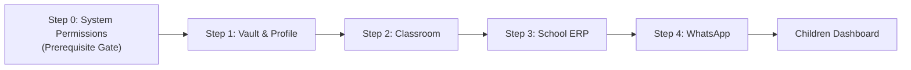
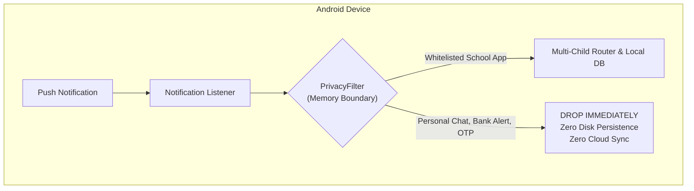
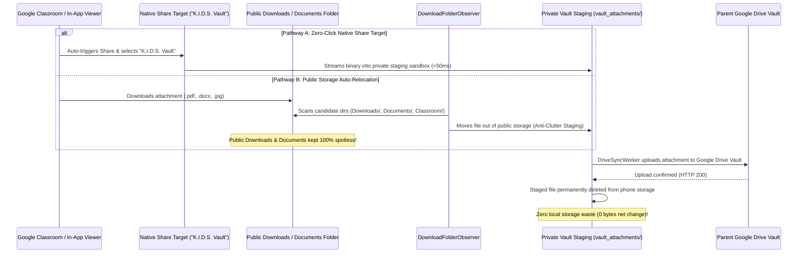

# 📖 K.I.D.S. User & Parent Manual
### Kids Intelligent Dashboard System — Ambient Educational Companion

<p align="center">
  
  
  
  
  
</p>

---

## 🌟 Welcome to K.I.D.S.

As parents, keeping up with school communications is exhausting. Homework assignments are posted in **Google Classroom**, urgent circulars arrive over **WhatsApp parent groups**, fee schedules sit in a **School ERP portal** (CampusCare, Toddle, Edunext), and exam timetables are buried inside multi-page **PDF attachments**. 

**K.I.D.S. (Kids Intelligent Dashboard System)** solves this pain point completely. It runs quietly on your Android smartphone as an ambient educational companion. It listens for incoming school announcements, crawls historical notice boards, performs optical character recognition (OCR) on circulars and worksheets, and automatically syncs everything directly into your personal **Google Drive Vault** in clean, AI-native formats (`notices.jsonl`, `MASTER_DIGEST.md`, `graph.html`, and `attachments/`).

> [!IMPORTANT]
> **Privacy Guarantee ($0 Cloud Cost & Zero Third-Party Servers):**
> K.I.D.S. does **NOT** use any cloud servers, external databases, or third-party relays. All data processing occurs 100% locally on your smartphone. Network traffic flows strictly and exclusively between your Android device and your own personal Google Drive account under the restricted `https://www.googleapis.com/auth/drive.file` privacy scope.

---

## 📋 Table of Contents

1. [System Requirements & Installation](#1-system-requirements--installation)
2. [Onboarding Wizard: Step 0 Prerequisite & 4-Step Setup](#2-onboarding-wizard-step-0-prerequisite--4-step-setup)
   - [Hardware, Gesture & TopBar Back Navigation](#hardware-gesture--topbar-back-navigation)
   - [Step 0: System Permissions & Setup (Prerequisite Gate)](#step-0-system-permissions--setup-prerequisite-gate)
     - [Android 13+ Dynamic Presentation ('Allow restricted settings')](#android-13-dynamic-presentation-allow-restricted-settings)
     - [Mandatory Accessibility Service Gate](#mandatory-accessibility-service-gate)
     - [Live UI Refresh via Lifecycle Observation](#live-ui-refresh-via-lifecycle-observation)
   - [Step 1: Cloud Vault & Child Profile](#step-1-cloud-vault--child-profile)
   - [Step 2: Google Classroom Mapping](#step-2-google-classroom-mapping)
   - [Step 3: School App & ERP Picker](#step-3-school-app--erp-picker)
   - [Step 4: WhatsApp Group Capture](#step-4-whatsapp-group-capture)
   - [Seamless Multi-Child (+ Add Child) Setup Flow](#seamless-multi-child--add-child-setup-flow)
3. [Android Permissions & Safety Guarantees](#3-android-permissions--safety-guarantees)
   - [Notification Listener Service (24/7 Passive Capture)](#notification-listener-service-247-passive-capture)
   - [Accessibility Service (Historical Backfill Assistant)](#accessibility-service-historical-backfill-assistant)
   - [Storage Access & The Anti-Clutter Staging Lifecycle](#storage-access--the-anti-clutter-staging-lifecycle)
4. [Google Classroom Deep Auto-Capture Guide](#4-google-classroom-deep-auto-capture-guide)
   - [Stream Tab vs. Classwork Tab](#stream-tab-vs-classwork-tab)
   - [The Floating K.I.D.S. Assistant Overlay & Live 2-Line Status Pill](#the-floating-kids-assistant-overlay--live-2-line-status-pill)
     - [Auto-Minimize on Crawl & Floating Overlay Self-Tap Immunity (Gesture Guard)](#auto-minimize-on-crawl--floating-overlay-self-tap-immunity-gesture-guard)
   - [Two-Pass Stream Architecture (Survey & Bottom-to-Top Reverse Ingestion)](#two-pass-stream-architecture-survey--bottom-to-top-reverse-ingestion)
     - [Announcement Discrimination & Zero-Click Direct Stream Ingestion](#announcement-discrimination--zero-click-direct-stream-ingestion)
     - [Safe Tap Targeting (Top-Third Strategy)](#safe-tap-targeting-top-third-strategy)
     - [Comment Sheet Auto-Dismissal](#comment-sheet-auto-dismissal)
     - [Pass 2 Anti-Loop Guard (Strict 2-Attempt Limit)](#pass-2-anti-loop-guard-strict-2-attempt-limit)
   - [Manifest-Driven Auto-Recovery & SQLite Instant Skipping](#manifest-driven-auto-recovery--sqlite-instant-skipping)
   - [Deep Post Traversal & Autonomous File Downloads](#deep-post-traversal--autonomous-file-downloads)
   - [Zero-Click Hands-Free Exit & Auto-Completion](#zero-click-hands-free-exit--auto-completion)
     - [Hands-Free Auto-Stop on App Exit](#hands-free-auto-stop-on-app-exit)
     - [Hands-Free Auto-Close on Stream Completion](#hands-free-auto-close-on-stream-completion)
   - [Manual Stop & Instant Coroutine Cancellation](#manual-stop--instant-coroutine-cancellation)
5. [WhatsApp School Group Integration](#5-whatsapp-school-group-integration)
   - [Real-Time Group Capture](#real-time-group-capture)
   - [Manual Chat Export Fallback (.txt / .zip)](#manual-chat-export-fallback-txt--zip)
6. [Accessing Your AI-Native Drive Vault](#6-accessing-your-ai-native-drive-vault)
   - [Vault Folder Structure](#vault-folder-structure)
   - [Using `MASTER_DIGEST.md` & `FAMILY_DIGEST.md`](#using-master_digestmd--family_digestmd)
   - [Exploring the Interactive Knowledge Graph (`graph.html`)](#exploring-the-interactive-knowledge-graph-graphhtml)
   - [Connecting AI Agents (Google Gemini & MCP Servers)](#connecting-ai-agents-google-gemini--mcp-servers)
7. [Troubleshooting & Diagnostic Logs](#7-troubleshooting--diagnostic-logs)
   - [Reading Diagnostic Logs & Telemetry Transparency](#reading-diagnostic-logs--telemetry-transparency)
   - [Xiaomi / MIUI / HyperOS Specific Setup](#xiaomi--miui--hyperos-specific-setup)
   - [Google Drive Authorization & SHA-1 Registration](#google-drive-authorization--sha-1-registration)
   - [Frequently Asked Questions (FAQ)](#frequently-asked-questions-faq)

---

## 1. System Requirements & Installation

### System Requirements
| Component | Specification | Details |
| :--- | :--- | :--- |
| **Operating System** | Android 8.0 (Oreo) or higher | Recommended: Android 14 or 15 (Target SDK 34/35) |
| **Google Account** | Personal Google Account (`@gmail.com`) | Free personal Google Drive storage (15 GB standard) |
| **Hardware** | 2 GB RAM minimum, 50 MB disk space | ML Kit runs on standard ARM64 / ARMv7 processors |
| **Network** | Wi-Fi or Mobile Data | Required only during Drive synchronization cycles |

### Downloading & Installing the App
1. Download the latest `app-debug.apk` directly from the [GitHub Releases](https://github.com/daarshnicsanjeev/K.I.D.S/releases/tag/latest) page.
2. Open the downloaded `.apk` on your Android smartphone.
3. If prompted by Android, enable **Install from Unknown Sources** for your browser or file manager.
4. Launch **K.I.D.S.** from your application drawer.

---

## 2. Onboarding Wizard: Step 0 Prerequisite & 4-Step Setup

When you first launch K.I.D.S., you are guided through a structured onboarding flow starting with a mandatory system permissions gate, followed by a 4-step sequential child setup wizard. The wizard configures Child #1 completely before returning to the multi-child dashboard. You do not have to type school passwords or configure complex cloud credentials.



### Hardware, Gesture & TopBar Back Navigation

Navigating through multi-step setup is completely effortless and resilient. You are never trapped in a forward-only flow:

- **TopBar Back Button (`←`):** An accessible, prominent back arrow is positioned in the top navigation bar on every step where backward progression or cancellation is possible. It complies with WCAG 2.1 AA/AAA standards with a minimum touch target size of 48dp × 48dp.
- **Hardware & Gesture Navigation:** Swiping from the left or right screen edge (Android predictive gesture navigation) or pressing your phone's physical Back button triggers the exact same reliable backward transition.
- **Deterministic Step Sequence:**
  - **From Step 4 (WhatsApp):** Returns to **Step 3 (School App & ERP)**.
  - **From Step 3 (School App & ERP):** Returns to **Step 2 (Google Classroom)**.
  - **From Step 2 (Google Classroom):** Returns to **Step 1 (Cloud Vault & Profile)**.
  - **From Step 1 (Cloud Vault & Profile):** If Accessibility Service was revoked or missing, returns to **Step 0 (Permissions Gate)**. If you are adding a secondary child from the dashboard, pressing Back safely cancels setup and returns you to the Children Dashboard without altering existing profiles.
  - **From Step 0 (Permissions Gate):** If accessed during a multi-child session, pressing Back cleanly exits back to the Children Dashboard.

---

### Step 0: System Permissions & Setup (Prerequisite Gate)
*The critical prerequisite gate ensuring all background capture and backfill capabilities are operational before provisioning child vaults.*

#### Android 13+ Dynamic Presentation ('Allow restricted settings')
> [!IMPORTANT]
> **Dynamic Presentation Only on Android 13, 14, and 15 (API 33+):**
> Android 13 introduced an enhanced security sandbox (`APP_OPS_ACCESS_RESTRICTED_SETTINGS`) that automatically disables sensitive accessibility and notification listener toggles for sideloaded applications (installed via APK from GitHub Releases). If you try enabling them directly in phone settings, Android displays a greyed-out toggle with the notice:
> *"Restricted setting: For your security, this setting is currently unavailable."*
>
> **Clean Setup on Android 10, 11, and 12:**
> On devices running Android 10 through 12, this operating system restriction does not exist. K.I.D.S. dynamically detects your Android version and **completely hides the "Advance Permission" card on Android 10–12**, keeping your setup screen clean, uncluttered, and free of unnecessary instructions!

**The 3-Step Solution for Android 13+ Devices (DO FIRST):**
1. In Step 0, tap the primary button: **Open App Settings (⋮ → Allow restricted settings)**.
2. In the Android **App Info** screen that opens, tap the **three dots (⋮)** in the top-right corner.
3. Tap **Allow restricted settings** and authenticate using your device PIN, pattern, or fingerprint.

> [!TIP]
> **Dual Unblock:** Completing this single 3-step action unblocks **both** the Accessibility Service and Notification Listener Service simultaneously, allowing both toggles in system settings to be enabled freely.

#### Mandatory Accessibility Service Gate
- **Status:** **MANDATORY** before Step 1 can be unlocked.
- **Why it is required:** Powers the **Floating K.I.D.S. Assistant**, native list auto-scrolling, discrete post card parsing, and autonomous zero-click attachment downloads in Google Classroom and School ERP portals.
- **The Mandatory Gate:** The **"Continue to Step 1: Cloud Vault & Profile →"** button remains strictly **locked and disabled** until Accessibility Service is turned on. A prominent warning banner alerts you:
  *"⚠️ Accessibility Service is mandatory before Step 1. Please enable it above to unlock Step 1."*
- **How to enable:**
  1. Tap **Enable Accessibility Service →**.
  2. Under **Downloaded Apps** (or **Installed Services**), tap **K.I.D.S.**.
  3. Turn the switch **ON** and tap **Allow** on the system confirmation prompt.
- **Architectural Guard:** If Accessibility Service is ever disabled or revoked in phone settings at any point, K.I.D.S. automatically returns you to Step 0 until it is re-enabled.

#### Notification Listener Service (Recommended)
- **Status:** **RECOMMENDED** for 24/7 background capture.
- **What it does:** Allows K.I.D.S. to silently capture homework, circulars, and announcements from school WhatsApp groups and school app push notifications the moment they arrive.
- **How to enable:** Tap **Enable Notification Access →**, locate **K.I.D.S.** in the list, and toggle the switch to ON.

#### Storage & Downloads Access (Recommended)
- **Status:** **RECOMMENDED** for auto-syncing attachments.
- **What it does:** Allows K.I.D.S. to detect downloaded circular PDFs and worksheets in your device's public Downloads directory, move them into private vault staging, and sync them to Google Drive without cluttering your phone.
- **How to enable:** Tap **Enable Storage Access →** and grant All Files Access (`MANAGE_EXTERNAL_STORAGE`).

#### Live UI Refresh via Lifecycle Observation
You never have to tap a "Refresh" button or restart K.I.D.S. after granting permissions in phone settings:
- K.I.D.S. monitors system lifecycle transitions (`Lifecycle.Event.ON_RESUME`).
- The moment you finish granting a permission and press Back to return to K.I.D.S., the screen **instantly refreshes**.
- Permission status badges transition live from red/orange to a bright green **✓ ACTIVE** chip.
- As soon as Accessibility Service is active, the **Continue to Step 1** button instantly unlocks and turns deep navy.

---

### Step 1: Cloud Vault & Child Profile
*The foundation of your child's private data storage.*

1. **Select Google Account for Vault (Automatic Background Pre-Warm)**:
   - Tap **Select Google Account for Vault**.
   - Pick your personal Google Account using the native Android system account picker.
   - When prompted, grant access to create files in your personal Google Drive (`drive.file` scope).
   - **Zero-Lag Background Pre-Warm & Folder Caching:** The exact moment you select your Google Account, K.I.D.S. immediately pre-warms the Google Drive OAuth authorization token in the background and resolves/caches the global root folder (`K.I.D.S. Data/`) and academic year folder (`2026-2027/`). While you type your child's name or choose a photo, background networking is already underway, completely eliminating upfront connection lag.
2. **Enter Child Details**:
   - **Child First Name**: e.g., `Aarav` or `Maya`.
   - **Academic Year**: Select the current academic session (e.g., `2026-2027`).
   - **Child Photo (Optional)**: Select a photo from your gallery using the secure Android Photo Picker.
3. **Optimistic Instant 0ms UI Transition to Step 2**:
   - Tap **Save Profile & Create Vault on Drive →**.
   - **Instant 0ms Screen Switch (Zero Wait / Zero Spinners):** Saving child details immediately persists your profile and vault preferences locally in under 10 milliseconds, unlocking **Step 2: Google Classroom Mapping** immediately with **0ms UI lag**. Parents never experience multi-second blocking loading spinners or frozen screens.
   - **Smooth Asynchronous Background Provisioning:** While you comfortably configure Step 2, K.I.D.S. provisions your private Google Drive vault hierarchy (`Google Drive / K.I.D.S. Data / 2026-2027 / Aarav / attachments/` and `_system/logs/`) smoothly in the background.
   - **In-Flight Synchronization & Timeout Safety:** If you advance through Step 2 or subsequent steps before cloud provisioning finishes, built-in synchronization monitors the in-flight provisioning task with a safety timeout, ensuring folder IDs are seamlessly linked without race conditions.
   - **Global & Local Folder Caching:** Root (`K.I.D.S. Data/`), academic year (`2026-2027/`), and child vault folder IDs are saved to local Android `SharedPreferences`. Future profile re-edits or adding secondary siblings reuse cached folder IDs without redundant Google Drive network queries.
   - **Background Template Seeding:** Heavy initial files—including `MASTER_DIGEST.md`, `FAMILY_DIGEST.md`, `_system/knowledge_graph.json`, `graph.html`, and diagnostic trace logs—seed quietly in a detached background scope so you can proceed with zero friction.

### Step 2: Google Classroom Mapping
*Seamlessly link school assignments and circulars without school admin blockages.*

1. **Enable Google Classroom**: Toggle the switch to **On**.
2. **Select Student Account**:
   - Tap **Select Account** to choose the Google account that your child uses for Google Classroom (e.g., `student@school.edu` or a family account).
   - > [!TIP]
   - > **Zero Password Typing:** Because this account is already authenticated on your Android phone, K.I.D.S. maps notifications and classroom streams by email handle without requiring school IT administration passwords or OAuth approval!
3. **Historical Backfill Assistant & Storage Status**:
   - Because you already enabled the **Accessibility Service** and **Storage Access** in Step 0, green checkmark badges confirm their active status.
   - If either service was inadvertently switched off, quick-reconnect buttons allow instant re-enablement right within Step 2.
4. **Dynamic Button Validation & Skip Handling**:
   - **Skip without Validation (`Skip Classroom`)**: If your child's school does not use Google Classroom, tap **Skip Classroom**. This bypasses Step 2 with zero friction, marks Classroom as skipped in your Google Drive vault, and moves directly to Step 3.
   - **Save & Next with Validation (`Save & Next →`)**: When the Google Classroom toggle is **On**, selecting a student account is strictly validated. The **Save & Next →** button remains disabled until an account is picked, accompanied by a helpful inline prompt: *"Select a student account above, or tap 'Skip Classroom' to proceed."* If you switch the toggle to **Off**, the button immediately enables so you can proceed without Classroom mapping.

### Step 3: School App & ERP Picker
*Capture notices from school management portals (CampusCare, Toddle, Edunext, Teams).*

1. **Enable School App Tracking**: Toggle the switch to **On**.
2. **Select Installed App**:
   - K.I.D.S. scans your phone's installed applications and displays them in a single-tap list (e.g., `CampusCare / Entab`, `Toddle Family Portal`, `Edunext Parent Portal`, `Microsoft Teams`).
   - Simply tap the app your school uses.
3. **Select Tracked Categories**:
   - Check the categories you wish to track: `Homework`, `Circulars`, `Attendance`, `Fee Receipts`.
4. **Dynamic Button Validation & Skip Handling**:
   - **Skip without Validation (`Skip App Setup`)**: If your school does not use a standalone portal application, tap **Skip App Setup**. This bypasses Step 3 with zero friction, updates Google Drive vault settings, and advances immediately to Step 4.
   - **Save & Next with Validation (`Save & Next →`)**: When the School ERP toggle is **On**, choosing an installed school app is strictly validated. The **Save & Next →** button remains disabled until you tap an app chip, accompanied by an inline prompt: *"Select an installed school app above, or tap 'Skip App Setup' to proceed."* If you switch the toggle to **Off**, the button activates immediately.

### Step 4: WhatsApp Group Capture
*Filter the noise and capture only official school circulars from parent WhatsApp groups.*

1. **Zero-Typing Group Selection**:
   - When WhatsApp capture is enabled, select a detected school group chip from the list (e.g., `School Parents Official Group 2026-27`), or tap **Listen for Message** to auto-detect the group the moment the next school message arrives.
2. **The Mandatory Channel Rule (At Least 1 Channel Required)**:
   - To ensure K.I.D.S. can monitor and summarize school circulars, **at least 1 of the 3 channels (Classroom, School App, or WhatsApp) is mandatory**. An empty profile with zero configured channels is not permitted.
   - **Scenario A — Prior Channel Configured (Classroom or School App Active):**
     - WhatsApp is completely optional!
     - **Skip without Validation (`Skip WhatsApp`)**: The **Skip WhatsApp** button is fully enabled. Tap it to complete child setup immediately without configuring WhatsApp.
     - **Complete Setup with Validation (`Complete Setup ✓`)**: If WhatsApp is toggled **On**, you must select a group chip before the button enables; otherwise, it remains disabled.
   - **Scenario B — Both Classroom and School App Were Skipped:**
     - WhatsApp becomes **strictly mandatory**.
     - An alert card clearly explains:
       > ⚠️ **At least 1 channel is mandatory**  
       > Classroom and School App were skipped. Please configure WhatsApp below, or tap Back to configure an earlier channel.
     - The **Skip WhatsApp** button is **disabled**.
     - The WhatsApp toggle switch is locked **On** (attempting to turn it off triggers a prompt reminding you that at least 1 channel is mandatory).
     - The **Complete Setup ✓** button remains disabled until a school group is selected or auto-detected, with a guiding prompt: *"At least 1 channel is mandatory. Please select a group above to complete setup."*
     - If your school does not use WhatsApp, simply tap the TopBar Back arrow (`←`) to return to Step 2 or Step 3 and configure Google Classroom or your school ERP portal instead.
3. Tap **Complete Setup for [Child Name] ✓**:
   - Your child's profile is initialized in the local encrypted Room database with validated channel configurations.
   - The initial knowledge graph (`graph.html`) and markdown digests (`MASTER_DIGEST.md` and `FAMILY_DIGEST.md`) are generated and synced to Google Drive.
   - You are redirected to the **Children Grid Dashboard**.

---

### Seamless Multi-Child (+ Add Child) Setup Flow
*Effortlessly manage multiple siblings across different grades, sections, or even different schools.*

Once your first child is configured, K.I.D.S. transforms into a multi-child family command center. Adding a second or third child is instant, clean, and completely isolated:

1. **Initiate Setup from Dashboard:** On the **Children Grid Dashboard**, tap the **+ Add Another Child** button.
2. **Prerequisite Step 0 Bypassed Automatically:** Because core system permissions (Accessibility, Notifications, and Storage) were already granted during the setup of Child #1, K.I.D.S. validates their active state and opens directly on **Step 1: Cloud Vault & Child Profile**.
3. **Clean Slate Guarantee (Zero Cross-Contamination):** 
   - The child name input field starts completely empty (`""`). It will **never** pre-fill or accidentally carry over the previous child's name, grade, or photo.
   - Secondary child sessions operate under a fresh session sequence (`childSequenceNumber > 1`), isolating local wizard preferences so your older child's configuration is never overwritten or mutated.
4. **Isolated Google Drive Vault:**
   - K.I.D.S. provisions an independent subfolder hierarchy on your Google Drive:
     `Google Drive / K.I.D.S. Data / {AcademicYear} / {NewChildName} /`
   - Child #2 gets their own dedicated `notices.jsonl`, `MASTER_DIGEST.md`, `graph.html`, and `attachments/` folder.
   - The top-level `FAMILY_DIGEST.md` is automatically updated to synthesize notices across all your children into one single family briefing!
5. **Sequence Visual Indicator & Cancel Safety:**
   - The top bar displays a prominent amber badge (`Child #2`, `Child #3`, etc.), ensuring you always know which child you are currently configuring.
   - If you tap the TopBar Back arrow (`←`) or use your phone's back gesture from Step 1, the wizard cleanly cancels and returns you directly to the **Children Grid Dashboard** without saving partial records or affecting your existing children.

---

## 3. Android Permissions & Safety Guarantees

Android permissions can sometimes feel intrusive. K.I.D.S. is built with strict architectural boundaries to guarantee that your personal data is never compromised.



### Notification Listener Service (24/7 Passive Capture)
- **Android Permission:** `BIND_NOTIFICATION_LISTENER_SERVICE`
- **What it does:** Allows K.I.D.S. to receive notifications from school apps (Classroom, WhatsApp, ERP portals) the millisecond they arrive, even when the phone screen is locked.
- **Safety Guarantee:** 
  - Every notification is checked against the **`PrivacyFilter` at the memory boundary**.
  - If the notification is from a personal contact, non-whitelisted WhatsApp group, bank, or contains keywords like `OTP`, `verification code`, `debited`, or `UPI`, it is **dropped immediately from RAM**.
  - It is **never** written to local disk, never logged to any file, and never transmitted over the internet.

### Accessibility Service (Historical Backfill Assistant)
- **Android Permission:** `BIND_ACCESSIBILITY_SERVICE`
- **What it does:** Powers the **Floating K.I.D.S. Assistant** over Google Classroom. It scrolls through past announcements, extracts circulars and homework posted weeks or months ago, and auto-downloads attachments.
- **Mandatory Setup Gate:** Enforced as a strict prerequisite in Step 0 before Child Profile or Vault creation. Without it, retrospective crawling of past announcements and worksheets cannot function.
- **Safety Guarantees:**
  - **Active Only In School Apps:** The service activates only when Google Classroom or an authorized school ERP is actively displayed on your screen. It automatically hides when you navigate to your home screen or another app.
  - **Zero Keystroke Logging:** It only inspects public text views and attachment chips in educational lists. It never inspects passwords, text fields, or personal keyboards.
  - **100% On-Device Processing:** Node-tree inspection, chip detection, and click dispatch execute entirely in local memory with zero external transmission.

### Storage Access & The Autonomous Zero-Permanent-Storage Pipeline
- **Android Permission:** `MANAGE_EXTERNAL_STORAGE` (All Files Access) / `READ_EXTERNAL_STORAGE`
- **Why it is needed:** When educational attachments (worksheets, circular PDFs, syllabus guides) are downloaded from Google Classroom or shared from school viewers, Android routes files through storage.
- **Zero-Permanent-Storage Guarantee:** K.I.D.S. guarantees that educational attachments (.pdf, .jpg, .docx) are uploaded directly to your personal Google Drive Vault **without eating any permanent phone storage**. Files are transited temporarily through a private staging sandbox (`Android/data/com.kids.collector/files/vault_attachments/`) and immediately deleted the millisecond upload is confirmed by Google Drive.
- **Dual Autonomous Ingestion Pathways:**
  1. **Direct Native Share Target Ingestion ("Share to K.I.D.S. Vault" / "Open with K.I.D.S. Vault"):** When attachments open in school previewers or document viewers, K.I.D.S. automatically routes them through Android's system share sheet directly into `ShareTargetActivity` (seamlessly supporting both `ACTION_SEND` and `ACTION_VIEW` intent actions) without touching public folders.
  2. **Public Downloads Staging via `DownloadFolderObserver`:** If a file lands in public `Download/` or `Documents/` folders, K.I.D.S. immediately sweeps and relocates it into private vault staging, keeping public folders spotless.
- **Zero Manual Management:** Parents never need to manually share files via external share-sheets, use USB cables, or hunt down hidden in-app caches.

#### The Autonomous Anti-Clutter Staging Lifecycle
Without K.I.D.S., your phone's personal `Downloads` and `Documents` folders would quickly fill up with hundreds of school PDFs, making it impossible to find your own personal files and consuming valuable device storage. K.I.D.S. implements an autonomous **5-step anti-clutter lifecycle**:



1. **Autonomous Ingestion:** School attachments are captured either via direct system share targeting ("Share to K.I.D.S. Vault") or detected in public storage candidate folders:
   - `Downloads/` and `Downloads/Classroom/`
   - `Documents/` and `Documents/Classroom/`
   - WhatsApp Documents & Images (if accessible)
2. **Immediate Move to Private Staging:** Every captured file lands strictly in the private app sandbox staging directory:
   `Android/data/com.kids.collector/files/vault_attachments/`.
3. **Zero Clutter:** Your personal `Downloads` and `Documents` folders stay spotless. No school circulars or worksheets linger to clutter your personal files.
4. **Drive Upload & ML Kit OCR:** `DriveSyncWorker` performs offline OCR on the file and uploads it securely to your Google Drive Vault under `Google Classroom/attachments/` (and child `attachments/`).
5. **Automatic Cleanup & Storage Clearance:** As soon as Google Drive confirms a successful upload, the file is **cleared from phone storage** (permanently deleted from private staging). Local storage consumption drops back to near zero.
6. **Residual Deletion:** If an already-synced file ever lingers or is redownloaded in public Downloads or Documents, K.I.D.S. automatically detects and cleans it from phone storage.

> [!NOTE]
> WhatsApp documents and images are indexed in place and are **never moved or deleted**, ensuring your WhatsApp chat media remains fully functional in your chat threads.

---

## 4. Google Classroom Deep Auto-Capture Guide

When setting up a child or catching up on previous weeks of schoolwork, Google Classroom contains a treasure trove of past announcements, circulars, worksheets, and syllabus PDFs. 

Rather than simply skimming visible surface summaries, K.I.D.S. features an autonomous **Deep Auto-Capture Engine**. The assistant systematically navigates into each individual post card, extracts the full announcement text, downloads every attached document directly to your device, and safely returns to the stream to continue traversing historical records.

### Stream Tab vs. Classwork Tab

Google Classroom organizes content into two distinct tabs:
1. **The Stream Tab:**
   - Contains chronological announcements, principal circulars, exam schedules, and holiday notices.
   - Attachments here are typically administrative circulars, weekly schedules, and school newsletters.
2. **The Classwork Tab:**
   - Contains subject-wise topics (e.g., *Mathematics*, *Science*, *English Literature*, *Social Studies*).
   - Contains homework assignments, practice question banks, printable worksheets, and project guidelines.

> [!TIP]
> **Recommended Workflow:**
> Run Auto-Capture **twice**: first on the **Stream** tab to capture administrative circulars, and second on the **Classwork** tab to capture all subject worksheets and study materials!

### The Floating K.I.D.S. Assistant Overlay & Live 2-Line Status Pill

When you open Google Classroom, K.I.D.S. automatically displays the **Floating Assistant** on the screen using Android's lightweight accessibility overlay layer (`TYPE_ACCESSIBILITY_OVERLAY`), requiring **zero extra permissions** like "Draw over other apps":

```
+-------------------------------------------------------+
|  K.I.D.S. Assistant         [ 14 Notices • 6 Files ]  — ✕ |
|  Status: Scanning Stream...                           |
|  "Mathematics Worksheet - Fractions Chapter 4"         |
|  +-------------------------------------------------+  |
|  |             ▶ Start Auto-Capture                |  |
|  +-------------------------------------------------+  |
+-------------------------------------------------------+
```

When active, the action button dynamically changes to a prominent red stop button:

```
+-------------------------------------------------------+
|  K.I.D.S. Assistant         [ 15 Notices • 7 Files ]  — ✕ |
|  Status: Downloading (1/2)...                         |
|  fraction_practice_sheet_grade5.pdf                   |
|  +-------------------------------------------------+  |
|  |             ⏹ Stop Capture                      |  |
|  +-------------------------------------------------+  |
+-------------------------------------------------------+
```

#### Real-Time Status & Metrics Display
The floating assistant features an informative **live 2-line status pill**:
- **Top Status Line (Active Pipeline State):** Reflects the exact operation the crawler is performing in real time:
  - `Status: Ready` — Idle and ready to start.
  - `Surveying (X found)...` — **Pass 1 (Pre-Flight Survey):** Swiping swiftly down the stream, compiling the inventory manifest without opening cards.
  - `Capturing Notices...` / `Capturing (X/Total - Y%)...` — **Pass 2 (Bottom-to-Top Reverse Deep Ingestion):** Ingesting notices from the bottom upwards (oldest to newest) with live percentage completion.
  - `Processing File...` — **Intelligent Viewer Auto-Recovery:** Automatically handling or safely returning from transient document viewers (Google Drive, Docs, PDF viewers, file managers, share sheets) back to Classroom without freezing.
  - `Fast-Forwarding Synced Notices...` — **Fast-Forward Seeking:** When the parent starts auto-capture on a stream that already has previously-synced notices, displays `"Seeking #X/total (Y already synced)"`, swiftly and safely navigating down to where new notices begin without duplicating work.
  - `Recovering Position...` — **Auto-Recovery:** Scrolling to correct viewport displacement when seeking a target post in the manifest.
  - `Navigating to Post...` — **Auto-Recovery:** Scrolling seeking an upcoming target post in the manifest.
  - `Reading Detail (X/Total)...` — Extracting announcement body, author, timestamp, and attachment metadata.
  - `Downloading (X/Y)...` — Autonomously downloading attachment $X$ out of $Y$ files attached to the current post.
  - `Opening (X/Y)...` — Tapping an attachment chip when direct download buttons are nested.
  - `Returning to Stream...` — Safely pressing Navigate Up or system Back to re-anchor in the list view.
  - `✓ Backfill Complete!` — All manifest notices successfully processed and saved.
  - `✓ Stream Up to Date` — All stream posts already captured previously in SQLite Room; no pending items.
  - `Status: Capture Stopped` — Manually stopped by the parent.
  - `Status: Paused (External App)` — Pauses only if a non-whitelisted, genuine external third-party app or launcher comes to foreground.
- **Bottom Metrics Badge (`XX Notices • YY Files`):** Kept up to date live. Displays the exact tally of unique school notices backfilled and physical attachment files (.pdf, .docx, .jpg) staged in local storage.
- **Truthful Attachment Counting:** Unlike basic click counters that inflate tallies by counting popup menu options (such as Classroom's 3-dots "More options for attachment" button), K.I.D.S. only increments the `YY Files` metric when an attachment is verified and staged in private vault storage via `DownloadFolderObserver.scanLocalAttachments()`.
- **Detail Snippet Line:** An auto-truncating preview line that displays the exact post headline or filename currently being processed (e.g., `"Circular No. 14 - Annual Sports Day Schedule"` or `"worksheet_fractions_ch4.pdf"`).
- **— Minimize:** Collapses the assistant into a compact, floating amber **`K`** circular bubble (48dp × 48dp) that you can drag anywhere on your screen. Tap the bubble anytime to expand it back.
- **✕ Close:** Closes the assistant overlay until you reopen Classroom.

> [!TIP]
> **Zero Button Hunting:** While minimize (`—`) and close (`✕`) buttons are available, parents **never need to manually hunt for a "stop" or "close" button**! The floating pill automatically cleans up and removes itself whenever you leave Google Classroom or when backfill finishes.

#### TalkBack Resilience & Accessible Overlay Controls

K.I.D.S. is engineered for complete accessibility compliance (WCAG 2.1 AA/AAA) and seamless integration with **Android TalkBack**:
- **1.2-Second Debounce on TalkBack Double-Tap:** TalkBack users activate buttons using a double-tap gesture. On some Android OEM skins, double-tapping can fire rapid successive touch events or accessibility click echoes. To prevent accidental starts followed immediately by premature stops, the overlay's toggle button features a **1.2-second (1,200ms) debounce**. Any secondary activation within 1.2 seconds is safely discarded, allowing TalkBack users to start and stop Auto-Capture smoothly and reliably without accidental double-trigger interruptions.
- **Dynamic Semantic Accessibility Labels (`contentDescription`):** Screen readers announce the exact current state and action of the floating button. The button's `contentDescription` dynamically transitions between `"Start Auto-Capture"` and `"Stop Auto-Capture"` as state changes.
- **Accessible Touch Targets:** All touch targets on the overlay enforce a minimum size of 48dp × 48dp (exceeding WCAG 2.1 AAA recommendations), making them easy to locate and double-tap with TalkBack or motor impairments.

#### Auto-Minimize on Crawl & Floating Overlay Self-Tap Immunity (Gesture Guard)

To keep the educational stream crystal-clear and eliminate any risk of the assistant interrupting itself, K.I.D.S. features **Autonomous Auto-Minimize** and an internal **Synthetic Gesture Guard**:

- **Auto-Minimize to Screen Edge upon Start:**
  The millisecond you tap `▶ Start Auto-Capture`, the assistant automatically collapses into a compact, floating 48dp × 48dp circular badge (`K`) docked neatly against the right edge of your screen (`x = screenWidth - 56dp`, `y = 140dp`).
  - **100% Unobstructed Classroom Feed:** By auto-minimizing, the entire Google Classroom stream, post cards, teacher announcements, and attachment chips remain completely visible and unobstructed.
  - **Zero Viewport Clutter:** No bulky overlay cards block the screen, ensuring that card bounding calculations, viewport visibility fraction math, and kinetic swipes operate across a clean, unoccluded display.
- **Single-Tap Bubble Expansion & Live Glanceability:**
  Tapping the docked circular bubble instantly expands the assistant back to its full two-line status pill (`x = 20dp`, `y = 140dp`), allowing parents to check live progress (`XX Notices • YY Files`), see the active post headline or attachment filename, or tap `⏹ Stop Capture`.
- **Floating Overlay Self-Tap Immunity (Synthetic Gesture Guard):**
  When automating clicks across post cards, attachment chips, overflow menus, and share targets, physical touches (`dispatchTap`) are programmatically injected into screen coordinates. If a simulated touch gesture or its touch echo happens to cross or land on the assistant's stop button, a naive overlay would register an inadvertent click and abruptly kill the crawl.
  K.I.D.S. guarantees **absolute self-tap immunity**:
  - The assistant maintains real-time gesture synchronization via an internal flag (`isDispatchingCrawlerGesture`).
  - The moment an automated tap is dispatched, the gesture guard is activated across the gesture duration and touch settlement window.
  - Any click events registered on the overlay's action button while the internal crawler gesture is active are **strictly rejected and swallowed**.
  - A diagnostic event is logged (`BLOCKED: Stop button click rejected because internal crawler gesture is active`), ensuring that the assistant **can never accidentally stop its own crawl**.
  - Only genuine, physical finger taps from the parent when the crawler is not dispatching an internal touch can pause or stop the crawl.

### Two-Pass Stream Architecture (Survey & Bottom-to-Top Reverse Ingestion)

To guarantee that no notice is ever overlooked, skipped, or duplicated, K.I.D.S. operates on a highly optimized **Two-Pass Stream Architecture**. Instead of naively clicking posts while scrolling down, or wasting time rewinding all the way back up to the top, the assistant coordinates historical backfill into two streamlined, continuous phases:

```mermaid
flowchart TD
    subgraph P1["Pass 1: Pre-Flight Survey (Top-to-Bottom)"]
        A1["User Taps ▶ Start Auto-Capture"] --> B1["Rapid Downward Kinetic Swipes<br/>(Overlay: 'Surveying (X found)...')"]
        B1 --> C1["Index Post Fingerprints into StreamManifest<br/>(Exclude Comments & UI Chrome)"]
        C1 --> D1{"SQLite Duplicate Check"}
        D1 -->|Already in Room DB| E1["Mark Status: ALREADY_SYNCED"]
        D1 -->|New Notice| F1["Mark Status: PENDING"]
        B1 --> G1{"5 Consecutive Empty Scrolls?<br/>(Stream End Reached)"}
        G1 -->|Yes| H1["Log Stream Boundaries:<br/>startItemTitle, endItemTitle, totalCount"]
    end

    subgraph FAST["Fast Up-to-Date Check"]
        H1 --> I1{"Any Pending Notices?<br/>(pendingCount == 0)"}
        I1 -->|All Synced| J1["Status: '✓ Stream Up to Date'<br/>Direct Cloud Sync & Clean Dismissal"]
    end

    subgraph P2["Pass 2: Reverse Deep Ingestion (Bottom-to-Top)"]
        I1 -->|Pending > 0| K1["Direct Transition at Stream Bottom<br/>(ZERO Rewind Pass Needed!)"]
        K1 --> N1["Fetch Target from StreamManifest<br/>(manifest.getNextPendingItemReverse())"]
        N1 --> LG{"Pass 2 Loop Guard<br/>(consecutiveTargetAttempts > 2?)"}
        LG -->|Yes (Limit Exceeded)| S3["Guaranteed Progression Fallback:<br/>ingestNoticeDirect() & manifest.markItemCompleted()"]
        LG -->|No| O1{"Target Notice Visible on Screen?<br/>(findCardForTarget)"}
        O1 -->|Yes| AD{"Announcement Discrimination<br/>(!cardIsMaterial?)"}
        AD -->|Announcement / Circular| AN1["Zero-Click Direct Stream Ingestion<br/>(No click, comment buttons prevented)"]
        AN1 --> T1["Mark Status: COMPLETED in Manifest<br/>Increment Notice & File Counters"]
        AD -->|Material / Assignment| P1["Overlay: 'Capturing (X/Total - Y%)...'<br/>Safe Top-Third Tap (bounds.top + 50)"]
        P1 --> Q1{"Detail Transition Success?<br/>(1200ms + Top-Tap Retry)"}
        Q1 -->|Comments Sheet Detected| CD["Auto-Dismiss Comment Sheet<br/>(performReturnToStream & Return)"]
        CD --> S1{"Attempts < 2?"}
        Q1 -->|Yes| R1["Extract Body + Auto-Download Attachments<br/>Intelligent Viewer Handling & Guarded Return"]
        Q1 -->|No| S1{"Attempts < 2?"}
        S1 -->|Yes| S2["Retry Detail Tap & Retain Pending"]
        S1 -->|No| S3
        R1 --> T1
        S3 --> T1
        T1 --> U1{"All Items Finished?<br/>(manifest.isAllFinished())"}
        U1 -->|No| N1
        U1 -->|Yes| V1["Overlay: '✓ Backfill Complete!'<br/>2.5s Dwell & Automatic Google Drive Sync"]
    end

    subgraph RECOV["Auto-Recovery Engine (Upward Progression)"]
        O1 -->|No (Displaced)| W1["Compare Visible Card Indices vs. Target Index"]
        W1 --> X1{"Target Ahead / Higher Up?<br/>(minVisibleIndex > target.index)"}
        X1 -->|Yes| Y1["Overlay: 'Recovering Position...'<br/>Backward Swipe (performScrollBackward) / Micro-Nudge"]
        X1 -->|No| Z1["Overlay: 'Navigating to Post...'<br/>Forward Swipe (performScroll) / Micro-Nudge"]
        Y1 --> AA1{"Stuck Screen Attempts >= 4?"}
        Z1 --> AA1
        AA1 -->|No| O1
        AA1 -->|Yes (Damaged / Unopenable)| AB1["Mark Status: FAILED_SKIPPED in Manifest<br/>Log Trace Warning & Proceed to Next Notice"]
        AB1 --> N1
    end
```

#### 1. Pass 1: Pre-Flight Stream Survey & Complete Full-Year Discovery
- **Swift Non-Intrusive Scanning:** The assistant glides swiftly down the entire Classroom stream using rapid kinetic physical swipes without opening any post cards.
- **Inventory Manifest Construction:** Every discovered announcement is fingerprinted and cataloged into an in-memory inventory manifest (`StreamManifest`).
- **Boundary Recording:** K.I.D.S. records the exact chronological boundaries of the stream: the very first notice (`startItemTitle`), the oldest notice (`endItemTitle`), and the total post count (`totalCount`).
- **Live Survey Progress:** The overlay status pill displays:
  $$\text{Surveying (X found)...}$$
  $$\text{Discovered X notices so far}$$
- **Complete Full-Year Stream Survey (June to Present with Zero Premature Cutoffs):**
  When auditing an entire academic year, Google Classroom feeds contain dozens or hundreds of notices spanning back to June or the start of the school term, intermixed with long multi-paragraph circulars. K.I.D.S. features intelligent stream survey mechanics that **never cut off prematurely**:
  - **Separation of Viewport Movement from Screen Immobility:** While scrolling past long announcements, the list viewport continues moving even if no new card header enters view immediately. K.I.D.S. separates active viewport movement from physical screen immobility.
  - **1,200ms Network Pagination Grace Delay:** Google Classroom fetches older historical batches over the network dynamically. When the viewport appears momentarily static, K.I.D.S. pauses for an adaptive **1,200ms network pagination delay** to give Classroom time to fetch and render the next batch of older posts.
  - **True Bottom Confirmation:** Only after **5 consecutive scrolls where the screen remains physically static (`identicalScreenCount >= 5`)** does Pass 1 declare the true bottom of the academic year, guaranteeing that notices from earlier months (June, July, August) are completely cataloged.
- **Instant Fast-Path Completion:** If all discovered notices already exist in local SQLite Room storage (`pendingCount == 0`), K.I.D.S. instantly displays `✓ Stream Up to Date (All X notices already captured)`, triggers background sync, and safely exits without running Pass 2.

#### 2. Pass 2: Manifest-Driven Reverse Deep Ingestion (Bottom-to-Top)
- **Elimination of the Upward Rewind Pass:** In previous generation screen crawlers, reaching the stream bottom required an artificial "Pass 1.5 Rewind" consisting of 30 to 45 backward swipes just to return to the top, only to scroll all the way back down again during ingestion. K.I.D.S. eliminates this redundant rewind pass completely!
- **Bottom-to-Top Reverse Traversal (`getNextPendingItemReverse()`):** Because the assistant is already resting at the chronological bottom of the stream when Pass 1 completes, it immediately begins deep capture right where it stopped. It retrieves pending items in reverse order—from the oldest post at the stream bottom (highest manifest index) upwards to the newest post at the top (index 1).
- **40% to 50% Reduction in Total Swipes & Halved Crawl Time:** Eliminating the rewind pass and ingesting directly bottom-to-top cuts total screen swipes by **40% to 50%**, reduces battery drain, minimizes screen wear, and cuts the total historical crawl duration in half!
- **Upward Progression & Micro-Nudges:** As the assistant processes each notice, it progresses upwards using backward physical scrolls (`performScrollBackward()`) and gentle 16% micro-nudges.
- **Live Counter & Percentage Metric:** Parents observe real-time progress on the floating status pill:
  $$\text{Capturing (X/Total - Y%)...}$$
  $$\text{[Current Announcement Headline Preview]}$$
- **Announcement Discrimination & Zero-Click Direct Stream Ingestion:**
  In Google Classroom, teacher communications fall into two fundamentally different structural types:
  1. **Announcements & Circulars:** Teacher notices, daily announcements, holiday greetings, and circular texts posted directly into the stream feed. In Google Classroom, **announcements do NOT have a separate detail activity or screen**. Their full message is already visible right on the stream card. Tapping an announcement card either does nothing or inadvertently pops up the class comments dialog.
  2. **Materials, Assignments, Questions & Quizzes:** Structured educational posts containing attached files (PDF worksheets, study packs) that expand into dedicated detail screens with submission controls and attachments.
  
  K.I.D.S. features **Automated Announcement Discrimination (`!cardIsMaterial`)**:
  - The crawler evaluates if the post title or body contains material indicators (`material`, `assignment`, `question`, `quiz`).
  - If the post is an announcement or circular, K.I.D.S. **ingests it directly from the stream card without clicking** (`ingestNoticeDirect`).
  - The full text, author, and timestamp are captured instantly, the notice is marked completed in the manifest (`markItemCompleted`), and the overlay counter increments.
  - **Zero Accidental Comment Clicks:** Because announcements are never tapped, accidental clicks on comment buttons or bottom comment sheets are **100% prevented**!

- **Safe Tap Targeting (Top-Third Strategy):**
  When a post does contain materials or assignments and needs to be opened to harvest attachments:
  - At the bottom of every Classroom card sits the class comment button (*"Add class comment"* or *"X class comments"*). In older automation systems, tapping the vertical center or bottom of a card frequently struck the comment button, opening comment dialogs instead of the post's assignment detail.
  - K.I.D.S. implements **Safe Tap Targeting**: taps are dispatched strictly to the **top third of the card** (`safeTapY = (bounds.top + 50).coerceIn(minTop + 20, maxBottom - 20)`), landing squarely on the title and header area.
  - In addition, the accessibility engine actively inspects candidate clickable nodes: any node containing the word `"comment"` in its accessibility text or content description is strictly disqualified from receiving clicks.

- **Comment Sheet Auto-Dismissal:**
  If a class comments dialog or bottom sheet ever appears on screen—whether because a parent had it open prior to starting Auto-Capture, or due to an OEM touch glitch:
  - K.I.D.S. immediately evaluates the screen with `isCommentsOnlyScreen()`. It recognizes that the window displays comment controls (*"Add class comment"*, *"Class comments"*) without assignment features (*"Your work"*, *"Assigned"*, *"Attachments"*).
  - Rather than mistaking comments for a post detail view or getting stuck, K.I.D.S. flags it instantly, logs `"Comments dialog detected instead of post detail"`, dispatches an automatic Back action (`performReturnToStream`), dismisses the comment sheet, and returns cleanly to the stream.

- **Pass 2 Anti-Loop Guard (Strict 2-Attempt Limit):**
  A classic hazard in mobile UI automation is an item that refuses to open due to an OEM animation glitch or network hiccup, causing the crawler to retry indefinitely. K.I.D.S. implements a mathematical **Anti-Loop Guard**:
  - The crawler monitors `lastTargetIndex` and tracks `consecutiveTargetAttempts`.
  - Every notice has a **strict 2-attempt limit**.
  - If a notice card cannot transition to detail view after 2 consecutive attempts (`consecutiveTargetAttempts > 2`):
    - The Loop Guard activates automatically.
    - K.I.D.S. logs `LOOP_GUARD: Target reached attempts without progress. Force-marking completed and advancing.`
    - Directly ingests the notice title and preview text from the stream card into SQLite Room (`ingestNoticeDirect`).
    - Force-marks the notice as completed in the manifest by its exact target index (`manifest.markItemCompleted(nextItem.index)`) and fingerprint.
    - Adds the fingerprint to `visitedPostFingerprints`, increments the notice count, resets the attempt counter, and advances immediately to the next pending item.
  - **Mathematical Guarantee:** Infinite loops and frozen crawler sessions are **mathematically impossible**.
- **Autonomous Detail View Downward Scrolling for Big Announcements:** When an announcement contains extensive paragraphs of text, Google Classroom pushes attachments and download buttons below the fold. K.I.D.S. resiliently identifies the detail screen and scrolls downward within the detail view (up to 3 gentle sweeps), scanning for and capturing all below-the-fold worksheets and download controls before returning to the stream.

#### 3. Intelligent Viewer Whitelisting (Seamless Document Capture)
When tapping an attachment chip, Android or Google Classroom may open the document in Google Drive Viewer, Google Docs, a system PDF viewer, or the system share sheet.
- **Zero False External App Freezes:** Traditional accessibility tools treat any window transition away from Classroom as an external app interruption, freezing with `Status: Paused (External App)`. K.I.D.S. features **Intelligent Viewer Whitelisting**: it recognizes Google Drive Viewer (`google.android.apps.docs`), Google Docs (`docs.editors`), Android System Document UI (`documentsui`, `android`), Adobe Acrobat Reader (`adobe.reader`), WPS Office (`cn.wps`), Samsung/OEM file viewers (`sec.android.app.myfiles`, `fileexplorer`, `viewer`), and system intent sheets (`resolver`, `chooser`) as legitimate, whitelisted surfaces of the file-capture workflow.
- **Automated Viewer Recovery:** When K.I.D.S. detects that an active window belongs to a whitelisted viewer or system component, it displays `Processing File...`, interacts with the file or share target, and executes `performReturnToStream(root)` (pressing Navigate Up or system back) to return smoothly to Classroom without any pause or user intervention required!

---

### Manifest-Driven Auto-Recovery & SQLite Instant Skipping

One of the greatest challenges in automating school apps is visual instability: items can shift when comments render, network pagination can jump, or system notifications can nudge the scroll position. K.I.D.S. solves this with a **Manifest-Driven Auto-Recovery Engine**:

#### 1. Autonomous Position Displacement Recovery
If the target post is not immediately visible on screen after returning from detail view or during stream navigation:
1. **Screen Fingerprint Scan:** The assistant scans all post cards currently visible in the safe viewport (`getVisibleCardFingerprints()`).
2. **Relative Index Comparison & Pass 2 Reverse Navigation:** It matches visible post fingerprints against their assigned indices in the `StreamManifest`:
   - **Traversing Toward Stream Top (`targetAhead == false`):** In Pass 2 reverse crawling, the assistant traverses from the bottom of the stream upwards toward post #1 (top of stream). Unless the target is verified to be further down (`nextItem.index > maxVisibleIndex`), the assistant defaults to backward/upward traversal. The overlay displays `Recovering Position...` (`Seeking post #X/Total`) and executes a **Full Kinetic Upward Swipe (`performScrollBackward()`)**. By deploying full kinetic swipes instead of micro-nudges, preceding **600–800px assignment and material cards** are swept fully into the viewport, completely exposing their title, instructions, and discrete attachment chips.
   - **Target is Further Down / Ahead (`targetAhead == true`):** If scroll overshoots or layout re-anchoring place the target notice below the current visible range (`nextItem.index > maxVisibleIndex`), the overlay displays `Navigating to Post...` (`Seeking post #X/Total`) and triggers a forward scroll (`performScroll()`).
   - **Oscillation-Guarded Micro-Scrolling:** Micro-scrolling (16% screen height gentle nudge) is strictly reserved for breaking confirmed directional oscillation (`isOscillating`), preventing endless ping-pong seeking while allowing full cards to display unclipped.
3. **Movement Progress Awareness:** When seeking a distant notice across multiple scrolls, K.I.D.S. monitors viewport motion. As long as the list is progressing closer toward the target notice, the engine never falsely penalizes or skips the item.
4. **Seamless Resumption:** As soon as `findCardByFingerprint()` locates the target card, normal deep capture resumes instantly.

#### 2. Fail-Safe Bounded Capture & Recovery Escalation
- **Bounded Target Verification (`isTargetBounded`):** When the target notice's index is bounded within the visible range of cards on screen (`targetIndex in minVisibleIndex..maxVisibleIndex`), K.I.D.S. knows the post is physically rendered on display. Swiping is halted to avoid overshooting.
- **Bounded Recovery Escalation:** The crawler identifies the best matching candidate card and dispatches physical touch taps. If the detail view does not open (due to OEM touch event absorption, non-clickable card containers, or inline post formats), K.I.D.S. escalates attempts via `manifest.incrementAttempt(fingerprint)`.
- **Fail-Safe Fallback Direct Ingestion (After 3 Bounded Attempts):**
  If a bounded notice fails to transition to detail view after **3 bounded attempts**, the recovery engine activates a graceful fallback:
  - It ingests the announcement text, title, author, and preview directly from the visible stream card into local SQLite Room storage (`NoticeEntity`).
  - Marks the item as `COMPLETED` in the `StreamManifest` and local visited set.
  - Increments the live notice tally on the overlay and immediately advances to the next notice in the manifest.
  - **Zero Hang / Zero Loop Guarantee:** The assistant never stalls, loops indefinitely, or freezes the user's device.

#### 3. Zero Dropped Notices & Stuck-Screen Skip Safeguard
- In traditional screen crawlers, displaced cards cause notices to be lost or crawler loops to crash. K.I.D.S. guarantees **zero dropped notices** by keeping every notice in the manifest until positively processed.
- Only if the screen is genuinely stuck in place for 3+ consecutive scrolls without moving closer does the recovery engine increment failure attempts.
- If an item fails to resolve after **4 confirmed stuck-screen recovery attempts**, K.I.D.S. marks the item as `FAILED_SKIPPED` in the manifest, logs a detailed warning in `crawler_trace.log`, and immediately proceeds to the next notice in the manifest. The crawler never hangs or gets trapped in infinite loops.

#### 4. Instant SQLite Synchronization Skipping (`ALREADY_SYNCED`)
- When indexing cards in Pass 1, K.I.D.S. cross-references each post's SHA-256 fingerprint with notices already stored in the local SQLite Room database (`visitedPostFingerprints` and `NoticeEntity`).
- Posts already saved from earlier crawl sessions or received via background push notifications are immediately tagged as `StreamItemStatus.ALREADY_SYNCED`.
- In Pass 2, `getNextPendingItemReverse()` skips `ALREADY_SYNCED` items in zero milliseconds. The assistant never wastes battery, data, or time reopening cards or redownloading worksheets that have already been backed up to your Google Drive Vault!
- The progress calculation mathematically accounts for synced notices:
  $$\text{progressPercent} = \frac{\text{completedCount} + \text{alreadySyncedCount}}{\text{totalCount}} \times 100$$
  giving parents a truthful, accurate view of total vault synchronization.

#### 5. Fast-Forward Seeking Mode (Zero Redundant Work)
When you start Auto-Capture on a classroom stream where recent notices were already synchronized during prior sessions or captured via background notification listening, K.I.D.S. avoids repetitive processing:
- **Intelligent Skip Detection:** The crawler recognizes that early notices are already safely stored in your vault (`manifest.completedCount >= (nextItem.index - 1)`).
- **Live Status Feedback:** Rather than showing standard step-by-step processing or redundantly re-opening cards, the floating assistant dynamically switches into **Fast-Forward Seeking Mode**, displaying:
  $$\text{Fast-Forwarding Synced Notices...}$$
  $$\text{Seeking \#X/total (Y already synced)}$$
- **Swift & Safe Traversal:** The assistant swiftly and safely navigates down through the already-synced notices until it reaches the exact point where new, un-synced notices begin, ensuring zero duplicate work, zero wasted battery, and zero redundant file downloads!

---

### Deep Post Traversal & Autonomous File Downloads

K.I.D.S. completely eliminates the exhausting chore of tapping into dozens of announcements, opening attachments, and downloading worksheets one by one:

1. **Universal Stream Post Detection (Zero Hardcoding):**
   - **Universal Distinction (Real Posts vs. Header Banners):** At the top of Google Classroom's Stream tab sits a large course header banner containing the class name, section, and academic year (e.g., `"Grade 3B CAIE 2026-27"`, `"Class 10-A Science 2025-26"`, `"Kindergarten - Sunflower Room"`, or `"IB DP Year 1 Mathematics"`). Previous crawlers relied on fragile hardcoded string lists to ignore these banners, causing failures whenever a school changed class naming conventions.
   - **Zero Hardcoding Architecture:** K.I.D.S. uses structural and semantic indicators with **ZERO hardcoded class names, grades, or divisions**:
     - *Header Banner Invariant:* A course header banner contains *only* the class name and academic year; it never possesses a post category, a publication timestamp, or a comments action.
     - *Positive Post Indicators:* A genuine educational post must satisfy at least one verified post indicator:
       1. **Post Category Prefix:** Matches educational prefixes like `"new material"`, `"new assignment"`, `"new question"`, `"new quiz"`, `"material:"`, or `"assignment:"`.
       2. **Date / Publication Timestamp:** Contains absolute or relative timestamps (e.g. `"yesterday"`, `"today"`, month patterns like `"Sep 18"` or `"18 Sep"`, 12-hour clock times like `"10:30 am"`, or relative markers like `"2 days ago"`).
       3. **Comments Action / Indicator:** Contains class comments interaction cues.
     - *Negative Exclusions:* Banners, composer input boxes (*"Announce something to your class"*, *"Share with your class"*), and navigation shortcuts (*"View to-do list"*) are definitively excluded.
   - Works seamlessly across all educational boards (CBSE, ICSE, Cambridge / CAIE, IB, State Boards) and any custom class nomenclature worldwide.

2. **Preserved Notices with Comments (Zero Dropped Announcements):**
   - In Google Classroom, almost every announcement contains a comment prompt or counter (e.g., `"0 class comments for post by Teacher Name"`, `"class comments for post by..."`, or `"3 class comments"`).
   - In older filtering heuristics, searching for `"class comments for"` against the entire text of a card could aggressively drop the entire notice card, mistakenly treating a real teacher announcement as a comment widget.
   - **100% Preservation:** K.I.D.S. completely eliminates this over-aggressive drop! Standalone comment chips (where a node contains *only* `"0 class comments"` with no body text, `< 35` chars) are ignored, but whenever comment indicators appear inside a valid announcement card, the announcement is **fully preserved and never dropped**.
   - **Dynamic Counter Stripping for Fingerprints:** When computing the post's SHA-256 fingerprint, comment counter lines are stripped before hashing. If other parents or students post new comments later, the announcement's fingerprint remains completely stable, preventing duplicate notices or false changes.

3. **Deterministic Viewport Discovery & Safe Tap Targeting (Top-Third Strategy):**
   - **Relaxed Viewport Tolerance:** In Google Classroom's Stream, post cards frequently sit partially clipped at the bottom or top edge of the screen as the list scrolls. In previous systems, partially visible cards were often skipped, causing missed notices. K.I.D.S. implements a **relaxed viewport tolerance rule**: a card is accepted for inspection if **at least 35% of its height is within the safe viewport** (`visibilityFraction >= 0.35f`) OR if **its vertical center is within the viewport** (`rect.centerY() in minTop..maxBottom`).
   - **Safe Tap Targeting (Top Third):** Rather than blindly clicking the vertical center or bottom of a card—where Classroom's *"Add class comment"* or comment count button sits—K.I.D.S. calculates:
     $$\text{safeTapY} = (\text{bounds.top} + 50)\text{.coerceIn}(\text{minTop} + 20, \text{maxBottom} - 20)$$
     This guarantees that injected taps always land safely in the **top third of the card** (header, title, and course icon), remaining completely isolated from the bottom comment button.
   - **Title Sanitization & Stream Prioritization:** Before tapping into any post card, K.I.D.S. extracts the clean headline candidate directly from the stream announcement and retains it as `fallbackTitle`. When detail views open, Google Classroom often lacks a distinct header or presents confusing navigation labels (e.g., `"Navigate up"`, `"Back to stream"`, `"Add class comment"`). K.I.D.S. rigorously filters out all navigation chrome and prioritizes `fallbackTitle` from the stream, ensuring that your Google Drive digests and notifications feature pristine, human-readable titles (e.g., `"Mathematics Worksheet - Fractions Chapter 4"`) rather than stray navigation arrows or comment prompts.

4. **Deep Post Entry, Safe Tap Targeting, Material Retry Bounds & Guaranteed Progression:**
   - **Announcement Discrimination (Zero-Click Direct Stream Ingestion):** Stream announcements and circulars (`!cardIsMaterial`) have no detail activity. K.I.D.S. skips clicking them entirely and ingests them directly from the stream card via `ingestNoticeDirect()`, completely preventing inadvertent comment clicks and cutting backfill latency.
   - **Safe Touch Injection & Comment Node Disqualification:** For materials and assignments, K.I.D.S. inspects candidate clickable nodes. Any node whose description or text contains `"comment"` is disqualified. The assistant performs `ACTION_CLICK` on the non-comment node or dispatches a physical tap at `(bounds.centerX(), safeTapY)`.
   - **Extended 2,500ms Detail View Window with Top-Tap Retry:** When opening a post card, K.I.D.S. observes screen transitions with an extended 2,500ms multi-stage window:
     1. Waits up to 1,200ms for the detail screen to initialize.
     2. If sluggish view loading or an OEM touch debounce delays opening, K.I.D.S. automatically dispatches a physical retry tap directly at the top of the card `(bounds.centerX(), safeTapY)`.
     3. A secondary 1,500ms verification window confirms entry into the post detail.
   - **Comment Sheet Auto-Dismissal:** If a class comments dialog or bottom sheet opens accidentally after a tap, K.I.D.S. immediately evaluates `isCommentsOnlyScreen(activeAfter)`, logs `"Comments dialog detected instead of post detail. Dismissing comments dialog..."`, and dismisses it via `performReturnToStream(activeAfter)` to return safely to the stream.
   - **Material Retry Bounds & Guaranteed Progression:**
     Notice cards containing educational materials, worksheets, and study guides (`material`, `worksheet`, `notes`, `answer key`, `answerkey`) are prioritized for detail view entry so all attachments can be downloaded. If after **2 attempts** the post card still fails to open a detail view (for example, inline posts or non-expandable material stubs), K.I.D.S. activates **guaranteed progression**: it captures the full title, body, and preview directly from the stream card via `ingestNoticeDirect()`, marks the item completed (`manifest.markItemCompleted(nextItem.index)` and `manifest.markCompleted(fingerprint)`), records it in `visitedPostFingerprints`, and advances cleanly to the next notice.
   - **Pass 2 Anti-Loop Guard (Strict 2-Attempt Limit):** At the top of Pass 2, `consecutiveTargetAttempts > 2` acts as a fail-safe mathematical loop breaker. If any target item stalls or repeats for more than 2 attempts, K.I.D.S. force-marks it completed (`manifest.markItemCompleted(nextItem.index)`), ingests stream text, and moves forward. Infinite retry loops are mathematically impossible.
5. **Keyboard Dismissal & Full Text Harvesting:** When a detail view opens, if the Android soft keyboard opens automatically over the "Add class comment" input box, the assistant immediately clears input focus to prevent view occlusion. It extracts the full announcement body, author, and timestamp.
6. **Autonomous Attachment Ingestion via Native Share Target ("Share to K.I.D.S. Vault"):**
   - **Zero Clicks & Zero Manual File Opening:** Parents never have to open files, hunt for download folders, or manually share anything. The entire ingestion pipeline is 100% autonomous and hands-free.
   - **Why Classroom's 'Save all files offline' Button is Deliberately Bypassed:**
     Many Classroom assignment posts display an internal button labeled *"Save all files offline"*. K.I.D.S. **deliberately blacklists, bypasses, and eliminates this button**:
     - *Sandbox Lock-In:* Classroom's "Save offline" feature does **NOT** export documents to device storage or public folders. Instead, it merely encrypts and caches files inside Google Classroom's private app sandbox directory (`/data/user/0/com.google.android.apps.classroom/cache/`).
     - *Zero External Access:* These sandboxed files cannot be opened by external PDF readers, cannot be accessed by file managers, cannot be indexed for offline search, and cannot be synced to your Google Drive Vault.
     - *Device Bloat:* Over months, Classroom's internal cache accumulates gigabytes of duplicate hidden data that permanently bloats your phone's internal storage without providing any usable files to the parent.
   - **The True Autonomous Native Share Target Pipeline:**
     To guarantee that parents receive pristine, uncorrupted, universally viewable documents in their Google Drive Vault, K.I.D.S. enforces the **Native Android Share Target Pipeline**:
     1. **Attachment Discovery:** The assistant inspects the announcement card and locates all individual attachment chips (`.pdf`, `.docx`, `.xlsx`, `.jpg`, `.png`).
     2. **Automated Chip Tap:** It programmatically taps the first clickable attachment chip (`clickableChip`), opening the document in Google Classroom's document previewer or Google Drive Viewer.
     3. **Real-Time Viewer & Preview Detection:** Within 3,000ms, `automateViewerShareOrDownload()` automatically detects that the active screen has transitioned to a document viewer (`isDocumentViewerScreen`).
     4. **Autonomous Share Triggering & Universal Menu Action Support (Both "Send file..." and "Open with..."):**
        The assistant scans the viewer for direct document transfer actions. Different viewers and OEM apps present different menu items:
        - **"Send file...", "Send a copy", or "Share":** Standard export options in Google Classroom, Google Drive Viewer, and Google Docs.
        - **"Open with...":** Common alternative in standalone PDF viewers, image viewers, and OEM document viewers.
        Because K.I.D.S. Vault registers intent filters for both **`ACTION_SEND` / `ACTION_SEND_MULTIPLE`** and **`ACTION_VIEW`** (`*/*`), K.I.D.S. seamlessly receives and stages attachments from **any** viewer menu option. If actions are concealed in an overflow menu, K.I.D.S. automatically taps the **More options** (⋮) button and triggers the action.
     5. **Dynamic Share Target Discovery (Zero Hardcoded Positions):**
        When Android's native system share sheet appears, OEM skins (such as Xiaomi HyperOS/MIUI, Samsung One UI, OnePlus OxygenOS, and Oppo ColorOS) arrange app icons dynamically based on recent usage, device context, and OEM-specific direct share carousels. Target positions are **never hardcoded**.
        - K.I.D.S. scans across all active accessibility windows and system dialog layers via `findKidsShareTargetInAllWindows()`.
        - It normalizes app labels via `isKidsVaultLabel()`, stripping punctuation, whitespace, and underscores to reliably match `"K.I.D.S. Vault"`, `"Kids Vault"`, or package identifiers across any OEM skin.
     6. **Sharesheet Scroll-to-Find Fallback:**
        If "K.I.D.S. Vault" is not visible among the immediate top 4 apps in the sharesheet grid, K.I.D.S. does not abort. Instead, it executes an autonomous **Scroll-to-Find Fallback**:
        - **Attempt 1 (Horizontal Swipe across Apps Row):** Dispatches a calibrated horizontal gesture ($0.80w \to 0.20w$ at $0.75h$) across the share sheet apps row to reveal hidden lateral app icons, followed by a multi-window rescan.
        - **Attempt 2 (Vertical Drag to Expand Bottom Sheet):** If still not visible, it dispatches an upward vertical swipe ($0.50w, 0.75h \to 0.50w, 0.40h$) to expand the bottom sheet into a full multi-row grid and rescans.
        - **Dynamic Bounds Selection:** Once located, K.I.D.S. computes the exact screen bounds of the "K.I.D.S. Vault" tile and performs `ACTION_CLICK` (or dispatches a physical center tap), launching ingestion.
     7. **Instant Staging via `ShareTargetActivity` (<50ms):** Android routes the pristine file byte stream directly into K.I.D.S.'s translucent `ShareTargetActivity`. The activity copies the stream into private vault staging (`Android/data/com.kids.collector/files/vault_attachments/`), computes the SHA-256 fingerprint, matches the file to the parent notice in SQLite Room, and enqueues Google Drive upload via WorkManager—all within 50ms and with zero screen flicker!
     8. **Guarded Return & Repetition:** The assistant executes a guarded return back to the Classroom detail view, taps the next attachment chip, and repeats the pipeline until 100% of attachments attached to the notice are safely captured and staged.
   - **Calibrated Debouncing:** When direct download buttons are present alongside chips, a 1,000ms debounce gives Android's system `DownloadManager` ample time to register the download request without queue dropouts or socket contention.
7. **Multi-Attempt Guarded Return Loop (Preview Dismissal & Stream Re-anchoring):**
   - Tapping attachment chips occasionally causes Android or Google Classroom to open a full-screen preview sheet or document viewer.
   - K.I.D.S. implements a resilient **Multi-Attempt Guarded Return Loop** executing **up to 3 sequential attempts**:
     - On each attempt, it inspects the active window. If `isStreamOrClassworkView(active)` confirms the phone has returned to the main feed, it immediately exits the loop.
     - If still inside a document viewer or post detail view, it triggers `performReturnToStream`: first attempting `ACTION_CLICK` on the Navigate Up (`←`) toolbar icon, falling back to physical tap on the icon bounds, and finally dispatching Android's system-level `GLOBAL_ACTION_BACK`.
     - It allows a 600ms delay between attempts, effortlessly dismissing any document previewers before returning to the stream.
   - Once back on the stream, it enforces up to 2,000ms of verification and a 600ms stabilization delay before scanning for the next post card.
8. **Physical Kinetic Pointer Swipes & Pass 2 Full Kinetic Upward Swiping:**
   - **Why Physical Swipes are Essential:** Modern Google Classroom `RecyclerView` implementations rely on physical finger fling momentum and `OnScrollListener` velocity callbacks to trigger infinite-scroll pagination. Traditional synthetic accessibility scrolls (`AccessibilityNodeInfo.ACTION_SCROLL_FORWARD`) often return a "success" status from the Android accessibility framework without generating actual scrolling physics, leaving Classroom's pagination adapter stalled and failing to request older historical notices.
   - **Forward Kinetic Swipe (`performScroll`):** Starts at 75% screen height and sweeps upward to 20% screen height:
     $$(0.65 \times \text{width}, 0.75 \times \text{height}) \longrightarrow (0.65 \times \text{width}, 0.20 \times \text{height})$$
     Dispatched over 400ms to reveal upcoming historical posts during Pass 1 surveying and Pass 2 forward traversal.
   - **Backward Kinetic Rewind Swipe (`performScrollBackward`):** Starts at 25% screen height and sweeps downward to 75% screen height:
     $$(0.65 \times \text{width}, 0.25 \times \text{height}) \longrightarrow (0.65 \times \text{width}, 0.75 \times \text{height})$$
     Dispatched over 400ms to return to the stream start during Pass 1.5 Rewind and re-anchor upward during Auto-Recovery position correction.
   - **Pass 2 Full Kinetic Upward Swiping (Replacing Micro-Nudges):**
     In Pass 2, the crawler navigates bottom-to-top from the oldest post toward post #1 at the top of the stream. Classroom assignment and material cards are substantial UI elements measuring **600 to 800 pixels in vertical height**.
     - Legacy micro-nudges (16% screen height) frequently left these large cards clipped off-screen or stranded beneath the viewport boundary, hiding their attachment chips and action buttons.
     - Pass 2 now uses **Full Kinetic Upward Swipes (`performScrollBackward`)** when traversing bottom-to-top (`targetAhead == false`), completely revealing 600–800px cards so their attachment chips can be opened and downloaded. Micro-scrolls are strictly reserved for breaking confirmed directional oscillation.
   - **Safe Margin Placement (65% Screen Width):** Positioned at 65% horizontal width, both swipes safely avoid triggering Android 10+ system navigation back gestures (which intercept touches along the outer 10–15% display edges) and avoid colliding with or dragging the floating assistant overlay.
   - **Kinetic Fling Velocity:** The 400ms contact duration generates true kinetic inertia, firing `RecyclerView.OnScrollListener` and forcing Classroom's pagination adapter to fetch older notices from Google servers.
   - **Native Scroll Fallback:** If physical gestures are cancelled or restricted by an OEM layer, the assistant seamlessly falls back to native `ACTION_SCROLL_FORWARD` or `ACTION_SCROLL_BACKWARD` on the primary scroll container.
9. **Zero-Permanent-Storage Guarantee & Automatic Cloud Sync:**
   - Whether files land in staging via the **Native Share Target** or via public folder sweeping (`Downloads/`, `Documents/`), all attachments are staged exclusively in private sandbox staging (`Android/data/com.kids.collector/files/vault_attachments/`).
   - `DriveSyncWorker` performs offline ML Kit OCR and uploads the attachments directly to your Google Drive Vault under `attachments/` using your restricted `drive.file` OAuth scope ($0 cloud cost, zero third-party servers).
   - **Immediate Local Purge:** As soon as upload succeeds, the staged files are **permanently deleted from phone storage**. Net storage impact is **zero bytes**, leaving your personal download folders and phone memory pristine! Parents never have to manually share files or manage hidden app caches.

### Zero-Click Hands-Free Exit & Auto-Completion

The K.I.D.S. Auto-Capture engine is engineered with a **zero-click, hands-free philosophy**. As a busy parent, you never need to babysit your phone during a crawl, monitor progress bars, or hunt for a tiny "stop" or "close" button. The assistant manages its own lifecycle end-to-end:

#### Hands-Free Auto-Stop on App Exit
- **Leave Anytime Without Worry:** If you exit Google Classroom at any time—by swiping up to return to your **Home screen**, switching to another application via the **Recents app switcher**, or repeatedly pressing **Back** to leave Classroom—Auto-Capture **automatically stops immediately**.
- **Instant Clean Screen (Zero Ghost Overlays):** The floating assistant pill immediately dismisses and removes itself completely from your screen. You will never experience lingering overlay bubbles, blocked touches, or "ghost" accessibility windows over your home screen or personal apps.
- **Automated Cloud Sync on Exit:** Exiting Google Classroom instantly triggers an automated background synchronization cycle to your Google Drive Vault via AndroidX `WorkManager`. Every notice extracted and every attachment downloaded up to the exact moment you navigated away is reliably saved and uploaded.
- **Intelligent Transient Shield:** You do not have to worry about brief, everyday system interruptions. When a software keyboard pops up, a system permission dialog appears, or you tap an attachment that opens in a document previewer (like Google Docs or Sheets), the assistant smoothly pauses without shutting down. The moment you return to Classroom, capture continues seamlessly.

#### 5-Attempt Pagination Tolerance & Hands-Free Auto-Close
- **5-Attempt Network Pagination Tolerance:** When the crawler reaches the bottom of the currently visible posts, Google Classroom often requires network round-trip time to load earlier announcements from Google's servers. If zero new notices are visible immediately after a scroll, K.I.D.S. does **not** prematurely assume the stream has ended. Instead, it enters an intelligent **5-attempt pagination retry loop**:
  - The status line displays: `"Checking for earlier posts..."` with detail `"Waiting for stream pagination (X/5)"`.
  - It pauses for a dedicated **1,500ms network settling delay** between attempts, providing Classroom's pagination adapter generous time to fetch older announcements over the network.
  - Only when **5 consecutive scrolls and pagination waits yield zero new cards (`5/5`)** does the crawler conclude that the historical stream has been fully traversed.
- **Reassuring Visual Outcome (New Notices Captured vs. Stream Up to Date):**
  - **When New Notices Were Captured (`totalNotices > 0`):** The floating pill transforms into an elegant **Success Green** state (`#1B4D3E` background with a `#4ADE80` emerald border). The action button disappears, and the status header clearly displays:
    $$\text{✓ Backfill Complete!}$$
    $$\text{X Notices } \bullet\text{ Y Files Saved}$$
    This confirmation banner stays visible on your screen for **exactly 2.5 seconds** so you can comfortably observe the final count of backfilled notices and worksheets. After 2.5 seconds, the pill **automatically closes and cleans itself from the screen** and dispatches background sync to Google Drive.
  - **When Stream Was Already Up to Date (`totalNotices == 0`):** If you run Auto-Capture on a stream where all notices were already captured previously, the overlay **does not abruptly vanish or disappear silently**. Doing so would leave parents wondering if the assistant worked. Instead, the overlay remains visible, clearly displaying:
    $$\text{✓ Stream Up to Date}$$
    $$\text{All current stream posts already captured}$$
    The assistant then cleanly concludes, initiates a background Google Drive verification sync, and removes itself from the screen.
- **100% Hands-Free:** You never need to hunt for an "OK", "Dismiss", or "Close" button. Once you tap `▶ Start Auto-Capture`, you can set your phone on your desk and let K.I.D.S. do all the heavy lifting. When it finishes, your screen is left completely clear, and your Google Drive Vault is fully up to date.

### Manual Stop & Instant Coroutine Cancellation

While hands-free exit and auto-close handle everyday operation autonomously, you maintain absolute manual control:
- **Instant Cancellation:** Tapping **`⏹ Stop Capture`** immediately stops the crawler. The underlying Kotlin coroutine job is cancelled instantaneously (<1ms)—there are **no queued or lingering taps**, no delayed scrolls, and no unwanted navigation actions after you tap stop.
- **Guaranteed Terminal Sync:** The moment you tap stop, K.I.D.S. enqueues an immediate background Google Drive synchronization cycle via AndroidX `WorkManager`, guaranteeing that all notices and staged attachment files gathered during that session are pushed to Google Drive without delay.

---

## 5. WhatsApp School Group Integration

Many schools rely on WhatsApp broadcast groups or parent-teacher associations (PTAs) for time-critical updates (e.g., bus delays, emergency closures, rainy day schedules).

### Real-Time Group Capture
- When an announcement is posted in your whitelisted WhatsApp group, `KidsNotificationListenerService` intercepts it immediately.
- The `PrivacyFilter` confirms that the message originates from your selected school group.
- The `MultiChildRouter` attributes the notice to the correct child based on the group name or keywords.
- The notice is classified (`CIRCULAR`, `HOMEWORK`, `ATTENDANCE`, or `FEES`), deduplicated via SHA-256 fingerprinting, and scheduled for Drive synchronization.

### Manual Chat Export Fallback (.txt / .zip)
If you missed notifications while your phone was switched off or you recently joined the school group:
1. Open the school group in **WhatsApp**.
2. Tap the three dots (⋮) in the top-right corner → **More** → **Export chat**.
3. Choose **Without Media** (or **Include Media** if you wish to import past photos and PDF circulars).
4. In the Android share sheet, select **K.I.D.S. Importer**.
5. K.I.D.S. parses the chat transcript, extracts past announcements, links attachments, and updates your child's Google Drive Vault.

---

## 6. Accessing Your AI-Native Drive Vault

All collected communications are synchronized to your personal Google Drive in open, standardized, human-readable and machine-readable formats.

### Vault Folder Structure
In your Google Drive, navigate to **My Drive** → **K.I.D.S. Data**:

```
My Drive/
└── K.I.D.S. Data/
    └── 2026-2027/
        ├── FAMILY_DIGEST.md                     <-- High-level overview of all children
        └── Aarav/
            ├── notices.jsonl                    <-- AI-native streaming notice records
            ├── MASTER_DIGEST.md                 <-- Complete categorized Markdown briefing
            ├── graph.html                       <-- Interactive visual knowledge graph
            ├── attachments/                     <-- Downloaded circular PDFs & worksheets
            │   ├── Annual_Sports_Day_Circular.pdf
            │   └── Math_Worksheet_Ch4.pdf
            ├── Google Classroom/                <-- Dedicated channel subfolder
            │   ├── notices.jsonl
            │   ├── CLASSROOM_DIGEST.md
            │   └── attachments/
            └── _system/
                ├── knowledge_graph.json         <-- GraphRAG schema index
                └── logs/
                    ├── sync_timeline.log        <-- Synchronization audit log
                    ├── crawler_trace.log        <-- Step-by-step assistant crawler log
                    └── diagnostic_snapshot.json <-- Device state & health probe
```

#### Vault Folder Hierarchy Guarantee & Anti-Ghost Architecture
To provide parents with total transparency, clean organization, and confidence in their cloud vault, K.I.D.S. enforces three structural guarantees:

1. **Strict Child-Named Hierarchy Guarantee:**
   Every child vault folder created inside an academic session is strictly and deterministically named after the child (e.g., `2026-2027/atharva/` or `2026-2027/Aarav/`). Anonymous, empty, or unassociated folder paths are structurally forbidden across all synchronization routines.
2. **Deferred Background Sync (Zero Ghost "New Folder" Artifacts):**
   During initial onboarding or permission setup, Android background workers or notification listeners may trigger synchronization events before the parent has finalized and saved the child profile. K.I.D.S. strictly guards against premature provisioning: if the child profile has not yet been saved in local storage or the child's name is blank, background synchronization (`DriveSyncWorker`) **defers execution immediately**. It yields safely with success without making any Google Drive API folder creation calls, preventing premature sync triggers from accidentally generating unnamed or ghost folders (`New Folder`).
3. **Autonomous Self-Healing & Stray Folder Purge:**
   Every synchronization cycle performs an automatic hygiene and self-healing sweep of your Google Drive vault. If any legacy, unlinked, or accidental empty folders named `"New Folder"` or `"New Folder (*"` exist under the academic year directory on Google Drive (such as from earlier manual app sessions or pre-setup triggers), K.I.D.S. autonomously detects and permanently purges them. Your Google Drive Vault remains pristine, structured, and strictly organized under your child's name.

### Using `MASTER_DIGEST.md` & `FAMILY_DIGEST.md`
- **`MASTER_DIGEST.md`:** Opens in any Markdown reader, text editor, or Google Docs. It provides a structured summary organized into:
  - 📚 **Homework & Assignments:** Sorted by due date and subject.
  - 📢 **Circulars & Schedules:** School policies, event invitations, and exam dates.
  - 💳 **Fees & Administrative Reminders:** Due dates and payment details.
  - 🔍 **Indexed OCR Excerpts:** Full searchable text extracted from multi-page PDF circulars.
- **`FAMILY_DIGEST.md`:** Perfect for parents with multiple children. It provides a consolidated cross-child dashboard comparing notices, upcoming deadlines, and recent announcements across all enrolled kids.

### Exploring the Interactive Knowledge Graph (`graph.html`)
- Open `graph.html` directly in any web browser (Chrome, Edge, Safari, Firefox).
- The file is completely self-contained and renders an interactive **D3.js Force-Directed Graph**:
  - **Blue Nodes:** The Child profile.
  - **Orange Nodes:** Homework & Assignments.
  - **Light Blue Nodes:** Circulars & Newsletters.
  - **Green Nodes:** Teachers & Senders.
  - **Grey Nodes:** Attachments & Worksheets.
- You can zoom, pan, and drag nodes to visualize connections between subjects, teachers, and assignments!

### Connecting AI Agents (Google Gemini & MCP Servers)
Because K.I.D.S. stores your data in AI-native formats (`notices.jsonl` and `MASTER_DIGEST.md`), you can easily use modern AI tools to query your child's school life:
- **Google Gemini / Claude / ChatGPT:** Upload `MASTER_DIGEST.md` and ask:
  - *"What homework does Aarav have due this Thursday?"*
  - *"Summarize the dress code guidelines from the Sports Day circular."*
  - *"Are there any school fee payments due before the end of this month?"*
- **Model Context Protocol (MCP):** Connect an MCP-compatible agent directly to your Google Drive `notices.jsonl` file for automated real-time calendar reminders and briefing digests.

---

## 7. Troubleshooting & Diagnostic Logs

### Reading Diagnostic Logs & Telemetry Transparency
K.I.D.S. is engineered with **total diagnostic observability**. The app maintains a continuous, un-truncated diagnostic log stream written synchronously to local persistent storage on device flash memory (`context.filesDir/logs/crawler_trace.log`) and synchronized directly into your Google Drive vault under `_system/logs/crawler_trace.log`.

Unlike standard mobile apps that truncate logs to a few lines or lose history across process restarts, K.I.D.S. preserves full lifecycle traces so parents and contributors can verify every step of the crawling and synchronization pipeline:

1. **`crawler_trace.log` (`_system/logs/crawler_trace.log`):**
   A granular, millisecond-by-millisecond execution trace of the crawler assistant. Every milestone event is recorded with structured tags:
   - **Stream Survey Bounds (`SURVEY_START`, `SURVEY_CARD`, `SURVEY_END`):** Records the top landmark notice, each discovered card's SHA-256 fingerprint and status (`ALREADY_SYNCED` vs `PENDING`), bottom stream post, and total discovery duration:
     `[SURVEY_START] === PASS 1: STREAM SURVEY STARTED === Top Landmark: "English Homework"`
     `[SURVEY_CARD] Discovered #3: "Maths Worksheet" [Fingerprint: a1b2c3d4, Status: PENDING]`
     `[SURVEY_END] === PASS 1 COMPLETE === Discovered 18 total items in 4200ms. Bottom Post: "Welcome Circular"`
   - **Rewind Milestones (`REWIND_START`, `REWIND_COMPLETE`):** Documents the exact swipe count and duration taken to rewind to the top of the feed:
     `[REWIND_START] === PASS 1.5: REWIND TO TOP STARTED === Returning from bottom (18 items ahead)`
     `[REWIND_COMPLETE] === PASS 1.5 COMPLETE === Rewound to top in 7 swipes (2450ms)`
   - **Swipe Trajectories & Auto-Recovery:** Logs exact swipe trajectories, screen coordinate vectors, micro-nudges, oscillation detection around cards, and position corrections:
     `[SCROLLER_SWIPE] Dispatching micro-nudge (FORWARD): (702.0, 1392.0) -> (702.0, 1008.0)`
     `[AUTO_RECOVERY] Target #5 is bounded within visible screen range [4..6]! Inspecting visible cards directly.`
   - **Post Detail Transitions (`POST_OPEN`):** Records transition latency and whether detail view loaded:
     `[POST_OPEN] Post #4/18: "Science Project" | Transition Latency: 420ms | Entered Detail: true`
   - **Attachment Discovery & Physical Disk Verification (`ATTACHMENT_DETECTED`, `ATTACHMENT_DOWNLOADED`, `POST_COMPLETED`):**
     `[ATTACHMENT_DETECTED] Attachment for "Science Project": "solar_system_guide.pdf"`
     `[ATTACHMENT_DOWNLOADED] Attachment verified on disk: "solar_system_guide.pdf" (1048576 bytes)`
     `[POST_COMPLETED] Notice #4/18 completed: "Science Project" (1 attachments physically saved & verified)`
2. **`sync_timeline.log` (`_system/logs/sync_timeline.log`):**
   A chronological audit record of every background Google Drive sync cycle:
   - `[CLASSROOM BATCH SYNC] Synced 5 notices into Google Classroom/ folder`
   - `[ATTACHMENT BATCH SYNC] Uploaded 3 physical files to attachments/ (plus 0 indexed references)`

### Xiaomi / MIUI / HyperOS Specific Setup
Devices running Xiaomi MIUI or HyperOS enforce aggressive background restrictions. To ensure seamless operation:
1. Go to **Settings** → **Apps** → **Manage Apps** → **K.I.D.S.**.
2. Enable **Autostart**.
3. Set **Battery Saver** to **No restrictions**.
4. Tap **Other permissions** and ensure **Display pop-up windows while running in the background** is allowed. This allows the Floating Assistant overlay to appear over Google Classroom.

### Google Drive Authorization & SHA-1 Registration
If Step 1 of the wizard displays an authorization error (*"Additional consent required"* or *"API access blocked"*):
1. Note the SHA-1 certificate fingerprint displayed in the error card:
   `D7:6F:AA:F1:98:E2:88:E8:AB:79:17:5B:65:13:BA:84:9F:E1:6E:88`
2. Package Name: `com.kids.collector.debug` (or `com.kids.collector`)
3. Tap **Copy SHA-1** and open your [Google Cloud Console Credentials](https://console.cloud.google.com/apis/credentials).
4. Add the Android OAuth client ID with your package name and SHA-1 fingerprint.

### Frequently Asked Questions (FAQ)

**Q: Does K.I.D.S. drain my smartphone's battery?**
*A: No. The Notification Listener is event-driven and consumes 0% battery while waiting. The Accessibility Assistant only runs when you actively trigger Auto-Capture in Google Classroom, and Drive uploads are batched efficiently via Android's WorkManager.*

**Q: Will my personal Downloads folder be filled with school files?**
*A: Never. K.I.D.S. features an autonomous anti-clutter staging engine. As soon as a school PDF is downloaded, it is moved out of public Downloads into private vault staging, uploaded to Google Drive, and then deleted locally. Your Downloads folder remains completely clean.*

**Q: Can I set up multiple children in different schools?**
*A: Yes! After completing the setup for Child #1, tap **Add Another Child** on the Children Grid Dashboard. Each child gets their own isolated Google Drive vault folder and tailored channel configurations.*

**Q: What happens if I lose internet connection?**
*A: All captured notices and local files are safely stored in your smartphone's encrypted offline SQLite Room database. Once your device reconnects to Wi-Fi or mobile data, WorkManager automatically resumes synchronization to Google Drive.*

**Q: Why does Step 1 ('Save Profile & Create Vault on Drive') finish so quickly?**
*A: K.I.D.S. is engineered with an **Optimistic UI Transition** architecture coupled with **Background OAuth Pre-Warm** and **Global Folder Caching**. As soon as you select your Google Account in Step 1, K.I.D.S. validates OAuth credentials and resolves the root directory hierarchy in the background while you enter your child's details. When you tap **Save Profile & Create Vault on Drive →**, your child's profile and vault preferences persist locally in milliseconds, immediately unlocking Step 2 with **0ms UI lag**—no waiting on loading spinners or frozen screens. Google Drive vault folder creation and template seeding (`MASTER_DIGEST.md`, `FAMILY_DIGEST.md`, `knowledge_graph.json`, `graph.html`) complete smoothly in a detached background coroutine, with in-flight synchronization safeguarding any subsequent steps.*

**Q: How does K.I.D.S. capture attachments without me clicking or opening files?**
*A: K.I.D.S. uses an autonomous Native Share Target pipeline. When the assistant taps an attachment chip and the file opens in an in-app viewer (such as Google Docs or Drive PDF viewer), the crawler automatically identifies the Share button, invokes Android's system share sheet, selects "K.I.D.S. Vault", stages the pristine binary file into private sandbox storage, and returns back to the Classroom stream in under 1 second per file—100% hands-free.*

**Q: Will student or parent comments on Classroom announcements cause duplicates or stall scrolling?**
*A: Not at all. K.I.D.S. features active comment noise filtering. Stream comment chips (such as "0 class comments for post by...", "add class comment", and dynamic comment tallies) are automatically filtered out during screen traversal. In addition, comment counters are stripped before generating the card's SHA-256 fingerprint, ensuring that dynamic comment threads never alter notice identity or produce duplicate records.*

---

*Thank you for trusting K.I.D.S. to protect your privacy and organize your child's educational journey!*
