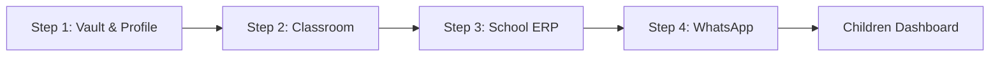
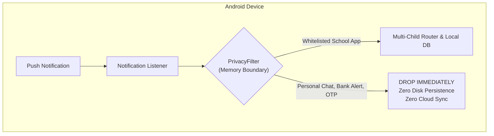
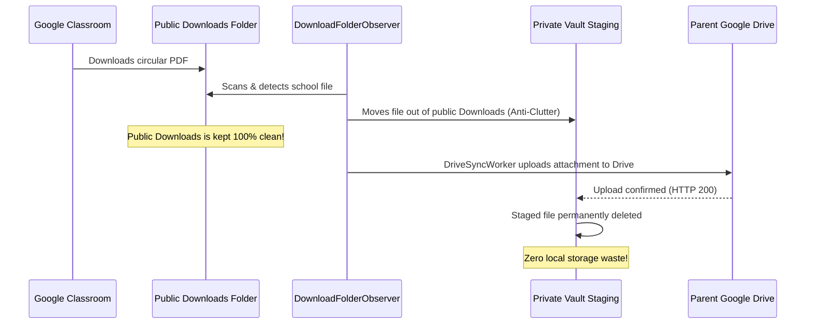

# 📖 K.I.D.S. User & Parent Manual
### Kids Intelligent Dashboard System — Ambient Educational Companion

<p align="center">
  
  
  
  
  
</p>

---

## 🌟 Welcome to K.I.D.S.

As parents, keeping up with school communications is exhausting. Homework assignments are posted in **Google Classroom**, urgent circulars arrive over **WhatsApp parent groups**, fee schedules sit in a **School ERP portal** (CampusCare, Toddle, Edunext), and exam timetables are buried inside multi-page **PDF attachments**. 

**K.I.D.S. (Kids Intelligent Dashboard System)** solves this pain point completely. It runs quietly on your Android smartphone as an ambient educational companion. It listens for incoming school announcements, crawls historical notice boards, performs optical character recognition (OCR) on circulars and worksheets, and automatically syncs everything directly into your personal **Google Drive Vault** in clean, AI-native formats (`notices.jsonl`, `MASTER_DIGEST.md`, `graph.html`, and `attachments/`).

> [!IMPORTANT]
> **Privacy Guarantee ($0 Cloud Cost & Zero Third-Party Servers):**
> K.I.D.S. does **NOT** use any cloud servers, external databases, or third-party relays. All data processing occurs 100% locally on your smartphone. Network traffic flows strictly and exclusively between your Android device and your own personal Google Drive account under the restricted `https://www.googleapis.com/auth/drive.file` privacy scope.

---

## 📋 Table of Contents

1. [System Requirements & Installation](#1-system-requirements--installation)
2. [4-Step Sequential Onboarding Wizard](#2-4-step-sequential-onboarding-wizard)
   - [Step 1: Cloud Vault & Child Profile](#step-1-cloud-vault--child-profile)
   - [Step 2: Google Classroom Mapping](#step-2-google-classroom-mapping)
   - [Step 3: School App & ERP Picker](#step-3-school-app--erp-picker)
   - [Step 4: WhatsApp Group Capture](#step-4-whatsapp-group-capture)
3. [Android Permissions & Safety Guarantees](#3-android-permissions--safety-guarantees)
   - [Notification Listener Service (24/7 Passive Capture)](#notification-listener-service-247-passive-capture)
   - [Accessibility Service (Historical Backfill Assistant)](#accessibility-service-historical-backfill-assistant)
   - [Storage Access & The Anti-Clutter Staging Lifecycle](#storage-access--the-anti-clutter-staging-lifecycle)
4. [Google Classroom Auto-Capture Guide](#4-google-classroom-auto-capture-guide)
   - [Stream Tab vs. Classwork Tab](#stream-tab-vs-classwork-tab)
   - [The Floating K.I.D.S. Assistant Overlay](#the-floating-kids-assistant-overlay)
   - [Autonomous Zero-Click Attachment Downloads](#autonomous-zero-click-attachment-downloads)
5. [WhatsApp School Group Integration](#5-whatsapp-school-group-integration)
   - [Real-Time Group Capture](#real-time-group-capture)
   - [Manual Chat Export Fallback (.txt / .zip)](#manual-chat-export-fallback-txt--zip)
6. [Accessing Your AI-Native Drive Vault](#6-accessing-your-ai-native-drive-vault)
   - [Vault Folder Structure](#vault-folder-structure)
   - [Using `MASTER_DIGEST.md` & `FAMILY_DIGEST.md`](#using-master_digestmd--family_digestmd)
   - [Exploring the Interactive Knowledge Graph (`graph.html`)](#exploring-the-interactive-knowledge-graph-graphhtml)
   - [Connecting AI Agents (Google Gemini & MCP Servers)](#connecting-ai-agents-google-gemini--mcp-servers)
7. [Troubleshooting & Diagnostic Logs](#7-troubleshooting--diagnostic-logs)
   - [Reading Diagnostic Logs on Google Drive](#reading-diagnostic-logs-on-google-drive)
   - [Xiaomi / MIUI / HyperOS Specific Setup](#xiaomi--miui--hyperos-specific-setup)
   - [Google Drive Authorization & SHA-1 Registration](#google-drive-authorization--sha-1-registration)
   - [Frequently Asked Questions (FAQ)](#frequently-asked-questions-faq)

---

## 1. System Requirements & Installation

### System Requirements
| Component | Specification | Details |
| :--- | :--- | :--- |
| **Operating System** | Android 8.0 (Oreo) or higher | Recommended: Android 14 or 15 (Target SDK 34/35) |
| **Google Account** | Personal Google Account (`@gmail.com`) | Free personal Google Drive storage (15 GB standard) |
| **Hardware** | 2 GB RAM minimum, 50 MB disk space | ML Kit runs on standard ARM64 / ARMv7 processors |
| **Network** | Wi-Fi or Mobile Data | Required only during Drive synchronization cycles |

### Downloading & Installing the App
1. Download the latest `app-debug.apk` directly from the [GitHub Releases](https://github.com/daarshnicsanjeev/K.I.D.S/releases/tag/latest) page.
2. Open the downloaded `.apk` on your Android smartphone.
3. If prompted by Android, enable **Install from Unknown Sources** for your browser or file manager.
4. Launch **K.I.D.S.** from your application drawer.

---

## 2. 4-Step Sequential Onboarding Wizard

When you first launch K.I.D.S., you are guided through a structured, 4-step sequential setup wizard. The wizard configures Child #1 completely before returning to the multi-child dashboard. You do not have to type school passwords or configure complex cloud credentials.



### Step 1: Cloud Vault & Child Profile
*The foundation of your child's private data storage.*

1. **Select Google Account for Vault**:
   - Tap **Select Google Account for Vault**.
   - Pick your personal Google Account using the native Android system account picker.
   - When prompted, grant access to create files in your personal Google Drive (`drive.file` scope).
2. **Enter Child Details**:
   - **Child First Name**: e.g., `Aarav` or `Maya`.
   - **Academic Year**: Select the current academic session (e.g., `2026-2027`).
   - **Child Photo (Optional)**: Select a photo from your gallery using the secure Android Photo Picker.
3. **Vault Creation & Instant Step Transition**:
   - Tap **Save Profile & Create Vault on Drive →**.
   - K.I.D.S. communicates directly with the Google Drive REST API to provision your private folder structure:
     `Google Drive / K.I.D.S. Data / 2026-2027 / Aarav /`.
   - **Zero-Lag UI Transition:** Step 1 transitions smoothly into Step 2 in **~1.5 seconds on first creation**, and **instantly (<50ms) when cached**.
   - **Why It Is So Fast:**
     - **SharedPreferences Folder Caching:** Once created, all folder IDs (`rootKidsFolderId`, `yearFolderId`, `childFolderId`, `attachmentsFolderId`, `systemFolderId`, and `logsFolderId`) are persisted in Android `SharedPreferences`. Subsequent setup passes or profile re-edits skip all Google Drive network discovery roundtrips, completing in under 50 milliseconds.
     - **Parallel Subfolder Resolution:** On cold creation, sibling folders (`attachments/` and `_system/`) resolve concurrently in parallel over coroutines rather than sequentially.
     - **Asynchronous Background Template Seeding:** Heavy initial files—including `MASTER_DIGEST.md`, `FAMILY_DIGEST.md`, `_system/knowledge_graph.json`, `graph.html`, and diagnostic trace logs—seed quietly in the background without blocking the user interface or freezing the screen. Parents proceed directly to Step 2 without waiting.

### Step 2: Google Classroom Mapping
*Seamlessly link school assignments and circulars without school admin blockages.*

1. **Enable Google Classroom**: Toggle the switch to **On**.
2. **Select Student Account**:
   - Tap **Select Account** to choose the Google account that your child uses for Google Classroom (e.g., `student@school.edu` or a family account).
   - > [!TIP]
   - > **Zero Password Typing:** Because this account is already authenticated on your Android phone, K.I.D.S. maps notifications and classroom streams by email handle without requiring school IT administration passwords or OAuth approval!
3. **Enable Historical Backfill Assistant**:
   - Tap **Enable Backfill Assistant** to open Android's Accessibility Settings.
   - Turn on **K.I.D.S.** under *Downloaded Apps / Accessibility*.
4. **Enable Storage & Downloads Access**:
   - Tap **Enable** next to *Storage & Downloads Access* to allow K.I.D.S. to detect downloaded circular PDFs and move them into private vault staging.
5. Tap **Save & Next →**.

### Step 3: School App & ERP Picker
*Capture notices from school management portals (CampusCare, Toddle, Edunext, Teams).*

1. **Enable School App Tracking**: Toggle the switch to **On**.
2. **Select Installed App**:
   - K.I.D.S. scans your phone's installed applications and displays them in a single-tap list (e.g., `CampusCare / Entab`, `Toddle Family Portal`, `Edunext Parent Portal`, `Microsoft Teams`).
   - Simply tap the app your school uses.
3. **Select Tracked Categories**:
   - Check the categories you wish to track: `Homework`, `Circulars`, `Attendance`, `Fee Receipts`.
4. Tap **Save & Next →** (or tap **Skip App Setup** if your school only uses Classroom and WhatsApp).

### Step 4: WhatsApp Group Capture
*Filter the noise and capture only official school circulars from parent WhatsApp groups.*

1. **Enable WhatsApp Group Capture**: Toggle the switch to **On**.
2. **Zero-Typing Group Selection**:
   - Select the detected school group chip from the list (e.g., `School Parents Official Group 2026-27`), or tap **Listen for Message** to auto-detect the group when the next school notification arrives.
3. Tap **Complete Setup for [Child Name] ✓**.
   - Your child's profile is initialized in the local encrypted database.
   - The initial knowledge graph (`graph.html`) and markdown digests (`MASTER_DIGEST.md` and `FAMILY_DIGEST.md`) are generated and uploaded to Google Drive.
   - You are redirected to the **Children Grid Dashboard**.

---

## 3. Android Permissions & Safety Guarantees

Android permissions can sometimes feel intrusive. K.I.D.S. is built with strict architectural boundaries to guarantee that your personal data is never compromised.



### Notification Listener Service (24/7 Passive Capture)
- **Android Permission:** `BIND_NOTIFICATION_LISTENER_SERVICE`
- **What it does:** Allows K.I.D.S. to receive notifications from school apps (Classroom, WhatsApp, ERP portals) the millisecond they arrive, even when the phone screen is locked.
- **Safety Guarantee:** 
  - Every notification is checked against the **`PrivacyFilter` at the memory boundary**.
  - If the notification is from a personal contact, non-whitelisted WhatsApp group, bank, or contains keywords like `OTP`, `verification code`, `debited`, or `UPI`, it is **dropped immediately from RAM**.
  - It is **never** written to local disk, never logged to any file, and never transmitted over the internet.

### Accessibility Service (Historical Backfill Assistant)
- **Android Permission:** `BIND_ACCESSIBILITY_SERVICE`
- **What it does:** Powers the **Floating K.I.D.S. Assistant** over Google Classroom. It scrolls through past announcements, extracts circulars and homework posted weeks or months ago, and auto-downloads attachments.
- **Safety Guarantees:**
  - **100% Optional:** If you decline accessibility access, K.I.D.S. continues to capture all new notices 24/7 through push notifications and manual chat exports.
  - **Active Only In School Apps:** The service activates only when Google Classroom or an authorized school ERP is actively displayed on your screen. It automatically hides when you navigate to your home screen or another app.
  - **Zero Keystroke Logging:** It only inspects public text views and attachment chips in educational lists. It never inspects passwords, text fields, or personal keyboards.

### Storage Access & The Anti-Clutter Staging Lifecycle
- **Android Permission:** `MANAGE_EXTERNAL_STORAGE` (All Files Access) / `READ_EXTERNAL_STORAGE`
- **Why it is needed:** When you or the assistant download a circular PDF or worksheet from Google Classroom, Android places the file in your device's public `Download/` or `Download/Classroom/` folder.

#### The Autonomous Anti-Clutter Staging Lifecycle
Without K.I.D.S., your phone's personal `Downloads` folder would quickly fill up with hundreds of school PDFs, making it impossible to find your own personal files. K.I.D.S. implements an autonomous **5-step anti-clutter lifecycle**:



1. **Autonomous Detection:** When a school attachment downloads, the `DownloadFolderObserver` scans public storage (`Downloads/` and `Downloads/Classroom/`).
2. **Immediate Move to Staging:** The detected file is **immediately moved out of public Downloads** into the private sandbox staging directory:
   `Android/data/com.kids.collector/files/vault_attachments/`.
3. **Zero Clutter:** Your personal Downloads folder stays spotless. No school circulars or worksheets linger to clutter your personal files.
4. **Drive Upload & ML Kit OCR:** `DriveSyncWorker` performs offline OCR on the file and uploads it securely to `Google Drive / K.I.D.S. Data / {Year} / {Child} / attachments/`.
5. **Automatic Cleanup:** As soon as Google Drive confirms a successful upload, the file is **deleted from the private staging folder**. Local storage consumption drops back to near zero.
6. **Residual Deletion:** If an already-synced file ever lingers in public Downloads, K.I.D.S. automatically detects and removes it.

> [!NOTE]
> WhatsApp documents and images are indexed in place and are **never moved or deleted**, ensuring your WhatsApp chat media remains fully functional.

---

## 4. Google Classroom Auto-Capture Guide

When setting up a child or catching up on previous weeks of schoolwork, Google Classroom contains a treasure trove of past announcements, circulars, worksheets, and syllabus PDFs.

### Stream Tab vs. Classwork Tab

Google Classroom organizes content into two distinct tabs:
1. **The Stream Tab:**
   - Contains chronological announcements, principal circulars, exam schedules, and holiday notices.
   - Attachments here are typically administrative circulars, weekly schedules, and school newsletters.
2. **The Classwork Tab:**
   - Contains subject-wise topics (e.g., *Mathematics*, *Science*, *English Literature*, *Social Studies*).
   - Contains homework assignments, practice question banks, printable worksheets, and project guidelines.

> [!TIP]
> **Recommended Workflow:**
> Run Auto-Capture **twice**: first on the **Stream** tab to capture administrative circulars, and second on the **Classwork** tab to capture all subject worksheets and study materials!

### The Floating K.I.D.S. Assistant Overlay

When you open Google Classroom, K.I.D.S. automatically displays the **Floating Assistant** on the screen:

```
+------------------------------------------+
|  K.I.D.S. Assistant         [14 Captured]|
|  --------------------------------------- |
|  [▶ Start Auto-Capture]   [📸 Grab Screen]|
|  [ — Minimize ]              [ ✕ Close ] |
+------------------------------------------+
```

- **Live Counter:** Shows the exact number of notices captured and deduplicated in real-time.
- **▶ Start Auto-Capture:** Starts automated scrolling and continuous notice extraction at the calibrated optimal speed (~1.3 seconds per screen).
- **📸 Grab Screen:** Captures the currently visible posts immediately without auto-scrolling.
- **— Minimize:** Collapses the assistant into a small, floating **`K`** circular bubble (48dp × 48dp) that you can drag anywhere on your screen. Tap the bubble anytime to expand it.
- **✕ Close:** Closes the assistant until you reopen Classroom.

### Autonomous Zero-Click Attachment Downloads

K.I.D.S. eliminates the chore of tapping into every single post and downloading attachments one by one:

1. As the assistant auto-scrolls down the Classroom feed, it identifies any post cards that contain attachment chips (`.pdf`, `.docx`, `.jpg`, etc.).
2. When an uncaptured attachment is detected, the assistant **autonomously taps the attachment chip**.
3. It waits for the Classroom preview screen to load, detects the native download button (`Download` or `Save to device`), and triggers the download.
4. It waits 400 milliseconds for the download task to hand off to Android's download manager, and automatically presses the system **Back** button to return to the Classroom list.
5. If a preview takes longer than 3.5 seconds to open, a safety timeout automatically presses Back, ensuring the crawler never gets stuck.
6. Meanwhile, the `DownloadFolderObserver` catches the downloaded file, moves it into private vault staging, and schedules it for Google Drive synchronization.

---

## 5. WhatsApp School Group Integration

Many schools rely on WhatsApp broadcast groups or parent-teacher associations (PTAs) for time-critical updates (e.g., bus delays, emergency closures, rainy day schedules).

### Real-Time Group Capture
- When an announcement is posted in your whitelisted WhatsApp group, `KidsNotificationListenerService` intercepts it immediately.
- The `PrivacyFilter` confirms that the message originates from your selected school group.
- The `MultiChildRouter` attributes the notice to the correct child based on the group name or keywords.
- The notice is classified (`CIRCULAR`, `HOMEWORK`, `ATTENDANCE`, or `FEES`), deduplicated via SHA-256 fingerprinting, and scheduled for Drive synchronization.

### Manual Chat Export Fallback (.txt / .zip)
If you missed notifications while your phone was switched off or you recently joined the school group:
1. Open the school group in **WhatsApp**.
2. Tap the three dots (⋮) in the top-right corner → **More** → **Export chat**.
3. Choose **Without Media** (or **Include Media** if you wish to import past photos and PDF circulars).
4. In the Android share sheet, select **K.I.D.S. Importer**.
5. K.I.D.S. parses the chat transcript, extracts past announcements, links attachments, and updates your child's Google Drive Vault.

---

## 6. Accessing Your AI-Native Drive Vault

All collected communications are synchronized to your personal Google Drive in open, standardized, human-readable and machine-readable formats.

### Vault Folder Structure
In your Google Drive, navigate to **My Drive** → **K.I.D.S. Data**:

```
My Drive/
└── K.I.D.S. Data/
    └── 2026-2027/
        ├── FAMILY_DIGEST.md                     <-- High-level overview of all children
        └── Aarav/
            ├── notices.jsonl                    <-- AI-native streaming notice records
            ├── MASTER_DIGEST.md                 <-- Complete categorized Markdown briefing
            ├── graph.html                       <-- Interactive visual knowledge graph
            ├── attachments/                     <-- Downloaded circular PDFs & worksheets
            │   ├── Annual_Sports_Day_Circular.pdf
            │   └── Math_Worksheet_Ch4.pdf
            ├── Google Classroom/                <-- Dedicated channel subfolder
            │   ├── notices.jsonl
            │   ├── CLASSROOM_DIGEST.md
            │   └── attachments/
            └── _system/
                ├── knowledge_graph.json         <-- GraphRAG schema index
                └── logs/
                    ├── sync_timeline.log        <-- Synchronization audit log
                    ├── crawler_trace.log        <-- Step-by-step assistant crawler log
                    └── diagnostic_snapshot.json <-- Device state & health probe
```

### Using `MASTER_DIGEST.md` & `FAMILY_DIGEST.md`
- **`MASTER_DIGEST.md`:** Opens in any Markdown reader, text editor, or Google Docs. It provides a structured summary organized into:
  - 📚 **Homework & Assignments:** Sorted by due date and subject.
  - 📢 **Circulars & Schedules:** School policies, event invitations, and exam dates.
  - 💳 **Fees & Administrative Reminders:** Due dates and payment details.
  - 🔍 **Indexed OCR Excerpts:** Full searchable text extracted from multi-page PDF circulars.
- **`FAMILY_DIGEST.md`:** Perfect for parents with multiple children. It provides a consolidated cross-child dashboard comparing notices, upcoming deadlines, and recent announcements across all enrolled kids.

### Exploring the Interactive Knowledge Graph (`graph.html`)
- Open `graph.html` directly in any web browser (Chrome, Edge, Safari, Firefox).
- The file is completely self-contained and renders an interactive **D3.js Force-Directed Graph**:
  - **Blue Nodes:** The Child profile.
  - **Orange Nodes:** Homework & Assignments.
  - **Light Blue Nodes:** Circulars & Newsletters.
  - **Green Nodes:** Teachers & Senders.
  - **Grey Nodes:** Attachments & Worksheets.
- You can zoom, pan, and drag nodes to visualize connections between subjects, teachers, and assignments!

### Connecting AI Agents (Google Gemini & MCP Servers)
Because K.I.D.S. stores your data in AI-native formats (`notices.jsonl` and `MASTER_DIGEST.md`), you can easily use modern AI tools to query your child's school life:
- **Google Gemini / Claude / ChatGPT:** Upload `MASTER_DIGEST.md` and ask:
  - *"What homework does Aarav have due this Thursday?"*
  - *"Summarize the dress code guidelines from the Sports Day circular."*
  - *"Are there any school fee payments due before the end of this month?"*
- **Model Context Protocol (MCP):** Connect an MCP-compatible agent directly to your Google Drive `notices.jsonl` file for automated real-time calendar reminders and briefing digests.

---

## 7. Troubleshooting & Diagnostic Logs

### Reading Diagnostic Logs on Google Drive
If you ever wonder why a notice was or wasn't captured, check the `_system/logs/` folder in your child's Google Drive vault:
1. **`crawler_trace.log`:** A granular, millisecond-by-millisecond execution trace of the crawler assistant. Look for lines like:
   - `[SCROLLER_CARDS] Identified 5 discrete post cards on active screen`
   - `[ATTACHMENT_AUTO_TAP] Autonomously tapping attachment chip: "Math_Unit_3.pdf"`
   - `[DOWNLOAD_MOVE] Moved "Math_Unit_3.pdf" out of public Downloads into private vault staging`
2. **`sync_timeline.log`:** A chronological record of every Google Drive upload cycle:
   - `[NOTICE BATCH SYNC] Synced 4 notices`
   - `[ATTACHMENT BATCH SYNC] Uploaded 2 physical files to attachments/`

### Xiaomi / MIUI / HyperOS Specific Setup
Devices running Xiaomi MIUI or HyperOS enforce aggressive background restrictions. To ensure seamless operation:
1. Go to **Settings** → **Apps** → **Manage Apps** → **K.I.D.S.**.
2. Enable **Autostart**.
3. Set **Battery Saver** to **No restrictions**.
4. Tap **Other permissions** and ensure **Display pop-up windows while running in the background** is allowed. This allows the Floating Assistant overlay to appear over Google Classroom.

### Google Drive Authorization & SHA-1 Registration
If Step 1 of the wizard displays an authorization error (*"Additional consent required"* or *"API access blocked"*):
1. Note the SHA-1 certificate fingerprint displayed in the error card:
   `D7:6F:AA:F1:98:E2:88:E8:AB:79:17:5B:65:13:BA:84:9F:E1:6E:88`
2. Package Name: `com.kids.collector.debug` (or `com.kids.collector`)
3. Tap **Copy SHA-1** and open your [Google Cloud Console Credentials](https://console.cloud.google.com/apis/credentials).
4. Add the Android OAuth client ID with your package name and SHA-1 fingerprint.

### Frequently Asked Questions (FAQ)

**Q: Does K.I.D.S. drain my smartphone's battery?**
*A: No. The Notification Listener is event-driven and consumes 0% battery while waiting. The Accessibility Assistant only runs when you actively trigger Auto-Capture in Google Classroom, and Drive uploads are batched efficiently via Android's WorkManager.*

**Q: Will my personal Downloads folder be filled with school files?**
*A: Never. K.I.D.S. features an autonomous anti-clutter staging engine. As soon as a school PDF is downloaded, it is moved out of public Downloads into private vault staging, uploaded to Google Drive, and then deleted locally. Your Downloads folder remains completely clean.*

**Q: Can I set up multiple children in different schools?**
*A: Yes! After completing the setup for Child #1, tap **Add Another Child** on the Children Grid Dashboard. Each child gets their own isolated Google Drive vault folder and tailored channel configurations.*

**Q: What happens if I lose internet connection?**
*A: All captured notices and local files are safely stored in your smartphone's encrypted offline SQLite Room database. Once your device reconnects to Wi-Fi or mobile data, WorkManager automatically resumes synchronization to Google Drive.*

**Q: Why does Step 1 ('Save Profile & Create Vault on Drive') finish so quickly?**
*A: K.I.D.S. is engineered with zero-lag background seeding. When you tap **Save Profile & Create Vault on Drive →**, the wizard advances to Step 2 in ~1.5 seconds on first creation, and in <50ms if the vault was previously configured and cached in local SharedPreferences. Heavy template uploads (like `MASTER_DIGEST.md`, `FAMILY_DIGEST.md`, `knowledge_graph.json`, and `graph.html`) run asynchronously in the background so you never have to wait on a loading spinner.*

---

*Thank you for trusting K.I.D.S. to protect your privacy and organize your child's educational journey!*
