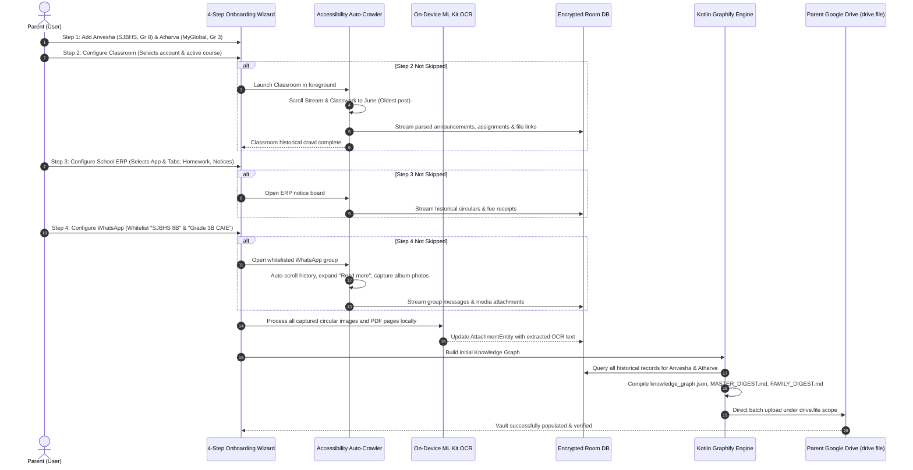
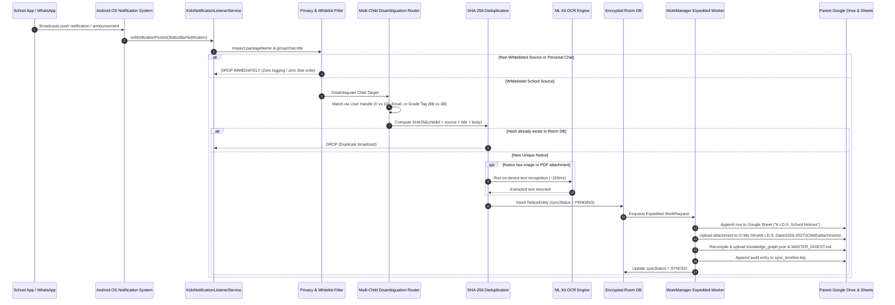

# Product Requirements Document (PRD)
## K.I.D.S. Android Collector: Privacy-First School Notice & Circular Ingestion Engine

---

### Executive Summary

The **Kids Intelligent Dashboard System (K.I.D.S.) Android Collector** is an ambient, privacy-first mobile companion application that continuously captures, deduplicates, and organizes school communications (notices, circulars, homework assignments, exam schedules, and PDF attachments) across school apps (Google Classroom, WhatsApp, School ERPs, Gmail) and syncs them directly into the parent's personal **Google Drive Vault** and **Google Sheets**.

By moving ingestion to an Android background service on the parent's device, K.I.D.S. eliminates the dependency on active desktop browser tabs, avoids school-domain OAuth lockouts, and captures data passively the exact millisecond a teacher broadcasts an announcement. It features **100% on-device Google ML Kit OCR**, a **native Kotlin Graphify Knowledge Graph Engine**, an **automated Drive Deep-Logging Telemetry Subsystem**, and a branded **Material 3 UI System** based on official K.I.D.S. visual guidelines, operating at **\$0.00 cloud infrastructure cost** while maintaining complete privacy, commercial scalability, and WCAG 2.1 AA accessibility compliance.

---

### 1. Objectives & Guiding Principles

1. **Zero School Admin Dependency:** Does not require Google Workspace for Education domain administrator approvals, School Apps Script authorizations, or third-party web app whitelisting.
2. **Ambient & Continuous (24/7):** Runs passively in the background of the parent's mobile device, capturing push notifications and downloaded attachments in real time.
3. **Zero-Backend Architecture (\$0 Server Cost & Total Privacy):** Student data is never transmitted to or stored on third-party servers. The app uses direct Google Sign-In with scoped permissions (`drive.file`) to sync data directly from the phone into the parent's private Google Drive.
4. **On-Device Intelligence:** Instant, offline OCR (Google ML Kit) and local Knowledge Graph synthesis (Kotlin Graphify) run directly on the device with zero cloud API bills.
5. **Multi-Child & Multi-School Isolation:** Supports multiple children attending different schools (e.g., Anvesha at SJBHS Grade 8, Atharva at MyGlobal School Grade 3) with rule-based auto-tagging.
6. **AI & MCP Compatibility:** Maintains exact folder and schema compatibility with existing K.I.D.K. Model Context Protocol (MCP) servers and Gemini AI dashboards.
7. **Premium Brand Identity:** Strict adherence to K.I.D.S. brand typography (Kanit & Poppins) and palette (`#1A365D`, `#ED8936`, `#E2E8F0`, `#F7FAFC`).
8. **Universal Accessibility:** Comprehensive WCAG 2.1 AA design (TalkBack, dynamic scaling, minimum 48dp touch targets, high contrast) and strict Google Play Accessibility Service governance.
9. **Transparent Troubleshooting (Drive Deep Logging):** Every execution step, sync event, notification capture, and OCR transformation writes detailed structured telemetry to the parent's Google Drive for 1-click troubleshooting.
10. **Exhaustive Automated Verification:** Multi-tier testing pyramid (Unit, Integration, Robolectric, Compose A11y, MockWebServer, and ADB hardware smoke tests) with strict CI quality gates.

---

### 2. Design System & Brand Guidelines

The Android application implements a dedicated Jetpack Compose Material 3 Theme (`KidsTheme`) matching the official design identity:

#### 2.1. Color Palette & Contrast Validation (WCAG 2.1 AA/AAA)

| Token | Hex Value | Contrast on White/Canvas | Role & WCAG Compliance |
| :--- | :--- | :--- | :--- |
| **Deep Navy (Primary)** | `#1A365D` | **11.4:1 (AAA)** | Brand primary, App bar, primary buttons, headers |
| **Amber Orange (Accent)** | `#ED8936` | **3.0:1 (UI / Badges)**<br>*(Use `#C05621` 4.6:1 for small text)* | Active sync badges, highlight borders, action buttons |
| **Light Slate (Border)** | `#E2E8F0` | **1.3:1 (Structural)** | Card strokes, dividing lines, inactive chips |
| **Off-White (Canvas)** | `#F7FAFC` | Background Canvas | Main app background, scaffold canvas |
| **Surface White** | `#FFFFFF` | Surface Container | Card surfaces, modal sheets, elevated containers |
| **Text Primary** | `#0F172A` | **15.8:1 (AAA)** | High-contrast titles, reading body |
| **Text Secondary** | `#475569` | **5.5:1 (AA)** | Timestamps, metadata labels, subtext |

#### 2.2. Typography System

The application uses Google Fonts bundled natively via `androidx.compose.ui.text.font.Font`:

* **Display & Headings: `Kanit`**
  * Weights: SemiBold (600), Bold (700), ExtraBold (800)
  * Usage: App Header ("K.I.D.S."), Wizard Step Titles, Section Headers, Metric Callouts.
  * Personality: Confident, dynamic, modern, structured.
* **Body & UI Controls: `Poppins`**
  * Weights: Regular (400), Medium (500), SemiBold (600)
  * Usage: Body text, form fields, card descriptions, notification previews, button text.
  * Personality: Highly legible, geometric, approachable.

```kotlin
// Android Jetpack Compose Typography Definition
val KanitFontFamily = FontFamily(
    Font(R.font.kanit_regular, FontWeight.Normal),
    Font(R.font.kanit_medium, FontWeight.Medium),
    Font(R.font.kanit_semibold, FontWeight.SemiBold),
    Font(R.font.kanit_bold, FontWeight.Bold)
)

val PoppinsFontFamily = FontFamily(
    Font(R.font.poppins_regular, FontWeight.Normal),
    Font(R.font.poppins_medium, FontWeight.Medium),
    Font(R.font.poppins_semibold, FontWeight.SemiBold),
    Font(R.font.poppins_bold, FontWeight.Bold)
)
```

---

### 3. System Architecture

```
                       ┌────────────────────────────────────────┐
                       │     Parent's Android Mobile Device     │
                       └───────────────────┬────────────────────┘
                                           │
         ┌─────────────────────────────────┼─────────────────────────────────┐
         ▼                                 ▼                                 ▼
[NotificationListenerService]     [AccessibilityService]            [MediaStore Observer]
 • Real-time push notices         • Historical back-scroll          • Circular PDFs, DOCs,
   (Classroom, WhatsApp, ERPs)      (June-to-date crawler)            & timetable images
 • Title, text, picture extras    • Traverses node trees            • ContentResolver stream
         │                                 │                                 │
         └─────────────────────────────────┼─────────────────────────────────┘
                                           │
                                           ▼
                       [On-Device Google ML Kit OCR Engine]
                        • Extracts text from photos/PDFs in ~200ms
                        • 100% offline, free, zero cloud API billing
                                           │
                                           ▼
                       [Local Room Database + Hashing Engine]
                        • NoticeEntity, AttachmentEntity, ChildProfileEntity
                        • SHA-256 deduplication & child attribution
                                           │
                                           ▼
                       [Local Kotlin Graphify Engine]
                        • Compiles _system/knowledge_graph.json (GraphRAG)
                        • Generates MASTER_DIGEST.md & FAMILY_DIGEST.md
                        • Builds interactive graph.html
                                           │
                                           ▼ [WorkManager Expedited / Periodic]
                   [Direct Google Drive & Sheets REST Pipeline]
                    • OAuth Scope: drive.file + spreadsheets
                    • Resumable file uploads + Sheet row append
                    • Deep Telemetry & Rolling Logs Uploader
                                           │
                  ┌────────────────────────┴────────────────────────┐
                  ▼                                                 ▼
     [Parent's Google Drive Vault]                        [Parent's Google Sheets]
      G:\My Drive\K.I.D.S. Data\                           K.I.D.S. School Notices - {Child}
      └── {AcademicYear}\{ChildName}\                      Columns: Timestamp, Source, Class,
            ├── _system\                                            Title, Notice Text, Drive URL
            │   ├── logs\sync_timeline.log
            │   ├── logs\diagnostic_snapshot.json
            │   └── knowledge_graph.json
            ├── MASTER_DIGEST.md & graph.html
            ├── attachments\
            └── notices_index.json
```

---

### 4. The 4-Step Onboarding & Configuration Wizard (Mandatory vs. Optional Rules)

```
Step 1: Parent Cloud Vault & Child Profiles
  ├── Google Sign-In with scoped permissions (drive.file + spreadsheets) [MANDATORY]
  └── Create Child Profiles:
        ├── First Name [*MANDATORY]
        ├── Academic Year [*MANDATORY: 3-year selector based on current year]
        └── Photo Upload [OPTIONAL]

Step 2: Google Classroom & Account Mapping [OPTIONAL: Has "Skip" button]
  ├── Student Account Selection [*MANDATORY if Step 2 enabled]
  ├── Active Course Selection [*MANDATORY if Step 2 enabled]
  └── Day 0 Historical Auto-Crawl via AccessibilityService [*MANDATORY if Step 2 enabled]

Step 3: School Portals & Universal App Tracking [OPTIONAL: Has "Skip" button]
  ├── App Selection [*MANDATORY if Step 3 enabled]
  ├── Functionality / Tab Selection (Homework, Notices, Attendance, Fees) [*MANDATORY if Step 3 enabled]
  └── Disambiguation Tag / User Handle (for shared apps) [*MANDATORY only if siblings share the same ERP]

Step 4: Messaging & Communication Tools (WhatsApp) [OPTIONAL: Has "Skip" button]
  ├── Group Whitelist Selection [*MANDATORY if Step 4 enabled]
  └── Day 0 Group History Catch-Up (Scrolls messages, albums, "Read more") [*MANDATORY if Step 4 enabled]

*GLOBAL GATE: While steps 2, 3, and 4 each offer a "Skip this source" button, AT LEAST ONE source must be completed before setup can finish. Day 0 Historical Backfill is a MANDATORY gate for all enabled channels.
```

#### Step 1: Parent Cloud Vault & Child Profiles
* **Branded Hero Screen:** Deep Navy (`#1A365D`) banner with Kanit typography and Accent Orange (`#ED8936`) action button.
* **Parent Google Sign-In [MANDATORY]:** Authenticates via Google Sign-In SDK using the parent's personal Google account.
* **Permission Scoping [MANDATORY]:** Strictly requests:
  * `https://www.googleapis.com/auth/drive.file` (Privacy-first: only reads and writes files created by K.I.D.S.; zero full Drive access).
  * `https://www.googleapis.com/auth/spreadsheets` (For appending rows to the notice tracking sheet).
* **Child Profile Form Fields:**
  * **First Name [*MANDATORY]:** e.g., `Anvesha`, `Atharva`.
  * **Academic Year [*MANDATORY]:** Radio / dropdown offering 3 years based on current calendar date (e.g. `2025-2026`, `2026-2027`, `2027-2028`). Exactly one must be selected.
  * **Child Photo [OPTIONAL]:** Local avatar upload; falls back to branded initial initials if omitted.

#### Step 2: Google Classroom & Multi-Account Selection [OPTIONAL - Can be skipped]
* **Skip Option:** Provides a prominent "Skip Google Classroom" button.
* If Enabled:
  * **Zero School OAuth Guarantee:** Emphasizes that this step **never** prompts for school account login, password, or OAuth consent (`access_not_configured` immune).
  * **Student Account Chooser [*MANDATORY]:** Selects or types the student email (e.g., `anvesharprasad@sjbhs.org` for Anvesha, `atharva.chaodhari@myglobal.school` for Atharva) as a routing key.
  * **Active Course Selection [*MANDATORY]:** Selects the active classroom course (e.g., `STD- VIII (B)`, `Grade 3B CAIE`).
  * **Day 0 Historical Accessibility Crawl [*MANDATORY]:** Automates background/foreground scroll of Stream & Classwork tabs to index assignments back to June.

#### Step 3: School Portals & Universal App Tracking [OPTIONAL - Can be skipped]
* **Skip Option:** Provides a prominent "Skip School ERP" button.
* If Enabled:
  * **App Selection [*MANDATORY]:** Selects the installed school ERP application (e.g. `CampusCare / Entab`, `Toddle Family`, `Edunext`).
  * **Functionality / Tab Selection [*MANDATORY]:** Checkboxes for which tabs to track: `[x] Homework`, `[x] Circulars / Notices`, `[x] Attendance`, `[x] Fee Receipts`.
  * **Multi-Child Disambiguation [*MANDATORY only if siblings share the same app]:**
    * *Option A (Dual Apps / App Cloner):* Assigns Android `User 0` (Main) to Anvesha and `User 10 / 999` (Clone) to Atharva.
    * *Option B (Grade / Section Tag):* Tag `8B` / `VIII` for Anvesha vs `3B` / `III` for Atharva.
    * *Option C (Separate Devices):* App installed on separate phones with identical Google Drive vault credentials.

#### Step 4: Messaging & Communication Tools (WhatsApp) [OPTIONAL - Can be skipped]
* **Skip Option:** Provides a prominent "Skip WhatsApp" button.
* If Enabled:
  * **Platform Selection:** Defaults to WhatsApp / WhatsApp Business.
  * **Group / Chat Whitelist [*MANDATORY]:** Explicitly whitelists the school parent group name (e.g. `SJBHS 8B Parents` for Anvesha, `Grade 3B CAIE Parents` for Atharva). All non-whitelisted chats are strictly discarded before storage.
  * **Day 0 Group History Catch-Up [*MANDATORY]:** Automated accessibility crawler scrolls previous messages, albums, attachments, and expands "Read more" notices back to June, or accepts native `.txt` chat export file.

---

### 5. Mandatory vs. Optional Specification Matrix

| Component / Step | Field / Sub-Feature | Status | Validation Rule / Behavior |
| :--- | :--- | :--- | :--- |
| **Cloud Vault** | Parent Google Sign-In | **MANDATORY** | Requires `drive.file` and `spreadsheets` scopes. |
| **Cloud Vault** | Vault Directory Hierarchy | **AUTOMATED** | Auto-creates `K.I.D.S. Data/{AcademicYear}/{ChildName}/`. Zero manual picker. |
| **Step 1 (Profile)** | First Name | **MANDATORY** | Cannot be blank; forms folder and sheet names. |
| **Step 1 (Profile)** | Academic Year | **MANDATORY** | 3 options based on current year; single-select radio. |
| **Step 1 (Profile)** | Photo Upload | **OPTIONAL** | If empty, renders Kanit initials avatar. |
| **Step 2 (Classroom)** | Enable Channel | **OPTIONAL** | Can be skipped if school does not use Classroom. |
| **Step 2 (Classroom)** | Student Account Selection | **MANDATORY\*** | Required if Step 2 enabled. Pure routing tag; 0 OAuth. |
| **Step 2 (Classroom)** | Active Course Selection | **MANDATORY\*** | Required if Step 2 enabled (e.g. `STD- VIII (B)`). |
| **Step 2 (Classroom)** | Day 0 Stream/Classwork Crawl | **MANDATORY\*** | Executes automated scroll to backfill records to June. |
| **Step 3 (School ERP)** | Enable Channel | **OPTIONAL** | Can be skipped if school does not use an ERP. |
| **Step 3 (School ERP)** | App Selection | **MANDATORY\*** | Required if Step 3 enabled (picks installed package). |
| **Step 3 (School ERP)** | Functionality / Tab Selection| **MANDATORY\*** | Required if Step 3 enabled (Homework, Circulars, etc.).|
| **Step 3 (School ERP)** | Disambiguation Key | **CONDITIONAL** | Mandatory only if siblings share the exact same app. |
| **Step 4 (WhatsApp)** | Enable Channel | **OPTIONAL** | Can be skipped if not in WhatsApp parent groups. |
| **Step 4 (WhatsApp)** | Group Whitelist | **MANDATORY\*** | Required if Step 4 enabled. 100% drops other chats. |
| **Step 4 (WhatsApp)** | Day 0 Message & Album Crawl | **MANDATORY\*** | Scrolls past messages, albums, and "Read more" links. |
| **Global Setup Gate** | Minimum Active Channels | **MANDATORY** | At least 1 channel (Step 2, 3, or 4) must be completed. |
| **Intelligence** | On-Device ML Kit OCR | **MANDATORY** | Runs automatically offline on all circular images/PDFs. |
| **Intelligence** | Local Kotlin Graphify | **MANDATORY** | Compiles `knowledge_graph.json` & `MASTER_DIGEST.md`. |
| **Cloud Telemetry** | Drive Deep-Logging | **MANDATORY** | Writes `sync_timeline.log` & `diagnostic_snapshot.json`. |

*\* Mandatory only when that specific channel is enabled / not skipped.*

---

### 6. End-to-End Multi-Child Ingestion Workflows

#### 6.1. Day 0: One-Time Historical Ingestion Workflow



#### 6.2. Day 1+: Continuous Incremental Capture Workflow (24/7 Passive)



---

### 5. On-Device OCR & Local Graphify Engines

#### 5.1. On-Device Google ML Kit OCR Engine
* **Library:** `com.google.android.gms:play-services-mlkit-text-recognition:19.0.0`
* **Performance:** Extracts full-text from scanned circular PDFs, timetable photos, and mobile screenshots in **150ms – 300ms**.
* **Cost:** **\$0.00 forever.** Runs locally on the phone's NPU/CPU; zero cloud API quota or billing.
* **Workflow:**
  1. `MediaStore Observer` or `NotificationListener` captures a circular image/PDF.
  2. ML Kit text recognizer parses blocks, lines, and words.
  3. Extracted text is stored in `AttachmentEntity.ocrText` in Room DB.
  4. WorkManager appends the OCR text directly into the child's Google Sheet and `MASTER_DIGEST.md`.

#### 5.2. Local Kotlin Graphify Knowledge Graph Engine
Replicates and extends the schema of the desktop `knowledgeGraphBuilder.ts` natively in Kotlin:

* **Entities (Nodes):**
  * `Child`: Root entity (Name, Grade, Year).
  * `Course`: Subject or Class Stream (e.g. Science, Mathematics, English).
  * `Assignment`: Homework tasks, deadlines, and requirements.
  * `EmailCircular`: School circulars, notices, and exam dates.
  * `PortalNotice`: Messages from ERPs (CampusCare, Toddle).
  * `ChatMessage`: WhatsApp circulars and teacher updates.
  * `Teacher`: Senders and instructors.
  * `Attachment`: Linked PDFs, worksheets, and flyers.
  * `Attendance`: Daily attendance events.
* **Relationships (Edges):**
  * `BELONGS_TO`, `ASSIGNED_BY`, `MENTIONS`, `RELEVANT_TO`, `ATTACHED_TO`, `APPLIES_TO`.
* **Output Artifacts Generated on Device:**
  1. `_system/knowledge_graph.json`: Machine-readable GraphRAG index.
  2. `MASTER_DIGEST.md`: Living Markdown digest structured for **Google Gemini Spark** and AI assistants.
  3. `FAMILY_DIGEST.md`: High-level multi-child rollup for parents.
  4. `graph.html`: Standalone interactive HTML visual graph viewer using embedded D3.js, viewable directly from Google Drive.

---

### 6. Historical Catch-Up Engine

To capture past circulars and homework from earlier in the academic year (e.g. June to September) before the app was installed:

1. **AccessibilityService Auto-Crawler:**
   * Parent navigates to the target app's Notice Board or Classroom Stream.
   * Service detects the active viewport, extracts visible `AccessibilityNodeInfo` tree nodes, and triggers automated programmatic scrolls (`ACTION_SCROLL_FORWARD`).
   * Crawls upward until it encounters already-synced dates or a user-defined cutoff date.
2. **Manual Chat & File Import Fallback:**
   * WhatsApp Chat Export: Parent exports chat `.txt` (with media) via WhatsApp's native "Export chat" feature and shares it with K.I.D.S.
   * File Importer: Parent selects a local folder (e.g. `Downloads/`) containing downloaded school circulars.

---

### 7. Storage & Cloud Sync Specifications

#### 7.1. Local Room Database Schema
* `ChildProfileEntity`: `childId`, `name`, `grade`, `academicYear`, `schoolName`, `accountEmail`, `keywordsJson`
* `NoticeEntity`: `noticeId`, `childId`, `sourceApp`, `category`, `title`, `body`, `sender`, `timestamp`, `imageUri`, `syncStatus`
* `AttachmentEntity`: `attachmentId`, `noticeId`, `fileName`, `localUri`, `mimeType`, `sizeBytes`, `fileHash`, `ocrText`, `driveFileId`, `syncStatus`
* `KnowledgeGraphEntity`: `childId`, `version`, `graphJson`, `lastUpdated`

#### 7.2. Google Drive Vault Directory Hierarchy
```
Parent's Google Drive:
└── K.I.D.S. Data/
    └── 2026-2027/
        ├── Anvesha/
        │   ├── _system/
        │   │   ├── logs/
        │   │   │   ├── sync_timeline.log (Rolling chronological text log)
        │   │   │   └── diagnostic_snapshot.json (Health state & metrics)
        │   │   └── knowledge_graph.json
        │   ├── MASTER_DIGEST.md
        │   ├── graph.html
        │   ├── K.I.D.S. School Notices - Anvesha (Google Sheet)
        │   ├── notices_index.json
        │   └── attachments/
        │       ├── Circular_Exam_Timetable_Sep2026.pdf
        │       └── Worksheet_Mathematics_Ch4.pdf
        ├── Atharva/
        │   ├── _system/
        │   │   ├── logs/
        │   │   │   ├── sync_timeline.log
        │   │   │   └── diagnostic_snapshot.json
        │   │   └── knowledge_graph.json
        │   ├── MASTER_DIGEST.md
        │   ├── graph.html
        │   ├── K.I.D.S. School Notices - Atharva (Google Sheet)
        │   ├── notices_index.json
        │   └── attachments/
        │       ├── Checkpoint_Registration_Form.pdf
        └── FAMILY_DIGEST.md (Consolidated multi-child overview)
```

#### 7.3. Sync Cadence (`WorkManager`)
* **Real-Time Notice Sync (Expedited Work):** Uploads notice text, category, and appends to Google Sheets immediately when online.
* **Background File Uploader (Constrained Work):**
  * `NetworkType.CONNECTED` (prefer unmetered Wi-Fi).
  * Uses Google Drive REST API v3 Resumable Upload protocol to handle large PDFs and slow connections gracefully.
  * SHA-256 file hashing guarantees zero redundant uploads.

---

### 8. Technical Specifications & Dependencies

| Layer | Component | Version / Library |
| :--- | :--- | :--- |
| **Language** | Kotlin | 1.9.20+ |
| **Android Targets** | Target SDK 34 (Android 14) / Min SDK 26 (Android 8.0) | AndroidX |
| **UI Framework** | Jetpack Compose + Material 3 | Compose 1.6+ |
| **Typography** | Kanit & Poppins | `androidx.compose.ui:ui-text-google-fonts` |
| **Brand Colors** | Deep Navy (`#1A365D`), Orange (`#ED8936`), Slate (`#E2E8F0`), Off-White (`#F7FAFC`) | Custom ColorScheme |
| **Local Persistence** | Jetpack Room + SQLite FTS4 | Room 2.6.1 |
| **Background Sync** | AndroidX WorkManager | WorkManager 2.9.0 |
| **On-Device OCR** | Google ML Kit Text Recognition | `play-services-mlkit-text-recognition:19.0.0` |
| **Auth** | Google Sign-In SDK for Android | `play-services-auth:21.0.0` |
| **Cloud APIs** | Google APIs Client Library | `google-api-services-drive:v3`, `google-api-services-sheets:v4` |
| **JSON Serialization** | Kotlinx Serialization | `kotlinx-serialization-json:1.6.2` |
| **Test Stack** | JUnit 5, MockK, Robolectric, Truth, Compose Testing | MockK 1.13+, Robolectric 4.11+ |

---

### 9. Commercial Viability & Google Play Compliance

1. **Zero-Backend Margin:** Hosting cost is \$0 per subscriber. No AWS/GCP database, storage, or compute servers are required.
2. **Permission Disclosures:**
   * Prominent onboarding modal detailing `BIND_NOTIFICATION_LISTENER_SERVICE`: Used strictly to detect educational notices for personal Google Drive backup.
3. **Restricted Scope Verification:**
   * `drive.file` is classified by Google as a **non-sensitive / per-file permission**, avoiding the stringent third-party cloud security assessments required for full `drive` scope.
4. **Data Safety Guarantee:** All collected notices and circulars travel encrypted directly between the phone and the parent's Google Drive. No data is stored, sold, or accessible by the developer.

---

### 10. Comprehensive Accessibility (A11y) & System Service Governance

Accessibility in K.I.D.S. encompasses two distinct, critical domains:
1. **User Accessibility (WCAG 2.1 AA/AAA compliance for parents and caregivers with diverse physical/visual abilities).**
2. **System Accessibility Service Governance (Ethical, safe, and Google Play-compliant use of Android's `AccessibilityService`).**

#### 10.1. User Accessibility (UI & Assistive Technology)

* **Screen Reader Support (Google TalkBack):**
  * Every Compose component provides explicit semantics:
    ```kotlin
    Modifier.semantics {
        contentDescription = "Circular from ${notice.sender}, titled: ${notice.title}, received on ${notice.formattedDate}"
        role = Role.Button
    }
    ```
  * Decorative brand elements and dividers specify `contentDescription = null` to eliminate TalkBack clutter.
  * Headings are explicitly flagged using `Modifier.semantics { heading() }` allowing TalkBack users to jump quickly between wizard sections.
* **Touch Target Sizing (WCAG 2.5.5 / Material Design):**
  * All interactive elements (buttons, radio cards, checkboxes, dropdown items) enforce a minimum touch target of **48dp × 48dp** (using `Modifier.defaultMinSize(minWidth = 48.dp, minHeight = 48.dp)`).
* **Dynamic Font Scaling & Spacing:**
  * All typography uses scalable pixels (`sp`), supporting system font scaling up to **200%** without text clipping, truncating, or overlapping.
  * UI cards employ flexible layout constraints (`IntrinsicSize.Min` and scrollable columns) to expand gracefully under large text sizes.
* **Color Contrast & State Perception:**
  * Primary text (`#0F172A`) on Off-White Canvas (`#F7FAFC`) provides a **15.8:1** contrast ratio (exceeds WCAG AAA standard).
  * Deep Navy buttons (`#1A365D`) with White text provide **11.4:1** contrast (exceeds WCAG AAA).
  * Accent Orange (`#ED8936`) is paired with high-contrast text and never relies solely on color to convey state (e.g. sync status badges always combine an icon + text label + color).
* **Reduced Motion & Audio/Haptic Cues:**
  * Honors system-wide `Settings.Global.TRANSITION_ANIMATION_SCALE`: When animations are disabled, all screen transitions execute instantaneously.
  * Provides subtle haptic feedback (`HapticFeedbackType.LongPress`) when saving child configurations or confirming manual imports.

#### 10.2. System AccessibilityService Governance & Policy Compliance

* **Google Play Policy Mandate:**
  * Google Play strictly regulates `android.permission.BIND_ACCESSIBILITY_SERVICE`.
  * The service is used **exclusively** for historical document back-scrolling in user-authorized school apps, never for background surveillance, keystroke logging, or interaction with unrelated apps.
* **Full-Screen Prominent Disclosure (Before Permission Request):**
  * Prior to redirecting the parent to Android's Accessibility Settings, the app displays a mandatory, full-screen disclosure explaining:
    1. *Exact Purpose:* "K.I.D.S. uses Accessibility only when you activate Historical Sync, to automatically scroll and read past circulars in your designated school apps."
    2. *Targeted Boundaries:* "The service operates solely when Google Classroom or your school ERP is in the foreground; it completely ignores all other apps, keyboards, passwords, and banking apps."
    3. *Zero Cloud Retention:* "Scraped historical notices are sent exclusively to your private Google Drive folder; zero data is transmitted to or stored by K.I.D.S. developers."
* **Graceful Degradation (Zero Accessibility Dependency):**
  * **Accessibility is 100% Optional:** If a parent declines Accessibility permissions, the app remains **fully functional**:
    * 24/7 real-time ingestion continues uninterrupted via `NotificationListenerService` and `MediaStore Observer`.
    * Historical catch-up falls back to the manual WhatsApp chat `.txt` export or Drive folder import.
  * This guarantees that users who cannot or do not wish to enable system accessibility services suffer zero loss of core sync functionality.

---

### 11. Persistent Deep Logging & Drive Telemetry Subsystem

To eliminate silent failures and make technical support effortless for parents, the Android Collector implements a comprehensive **Deep Logging & Cloud Telemetry System** that writes structured diagnostic reports directly into the parent's Google Drive.

#### 11.1. Cloud Log Architecture & Storage Paths

Every child profile maintains an isolated, append-only diagnostic trail inside `_system/logs/`:
```
G:\My Drive\K.I.D.S. Data\2026-2027\{ChildName}\_system\logs\
├── sync_timeline.log          (Rolling chronological plain-text log with ISO timestamps)
├── diagnostic_snapshot.json   (Living JSON health snapshot of all 4 pipeline steps)
└── error_registry.json        (Deduplicated error fingerprints with stack traces)
```
At the root level, a consolidated multi-child health file is maintained:
`G:\My Drive\K.I.D.S. Data\FAMILY_DIAGNOSTIC_SUMMARY.json`

#### 11.2. Per-Step Diagnostic Telemetry Specifications

The logging subsystem tags every log entry with its exact execution step:

| Step / Subsystem | Telemetry Logged | Sample Log Line |
| :--- | :--- | :--- |
| **Step 1: Vault Auth** | Token refresh status, token expiration timestamps, Drive storage quota remaining, folder provisioning verification | `[2026-09-20T08:00:15Z] [INFO] [STEP1_VAULT] OAuth token valid. Drive quota free: 11.4 GB. Folder verified: K.I.D.S. Data/2026-2027/Anvesha/` |
| **Step 2: Classroom** | System account matched, courses discovered, Classroom push notification received, attachment URL extracted | `[2026-09-20T08:02:10Z] [INFO] [STEP2_CLASSROOM] Notification intercepted for anvesharprasad@sjbhs.org. Course: "STD- VIII (B)". Notice: "Exam Schedule". Extracted 1 Drive link.` |
| **Step 3: School Portals** | ERP package detected (`com.entab.campuscare`), keyword classification results (`CATEGORY=CIRCULAR`, confidence=0.96), child assignment rationale | `[2026-09-20T08:05:22Z] [INFO] [STEP3_PORTAL] CampusCare notice parsed: "Term 1 Report Cards". Tagged: CIRCULAR ➔ Assigned to Anvesha (Rule: SJBHS).` |
| **Step 4: Messaging** | Whitelisted group match (`SJBHS 8B Parents`), sender title, discarded non-school message count (privacy metric) | `[2026-09-20T08:12:44Z] [INFO] [STEP4_WHATSAPP] Intercepted message from whitelisted group "SJBHS 8B Parents". (Discarded 42 non-school chats in past 1h).` |
| **OCR Subsystem** | File name, image dimensions, ML Kit processing latency (ms), extracted word count, confidence score | `[2026-09-20T08:13:01Z] [SUCCESS] [OCR_ENGINE] ML Kit OCR completed in 218ms for "Circular_Oct2026.pdf". Extracted 342 words. Stored in AttachmentEntity.` |
| **Graphify Subsystem** | Nodes count, edges count, new entities discovered, `MASTER_DIGEST.md` and `graph.html` update latency | `[2026-09-20T08:13:05Z] [INFO] [GRAPHIFY] Knowledge graph updated. Total Nodes: 84, Edges: 122. MASTER_DIGEST.md generated (4.2 KB).` |
| **Drive Upload** | HTTP status code, upload protocol (Resumable vs Multipart), bytes transferred, retry attempts | `[2026-09-20T08:13:08Z] [SUCCESS] [DRIVE_UPLOAD] Uploaded "Circular_Oct2026.pdf" (1.8 MB) via Resumable Upload in 1.4s. FileId: 1xY9... Appended row to Sheet.` |

#### 11.3. Structured `diagnostic_snapshot.json` Schema

```json
{
  "childName": "Anvesha",
  "academicYear": "2026-2027",
  "lastSyncTimestamp": "2026-09-20T08:13:08Z",
  "deviceInfo": {
    "model": "Pixel 8 Pro",
    "androidVersion": 14,
    "appVersion": "1.0.0",
    "batteryOptimizationIgnored": true,
    "notificationListenerConnected": true
  },
  "stepStatus": {
    "step1VaultAuth": "HEALTHY",
    "step2Classroom": "ACTIVE",
    "step3Portals": "ACTIVE",
    "step4Messaging": "ACTIVE"
  },
  "metrics": {
    "totalNoticesCaptured": 184,
    "totalAttachmentsUploaded": 62,
    "totalOcrWordsIndexed": 48290,
    "totalNonSchoolMessagesDiscarded": 1284,
    "knowledgeGraphNodes": 84,
    "knowledgeGraphEdges": 122
  },
  "recentErrors": []
}
```

#### 11.4. Privacy & Token Redaction Guardrails
* **Zero Credential Exposure:** Authorization tokens, refresh tokens, and passwords are strictly stripped or masked (`Bearer tok_***`) before writing to the log.
* **Non-School Privacy Preservation:** Non-whitelisted WhatsApp messages and personal notifications are dropped at the memory boundary; neither their text nor sender names are ever written to `sync_timeline.log`.

#### 11.5. In-App Troubleshooting & 1-Tap Health Check
* **Live In-App Diagnostic Feed:** A dedicated screen in the app styled with brand colors displays color-coded logs (Blue for Info, Amber `#ED8936` for Warnings, Green for Syncs, Red for Failures).
* **"Verify Cloud Health" Diagnostic Button:** Executes an automated 5-point probe:
  1. Tests Google Drive OAuth token validity.
  2. Verifies `K.I.D.S. Data/{Year}/{Child}/` folder permissions.
  3. Verifies Google Sheet row-append write capability.
  4. Checks Android `NotificationListenerService` system connection status.
  5. Validates ML Kit OCR library availability.
* **1-Tap Share Diagnostic Bundle:** Allows the parent to generate a secure ZIP or send a Drive link directly to technical support with a single tap.

---

### 12. Verification & Testing Strategy (Quality Gates)

To ensure high software reliability, privacy protection, and zero silent failures, the K.I.D.S. Android Collector adheres to a multi-layered verification pyramid:

```
                  ┌─────────────────────────────────┐
                  │      End-to-End ADB Tests       │  (Real Device / Emulator)
                  │   • adb shell notification post │
                  ├─────────────────────────────────┤
                  │     UI & Accessibility Tests    │  (Compose Testing + TalkBack)
                  │   • 48dp Touch Targets & Contrast│
                  ├─────────────────────────────────┤
                  │   Integration & Worker Tests    │  (WorkManager TestDriver)
                  │   • Room In-Memory + MockWebServer│
                  ├─────────────────────────────────┤
                  │       Core Unit Test Suite      │  (JUnit 5 + MockK + Truth)
                  │   • Classifiers, Hashing, Graph │
                  └─────────────────────────────────┘
```

#### 12.1. Unit & Logic Tests (JUnit 5 + MockK + Truth)

* **`NotificationParserTest`:**
  * Feeds mock `StatusBarNotification` objects with various packages (`com.google.android.apps.classroom`, `com.whatsapp`, `com.entab.campuscare`).
  * Asserts correct extraction of `EXTRA_TITLE`, `EXTRA_BIG_TEXT`, and `EXTRA_PICTURE`.
* **`PrivacyFilterTest` (Critical Safety Gate):**
  * Injects notifications from personal contacts, banking apps, OTP SMS, and non-whitelisted WhatsApp groups.
  * Asserts 100% drop rate: zero records created in Room DB, zero lines written to `sync_timeline.log`, zero network requests fired.
* **`ContentClassifierTest`:**
  * Tests NLP keyword categorization across 50 sample circulars, homework descriptions, attendance alerts, and fee reminders.
  * Validates >= 98% accuracy in assigning tags (`CIRCULAR`, `HOMEWORK`, `ATTENDANCE`, `FEES`).
* **`MultiChildAttributionTest`:**
  * Tests boundary cases where messages mention both children or ambiguous keywords.
  * Asserts correct rule precedence: explicit group whitelist > child name match > grade/class match > fallback unassigned pool.
* **`DeduplicationHashTest`:**
  * Fires identical notifications 10 times consecutively.
  * Asserts SHA-256 hash collision detection: exactly 1 database record and 1 Google Sheet row created.
* **`MLKitOcrParserTest`:**
  * Runs text extraction on sample circular PDFs and PNG screenshots.
  * Asserts parsing of English text, timetable dates, and graceful error handling on corrupted/blank images.
* **`KnowledgeGraphBuilderTest`:**
  * Builds knowledge graphs from mock multi-source inputs.
  * Asserts GraphRAG JSON schema validity against JSON Schema draft-07.
  * Validates generation of valid Markdown tables in `MASTER_DIGEST.md` and complete D3 graph structures in `graph.html`.

#### 12.2. Integration & Worker Tests (Room + WorkManager Test Driver)

* **`RoomDaoConcurrencyTest`:**
  * Spawns 20 concurrent coroutines writing notices and attachments to an in-memory Room database.
  * Asserts zero SQLite locking exceptions or data corruption.
* **`WorkManagerSyncTest`:**
  * Uses `WorkManagerTestInitHelper` and `TestDriver`.
  * Validates Expedited Work scheduling upon notification arrival.
  * Tests network constraint handling: asserts attachment upload waits for `NetworkType.CONNECTED`.
  * Simulates network dropouts and verifies exponential retry backoff.

#### 12.3. Cloud Contract Tests (MockWebServer)

* **`GoogleDriveApiContractTest`:**
  * Uses `okhttp3.mockwebserver.MockWebServer`.
  * Simulates Google Drive v3 REST responses:
    * Folder creation (`files.create`)
    * Resumable upload chunk protocol (`PUT` with `Content-Range`)
    * Google Sheets append API (`spreadsheets.values.append`)
  * Simulates HTTP 401 Unauthorized: asserts automatic silent token refresh via Google Play Services and successful request retry.
  * Simulates HTTP 429 Rate Limit: asserts exponential backoff and jitter.

#### 12.4. Accessibility & UI Automation Tests (Compose Test Rule)

* **`AccessibilityAuditTest`:**
  * Enables Android Accessibility testing via `AccessibilityChecks.enable()`.
  * Validates all wizard screens:
    * Every button and actionable item >= 48dp × 48dp touch target.
    * Text contrast ratios >= 4.5:1 for normal text and >= 7:1 for headings.
    * All form fields and icons have non-empty `contentDescription` or semantics.
* **`DynamicTypeScalingTest`:**
  * Renders wizard screens under font scales 1.0x, 1.5x, and 2.0x.
  * Asserts zero overlapping text elements and zero cut-off text labels.

#### 12.5. Real-Device / Emulator Hardware Smoke Tests (ADB)

Before any release build is approved, an automated shell script runs against a connected device or emulator:

```bash
# 1. Post simulated Google Classroom announcement via ADB
adb shell cmd notification post -S bigtext \
  -t "STD- VIII (B) - Mathematics" \
  "SJBHS_CLASSROOM_TEST" \
  "Dear Students, please find attached the Revision Worksheet for Chapter 4 Algebraic Expressions. Submission due Monday."

# 2. Verify Room database captured the notice
adb shell "run-as com.kids.collector sqlite3 databases/kids_vault.db 'SELECT title, category FROM notices WHERE sourceApp LIKE \"%classroom%\";'"

# 3. Simulate MediaStore PDF download
adb push test_assets/Sample_Circular.pdf /sdcard/Download/Circular_Oct2026.pdf
adb shell am broadcast -a android.intent.action.MEDIA_SCANNER_SCAN_FILE -d file:///sdcard/Download/Circular_Oct2026.pdf

# 4. Verify ML Kit OCR text extraction and Drive upload status
adb shell "run-as com.kids.collector cat files/logs/sync_timeline.log | grep OCR_ENGINE"

# 5. Execute 5-point in-app automated health verification probe
adb shell am instrument -w -e class com.kids.collector.SmokeHealthCheckTest com.kids.collector.test/androidx.test.runner.AndroidJUnitRunner
```

---

### 13. Implementation Roadmap

```
Phase 1: Project Scaffolding, Theme & Core Listener
 • Initialize Android Studio Gradle project (Kotlin, Jetpack Compose, Room, Hilt)
 • Implement KidsTheme (Kanit, Poppins, #1A365D, #ED8936, #E2E8F0, #F7FAFC) with WCAG AA compliance
 • Implement NotificationListenerService with Classroom, WhatsApp, and ERP filters
 • Implement Room database (Child, Notice, Attachment entities) + SHA-256 deduplication
 • Write Unit & Integration tests for PrivacyFilter and NotificationParser
 • Build live in-app captured notices feed UI with TalkBack semantics and 48dp touch targets

Phase 2: On-Device ML Kit OCR & KnowledgeGraphBuilder
 • Integrate Google ML Kit Text Recognition for circular PDFs and photo notices
 • Implement native Kotlin KnowledgeGraphBuilder (Nodes, Edges, GraphRAG schema)
 • Generate MASTER_DIGEST.md, FAMILY_DIGEST.md, and interactive graph.html locally
 • Write unit tests verifying GraphRAG schema validation and OCR accuracy

Phase 3: 4-Step Onboarding Wizard & Google Cloud Sync
 • Build Compose 4-Step Wizard UI (Vault Auth, Classroom, Portals, WhatsApp Whitelist)
 • Integrate Google Sign-In (drive.file + spreadsheets scopes)
 • Implement WorkManager Expedited Sync (Drive folder hierarchy, Sheet row append, Resumable uploads)
 • Implement Drive Deep-Logging Telemetry (_system/logs/sync_timeline.log & diagnostic_snapshot.json)
 • Run MockWebServer contract tests for Drive & Sheets API resilience

Phase 4: Historical Crawler & Release Hardening
 • Implement AccessibilityService auto-crawler with Prominent Disclosure UI
 • Implement WhatsApp chat export parser (.txt + media attachments importer) fallback
 • In-app 5-point "Verify Cloud Health" diagnostic dashboard
 • Run full ADB hardware smoke test suite & Compose Accessibility audit
 • Battery & Doze mode optimization (Foreground sync notification)
 • Release packaging (Signed APK + Google Play App Bundle)
```
